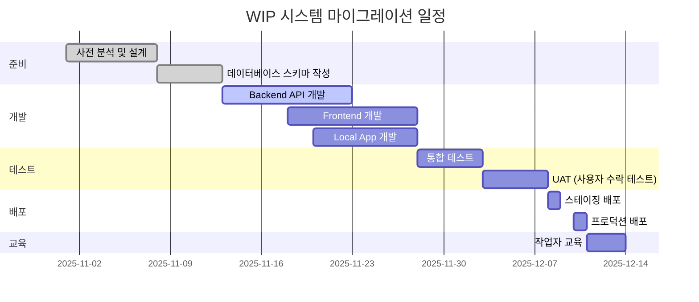

# WIP 시스템 마이그레이션 가이드

> F2X NeuroHub MES - 기존 시스템에서 WIP 시스템으로 전환 가이드

**문서 버전**: 1.0
**작성일**: 2025-11-21
**대상**: 시스템 관리자, 개발팀

---

## 📋 목차

1. [마이그레이션 개요](#1-마이그레이션-개요)
2. [사전 준비](#2-사전-준비)
3. [데이터베이스 마이그레이션](#3-데이터베이스-마이그레이션)
4. [애플리케이션 업데이트](#4-애플리케이션-업데이트)
5. [테스트 계획](#5-테스트-계획)
6. [배포 계획](#6-배포-계획)
7. [롤백 계획](#7-롤백-계획)
8. [교육 및 훈련](#8-교육-및-훈련)

---

## 1. 마이그레이션 개요

### 1.1 마이그레이션 목적

**기존 시스템의 한계**:
- Serial Number가 공정 7에서 생성되어 공정 1~6에서 개별 추적 불가
- LOT 단위로만 관리되어 세밀한 품질 관리 어려움
- 불량 발생 시 공정별 원인 추적 한계

**WIP 시스템의 장점**:
- 공정 1부터 개별 제품 추적 가능
- 전 공정 이력 완벽 관리
- 불량 원인 분석 용이

### 1.2 마이그레이션 범위

| 구분 | 대상 | 변경 사항 |
|------|------|----------|
| **데이터베이스** | PostgreSQL | 2개 테이블 추가 (wip_items, wip_process_history) |
| **Backend API** | FastAPI | 8개 API 엔드포인트 추가 |
| **Frontend** | React | WIP 관리 화면 추가 |
| **Local App** | PySide6 | WIP 스캔 및 처리 기능 추가 |
| **프린터** | Zebra | 변경 없음 (기존 라벨 형식 유지) |

### 1.3 마이그레이션 일정



**예상 소요 기간**: 약 6주

---

## 2. 사전 준비

### 2.1 시스템 요구사항

#### 서버 요구사항

| 구분 | 최소 사양 | 권장 사양 |
|------|----------|----------|
| **CPU** | 4 Core | 8 Core |
| **RAM** | 8 GB | 16 GB |
| **Storage** | 100 GB SSD | 500 GB SSD |
| **PostgreSQL** | 14.x | 15.x+ |
| **Python** | 3.10+ | 3.11+ |

#### 클라이언트 요구사항

| 구분 | 요구사항 |
|------|----------|
| **태블릿 OS** | Windows 10/11 또는 Android 10+ |
| **브라우저** | Chrome 90+, Edge 90+ |
| **Local App** | Python 3.10+ with PySide6 |
| **바코드 스캐너** | USB 또는 Bluetooth |

### 2.2 데이터 백업

**백업 대상**:
- PostgreSQL 전체 데이터베이스
- 애플리케이션 설정 파일
- 로그 파일

**백업 명령**:

```bash
# PostgreSQL 전체 백업
pg_dump -h localhost -U postgres -d f2x_neurohub > backup_$(date +%Y%m%d_%H%M%S).sql

# 특정 테이블 백업
pg_dump -h localhost -U postgres -d f2x_neurohub -t lots -t serials -t process_data > backup_core_tables.sql

# 압축 백업
pg_dump -h localhost -U postgres -d f2x_neurohub | gzip > backup_$(date +%Y%m%d_%H%M%S).sql.gz
```

### 2.3 개발 환경 준비

#### Backend 환경

```bash
# 가상 환경 생성
python -m venv venv
source venv/bin/activate  # Linux/Mac
venv\Scripts\activate     # Windows

# 의존성 설치
pip install -r requirements.txt

# 새 패키지 추가 (필요 시)
pip install sqlalchemy-utils
pip freeze > requirements.txt
```

#### Frontend 환경

```bash
# Node.js 패키지 설치
cd frontend
npm install

# 개발 서버 실행
npm run dev
```

---

## 3. 데이터베이스 마이그레이션

### 3.1 스키마 변경

#### 3.1.1 새 테이블 생성

**파일**: `database/ddl/02_tables/10_wip_items.sql`

```sql
-- WIP Items 테이블 생성
CREATE TABLE wip_items (
    id BIGSERIAL PRIMARY KEY,
    wip_id VARCHAR(50) UNIQUE NOT NULL,
    lot_id BIGINT NOT NULL REFERENCES lots(id) ON DELETE RESTRICT,
    sequence_in_lot INTEGER NOT NULL CHECK (sequence_in_lot > 0 AND sequence_in_lot <= 200),
    status VARCHAR(20) DEFAULT 'CREATED' NOT NULL CHECK (status IN ('CREATED', 'IN_PROGRESS', 'COMPLETED', 'CONVERTED')),
    current_process_id BIGINT REFERENCES processes(id),
    serial_id BIGINT REFERENCES serials(id) ON DELETE SET NULL,
    created_at TIMESTAMP WITH TIME ZONE DEFAULT NOW() NOT NULL,
    updated_at TIMESTAMP WITH TIME ZONE DEFAULT NOW() NOT NULL,
    converted_at TIMESTAMP WITH TIME ZONE,
    UNIQUE(lot_id, sequence_in_lot)
);

-- 코멘트 추가
COMMENT ON TABLE wip_items IS 'WIP (작업 중인 제품) 관리 테이블';
COMMENT ON COLUMN wip_items.wip_id IS 'WIP ID (예: KR01PSA2511001-W0001)';
COMMENT ON COLUMN wip_items.sequence_in_lot IS 'LOT 내 순번 (1~100)';
COMMENT ON COLUMN wip_items.status IS 'WIP 상태 (CREATED → IN_PROGRESS → COMPLETED → CONVERTED)';
COMMENT ON COLUMN wip_items.current_process_id IS '현재 진행 중인 공정 ID';
COMMENT ON COLUMN wip_items.serial_id IS '전환된 Serial ID (NULL=미전환)';

-- 인덱스 생성
CREATE INDEX idx_wip_lot ON wip_items(lot_id);
CREATE INDEX idx_wip_status ON wip_items(status);
CREATE INDEX idx_wip_current_process ON wip_items(current_process_id);
CREATE INDEX idx_wip_not_converted ON wip_items(lot_id, status) WHERE status != 'CONVERTED';
```

**파일**: `database/ddl/02_tables/11_wip_process_history.sql`

```sql
-- WIP Process History 테이블 생성
CREATE TABLE wip_process_history (
    id BIGSERIAL PRIMARY KEY,
    wip_item_id BIGINT NOT NULL REFERENCES wip_items(id) ON DELETE CASCADE,
    process_id BIGINT NOT NULL REFERENCES processes(id) ON DELETE RESTRICT,
    operator_id BIGINT REFERENCES users(id) ON DELETE SET NULL,
    equipment_id BIGINT REFERENCES equipment(id) ON DELETE SET NULL,
    started_at TIMESTAMP WITH TIME ZONE NOT NULL,
    completed_at TIMESTAMP WITH TIME ZONE,
    result VARCHAR(20) CHECK (result IN ('PASS', 'FAIL', 'REWORK')),
    process_data JSONB,
    is_rework BOOLEAN DEFAULT FALSE NOT NULL,
    created_at TIMESTAMP WITH TIME ZONE DEFAULT NOW() NOT NULL,
    updated_at TIMESTAMP WITH TIME ZONE DEFAULT NOW() NOT NULL,
    CONSTRAINT chk_wip_process_completion CHECK (
        (completed_at IS NOT NULL AND result IS NOT NULL) OR
        (completed_at IS NULL AND result IS NULL)
    )
);

-- 코멘트 추가
COMMENT ON TABLE wip_process_history IS 'WIP 공정 이력 테이블 (공정 1~6)';
COMMENT ON COLUMN wip_process_history.wip_item_id IS 'WIP FK';
COMMENT ON COLUMN wip_process_history.process_id IS '공정 FK (1~6)';

-- 인덱스 생성
CREATE INDEX idx_wip_history_wip ON wip_process_history(wip_item_id);
CREATE INDEX idx_wip_history_process ON wip_process_history(process_id);
CREATE INDEX idx_wip_history_wip_process ON wip_process_history(wip_item_id, process_id);
CREATE INDEX idx_wip_history_incomplete ON wip_process_history(wip_item_id, process_id) WHERE completed_at IS NULL;
CREATE INDEX idx_wip_history_jsonb ON wip_process_history USING GIN (process_data);
```

#### 3.1.2 Trigger 및 Function 생성

**파일**: `database/ddl/03_functions/05_wip_triggers.sql`

```sql
-- WIP 상태 자동 업데이트 Trigger
CREATE OR REPLACE FUNCTION update_wip_status()
RETURNS TRIGGER AS $$
BEGIN
    -- 공정 1 완공 시 IN_PROGRESS로 변경
    IF NEW.process_id = 1 AND NEW.result = 'PASS' THEN
        UPDATE wip_items
        SET status = 'IN_PROGRESS', current_process_id = 1
        WHERE id = NEW.wip_item_id;
    END IF;

    -- 공정 2~5 완공 시 current_process_id 업데이트
    IF NEW.process_id BETWEEN 2 AND 5 AND NEW.result = 'PASS' THEN
        UPDATE wip_items
        SET current_process_id = NEW.process_id
        WHERE id = NEW.wip_item_id;
    END IF;

    -- 공정 6 완공 시 COMPLETED로 변경
    IF NEW.process_id = 6 AND NEW.result = 'PASS' THEN
        UPDATE wip_items
        SET status = 'COMPLETED', current_process_id = 6
        WHERE id = NEW.wip_item_id;
    END IF;

    RETURN NEW;
END;
$$ LANGUAGE plpgsql;

CREATE TRIGGER trg_update_wip_status
AFTER INSERT OR UPDATE ON wip_process_history
FOR EACH ROW
EXECUTE FUNCTION update_wip_status();
```

#### 3.1.3 마이그레이션 스크립트 실행

```bash
# 1. 백업
pg_dump -h localhost -U postgres -d f2x_neurohub > backup_before_migration.sql

# 2. DDL 실행
psql -h localhost -U postgres -d f2x_neurohub -f database/ddl/02_tables/10_wip_items.sql
psql -h localhost -U postgres -d f2x_neurohub -f database/ddl/02_tables/11_wip_process_history.sql
psql -h localhost -U postgres -d f2x_neurohub -f database/ddl/03_functions/05_wip_triggers.sql

# 3. 검증
psql -h localhost -U postgres -d f2x_neurohub -c "\dt wip*"
psql -h localhost -U postgres -d f2x_neurohub -c "\d wip_items"
psql -h localhost -U postgres -d f2x_neurohub -c "\d wip_process_history"
```

### 3.2 기존 데이터 처리

#### 3.2.1 진행 중인 LOT 처리 방안

**상황**: 마이그레이션 시점에 진행 중인 LOT이 있는 경우

**방안 1: 기존 방식으로 완료 (권장)**
- 진행 중인 LOT은 WIP 없이 기존 방식으로 완료
- 새 LOT부터 WIP 시스템 적용

**방안 2: WIP로 전환**
- 진행 중인 제품에 대해 WIP ID 소급 생성
- 완료된 공정에 대해 WIP 이력 소급 입력
- 복잡하고 오류 가능성 높음 (비권장)

#### 3.2.2 마이그레이션 스크립트 (방안 2 선택 시)

```sql
-- 진행 중인 LOT의 Serial에 대해 WIP 소급 생성
INSERT INTO wip_items (wip_id, lot_id, sequence_in_lot, status, serial_id, converted_at)
SELECT
    CONCAT(l.lot_number, '-W', LPAD(s.sequence_in_lot::TEXT, 4, '0')) AS wip_id,
    s.lot_id,
    s.sequence_in_lot,
    'CONVERTED' AS status,
    s.id AS serial_id,
    s.created_at AS converted_at
FROM serials s
JOIN lots l ON s.lot_id = l.id
WHERE l.status IN ('IN_PROGRESS', 'COMPLETED')
AND s.created_at >= '2025-11-01';  -- 마이그레이션 기준일

-- 기존 process_data에서 WIP 이력 소급 생성
INSERT INTO wip_process_history (wip_item_id, process_id, operator_id, equipment_id, started_at, completed_at, result, process_data)
SELECT
    w.id AS wip_item_id,
    pd.process_id,
    pd.operator_id,
    pd.equipment_id,
    pd.start_time AS started_at,
    pd.complete_time AS completed_at,
    pd.result,
    pd.process_specific_data AS process_data
FROM process_data pd
JOIN serials s ON pd.serial_id = s.id
JOIN wip_items w ON w.serial_id = s.id
WHERE pd.process_id BETWEEN 1 AND 6;
```

---

## 4. 애플리케이션 업데이트

### 4.1 Backend API

#### 4.1.1 모델 추가

**파일**: `backend/app/models/wip.py`

```python
from sqlalchemy import Column, Integer, String, BigInteger, ForeignKey, DateTime, Boolean, CheckConstraint
from sqlalchemy.orm import relationship
from sqlalchemy.dialects.postgresql import JSONB
from backend.app.models.base import Base
from datetime import datetime, timezone

class WIPItem(Base):
    __tablename__ = "wip_items"

    id = Column(BigInteger, primary_key=True, index=True)
    wip_id = Column(String(50), unique=True, nullable=False, index=True)
    lot_id = Column(BigInteger, ForeignKey("lots.id"), nullable=False)
    sequence_in_lot = Column(Integer, nullable=False)
    status = Column(String(20), default="CREATED", nullable=False)
    current_process_id = Column(BigInteger, ForeignKey("processes.id"))
    serial_id = Column(BigInteger, ForeignKey("serials.id"))
    created_at = Column(DateTime(timezone=True), default=lambda: datetime.now(timezone.utc))
    updated_at = Column(DateTime(timezone=True), default=lambda: datetime.now(timezone.utc), onupdate=lambda: datetime.now(timezone.utc))
    converted_at = Column(DateTime(timezone=True))

    # Relationships
    lot = relationship("Lot", back_populates="wip_items")
    serial = relationship("Serial", back_populates="wip_item")
    process_history = relationship("WIPProcessHistory", back_populates="wip_item")

    __table_args__ = (
        CheckConstraint("status IN ('CREATED', 'IN_PROGRESS', 'COMPLETED', 'CONVERTED')"),
        CheckConstraint("sequence_in_lot > 0 AND sequence_in_lot <= 200"),
    )
```

#### 4.1.2 API 엔드포인트 추가

**파일**: `backend/app/api/v1/wip.py`

```python
from fastapi import APIRouter, Depends, HTTPException, status
from sqlalchemy.orm import Session
from typing import List

from backend.app.api.deps import get_db, get_current_user
from backend.app.models.user import User
from backend.app.crud import wip as crud_wip
from backend.app.schemas import wip as schemas_wip

router = APIRouter()

@router.post("/wip-items", response_model=schemas_wip.WIPItem, status_code=status.HTTP_201_CREATED)
def create_wip_item(
    wip_in: schemas_wip.WIPItemCreate,
    db: Session = Depends(get_db),
    current_user: User = Depends(get_current_user)
):
    """Create WIP item (공정 1)"""
    return crud_wip.create_wip_item(db=db, wip_in=wip_in)

@router.get("/wip-items", response_model=List[schemas_wip.WIPItem])
def list_wip_items(
    lot_id: int = None,
    status: str = None,
    skip: int = 0,
    limit: int = 100,
    db: Session = Depends(get_db),
    current_user: User = Depends(get_current_user)
):
    """List WIP items with filters"""
    return crud_wip.get_wip_items(db=db, lot_id=lot_id, status=status, skip=skip, limit=limit)

@router.post("/wip-items/{wip_id}/convert-to-serial", response_model=schemas_wip.WIPConversion)
def convert_wip_to_serial(
    wip_id: str,
    conversion_in: schemas_wip.WIPConversionCreate,
    db: Session = Depends(get_db),
    current_user: User = Depends(get_current_user)
):
    """Convert WIP to Serial (공정 7)"""
    return crud_wip.convert_to_serial(db=db, wip_id=wip_id, conversion_in=conversion_in)
```

### 4.2 Frontend

#### 4.2.1 WIP 관리 화면 추가

**파일**: `frontend/src/pages/WIPManagementPage.tsx`

```typescript
import React from 'react';
import { useQuery } from '@tanstack/react-query';
import { api } from '@/lib/api';

export const WIPManagementPage: React.FC = () => {
  const { data: wipItems, isLoading } = useQuery({
    queryKey: ['wip-items'],
    queryFn: () => api.get('/wip-items'),
  });

  if (isLoading) return <div>Loading...</div>;

  return (
    <div className="container mx-auto p-4">
      <h1 className="text-2xl font-bold mb-4">WIP 관리</h1>
      <table className="w-full border-collapse">
        <thead>
          <tr className="bg-gray-100">
            <th className="border p-2">WIP ID</th>
            <th className="border p-2">LOT</th>
            <th className="border p-2">순번</th>
            <th className="border p-2">상태</th>
            <th className="border p-2">현재 공정</th>
          </tr>
        </thead>
        <tbody>
          {wipItems?.map((wip) => (
            <tr key={wip.id}>
              <td className="border p-2">{wip.wip_id}</td>
              <td className="border p-2">{wip.lot.lot_number}</td>
              <td className="border p-2">{wip.sequence_in_lot}</td>
              <td className="border p-2">{wip.status}</td>
              <td className="border p-2">{wip.current_process?.process_name}</td>
            </tr>
          ))}
        </tbody>
      </table>
    </div>
  );
};
```

### 4.3 Local App (PySide6)

#### 4.3.1 WIP 스캔 기능 추가

**파일**: `production_tracker_app/services/wip_service.py`

```python
from typing import Optional, Dict, Any
import requests
from production_tracker_app.config import API_BASE_URL

class WIPService:
    """WIP 관련 API 호출 서비스"""

    def __init__(self, api_base_url: str = API_BASE_URL):
        self.api_base_url = api_base_url

    def scan_wip(self, wip_id: str, process_id: int, operator_id: int) -> Dict[str, Any]:
        """WIP 바코드 스캔"""
        response = requests.post(
            f"{self.api_base_url}/wip-items/{wip_id}/scan",
            json={
                "process_id": process_id,
                "operator_id": operator_id
            }
        )
        response.raise_for_status()
        return response.json()

    def start_wip_process(self, wip_id: str, process_id: int, operator_id: int, equipment_id: str) -> Dict[str, Any]:
        """WIP 공정 착공"""
        response = requests.post(
            f"{self.api_base_url}/wip-items/{wip_id}/start-process",
            json={
                "process_id": process_id,
                "operator_id": operator_id,
                "equipment_id": equipment_id
            }
        )
        response.raise_for_status()
        return response.json()

    def complete_wip_process(self, wip_id: str, process_id: int, result: str, process_data: Optional[Dict] = None) -> Dict[str, Any]:
        """WIP 공정 완공"""
        response = requests.post(
            f"{self.api_base_url}/wip-items/{wip_id}/complete-process",
            json={
                "process_id": process_id,
                "result": result,
                "process_data": process_data or {}
            }
        )
        response.raise_for_status()
        return response.json()

    def convert_to_serial(self, wip_id: str, operator_id: int, printer_id: str) -> Dict[str, Any]:
        """WIP를 Serial로 전환 (공정 7)"""
        response = requests.post(
            f"{self.api_base_url}/wip-items/{wip_id}/convert-to-serial",
            json={
                "operator_id": operator_id,
                "printer_id": printer_id
            }
        )
        response.raise_for_status()
        return response.json()
```

---

## 5. 테스트 계획

### 5.1 단위 테스트

#### Backend API 테스트

```python
# tests/test_wip_api.py
import pytest
from fastapi.testclient import TestClient

def test_create_wip_item(client: TestClient, test_lot):
    response = client.post(
        "/api/v1/wip-items",
        json={
            "lot_id": test_lot.id,
            "operator_id": 1,
            "equipment_id": "LASER-001"
        }
    )
    assert response.status_code == 201
    data = response.json()
    assert "wip_id" in data
    assert data["wip_id"].startswith(test_lot.lot_number)

def test_convert_wip_to_serial(client: TestClient, test_wip_completed):
    response = client.post(
        f"/api/v1/wip-items/{test_wip_completed.wip_id}/convert-to-serial",
        json={
            "operator_id": 1,
            "printer_id": "ZEBRA-001"
        }
    )
    assert response.status_code == 200
    data = response.json()
    assert "serial_number" in data
    assert data["label_printed"] == True
```

### 5.2 통합 테스트

#### 전체 워크플로우 테스트

```python
def test_complete_wip_workflow():
    # 1. LOT 생성
    lot = create_lot()

    # 2. WIP 생성 (공정 1)
    wip = create_wip_item(lot.id)
    assert wip.status == "CREATED"

    # 3. 공정 1 완공
    complete_process(wip.wip_id, process_id=1, result="PASS")
    wip = get_wip(wip.wip_id)
    assert wip.status == "IN_PROGRESS"

    # 4. 공정 2~6 완공
    for process_id in range(2, 7):
        complete_process(wip.wip_id, process_id=process_id, result="PASS")

    wip = get_wip(wip.wip_id)
    assert wip.status == "COMPLETED"

    # 5. Serial 전환 (공정 7)
    result = convert_to_serial(wip.wip_id)
    assert result["serial_number"] is not None
    assert result["label_printed"] == True

    wip = get_wip(wip.wip_id)
    assert wip.status == "CONVERTED"
    assert wip.serial_id is not None
```

### 5.3 UAT (사용자 수락 테스트)

#### 테스트 시나리오

**시나리오 1: 정상 흐름**
1. LOT 생성
2. 공정 1에서 WIP 생성 (10개)
3. 공정 2~6 순차 진행 (모두 PASS)
4. 공정 7에서 Serial 전환
5. 공정 8 완료

**시나리오 2: 불량 처리**
1. 공정 3에서 불량 발생
2. 재작업 승인
3. 재작업 후 PASS
4. 나머지 공정 진행

**시나리오 3: 공정 스킵 시도**
1. 공정 2 미완료 상태에서 공정 3 착공 시도
2. 시스템이 거부하는지 확인

---

## 6. 배포 계획

### 6.1 배포 환경

| 환경 | 용도 | URL |
|------|------|-----|
| **개발 (Dev)** | 개발 및 단위 테스트 | http://dev.f2x-neurohub.local |
| **스테이징 (Staging)** | 통합 테스트 및 UAT | http://staging.f2x-neurohub.com |
| **프로덕션 (Prod)** | 실제 운영 | https://api.f2x-neurohub.com |

### 6.2 배포 절차

#### 6.2.1 스테이징 배포

```bash
# 1. 코드 pull
cd /opt/f2x_neurohub
git pull origin main

# 2. 데이터베이스 백업
pg_dump -h staging-db -U postgres -d f2x_neurohub > backup_staging_$(date +%Y%m%d_%H%M%S).sql

# 3. 데이터베이스 마이그레이션
psql -h staging-db -U postgres -d f2x_neurohub -f database/migrations/add_wip_tables.sql

# 4. Backend 배포
cd backend
source venv/bin/activate
pip install -r requirements.txt
uvicorn app.main:app --reload

# 5. Frontend 빌드 및 배포
cd ../frontend
npm install
npm run build
sudo cp -r dist/* /var/www/html/

# 6. 서비스 재시작
sudo systemctl restart f2x-backend
sudo systemctl restart nginx
```

#### 6.2.2 프로덕션 배포

**배포 시간**: 오전 2:00 AM (야간 교대조 시작 전)

**배포 체크리스트**:
- [ ] 스테이징 환경에서 모든 테스트 통과
- [ ] 데이터베이스 백업 완료
- [ ] 롤백 스크립트 준비
- [ ] 모니터링 대시보드 확인
- [ ] 긴급 연락망 구성

**배포 단계**:
1. 시스템 점검 모드 활성화
2. 진행 중인 작업 완료 대기 (최대 10분)
3. 데이터베이스 백업
4. 데이터베이스 마이그레이션
5. 애플리케이션 배포
6. 스모크 테스트 수행
7. 시스템 점검 모드 해제
8. 모니터링 강화 (24시간)

---

## 7. 롤백 계획

### 7.1 롤백 트리거

다음 상황 발생 시 즉시 롤백:
- 시스템 가동 중단 (다운타임 5분 이상)
- 데이터 무결성 오류
- 치명적 버그 발견 (생산 중단)
- UAT 실패

### 7.2 롤백 절차

#### 7.2.1 데이터베이스 롤백

```bash
# 1. 현재 상태 백업 (롤백 후 분석용)
pg_dump -h localhost -U postgres -d f2x_neurohub > backup_before_rollback.sql

# 2. 백업에서 복원
psql -h localhost -U postgres -d f2x_neurohub < backup_before_migration.sql

# 3. 연결 종료 및 재시작
sudo systemctl restart postgresql
```

#### 7.2.2 애플리케이션 롤백

```bash
# 1. 이전 버전으로 체크아웃
cd /opt/f2x_neurohub
git checkout <previous_commit_hash>

# 2. Backend 재배포
cd backend
source venv/bin/activate
pip install -r requirements.txt
uvicorn app.main:app --reload

# 3. Frontend 재배포
cd ../frontend
npm install
npm run build
sudo cp -r dist/* /var/www/html/

# 4. 서비스 재시작
sudo systemctl restart f2x-backend
sudo systemctl restart nginx
```

### 7.3 롤백 후 조치

1. 롤백 원인 분석
2. 버그 수정 및 재테스트
3. 재배포 일정 수립
4. 관련자 보고

---

## 8. 교육 및 훈련

### 8.1 교육 대상 및 내용

| 대상 | 교육 내용 | 시간 |
|------|----------|------|
| **관리자** | 시스템 개요, LOT 관리, 모니터링 | 2시간 |
| **공정 1 작업자** | WIP 생성, 바코드 스캔, 착공/완공 | 1시간 |
| **공정 2~6 작업자** | WIP 스캔, 공정 처리, 불량 처리 | 1시간 |
| **공정 7 작업자** | Serial 전환, 라벨 출력, 문제 해결 | 1시간 |
| **공정 8 작업자** | Serial 스캔, 외관검사, 완공 | 30분 |

### 8.2 교육 자료

- **운영 매뉴얼**: [WIP_OPERATIONAL_MANUAL.md](./WIP_OPERATIONAL_MANUAL.md)
- **시스템 아키텍처**: [WIP_SYSTEM_ARCHITECTURE.md](./WIP_SYSTEM_ARCHITECTURE.md)
- **동영상 튜토리얼**: 공정별 실습 영상
- **FAQ**: 자주 묻는 질문 모음

### 8.3 교육 일정

```
Day 1 (12/11):
- 09:00-11:00: 관리자 교육
- 14:00-15:00: 공정 1 작업자 교육

Day 2 (12/12):
- 09:00-10:00: 공정 2~6 작업자 교육 (주간조)
- 14:00-15:00: 공정 2~6 작업자 교육 (야간조)

Day 3 (12/13):
- 09:00-10:00: 공정 7 작업자 교육
- 11:00-11:30: 공정 8 작업자 교육
- 14:00-16:00: 전체 실습 및 Q&A
```

---

## 9. 모니터링 및 지원

### 9.1 배포 후 모니터링

**모니터링 항목**:
- 시스템 가동률 (Uptime)
- API 응답 시간
- 데이터베이스 성능
- WIP 생성/전환 성공률
- 오류 발생 빈도

**알림 설정**:
- 시스템 다운: 즉시 알림
- API 응답 시간 > 3초: 경고
- 오류율 > 5%: 경고

### 9.2 지원 체계

| 지원 레벨 | 대상 | 응답 시간 | 연락처 |
|----------|------|----------|--------|
| **L1** | 일반 문의 | 1시간 이내 | IT 헬프데스크 |
| **L2** | 기술 문의 | 4시간 이내 | 개발팀 |
| **L3** | 긴급 장애 | 즉시 | 시스템 관리자 |

### 9.3 피드백 수집

**수집 방법**:
- 주간 회의 (매주 금요일 14:00)
- 피드백 양식 (Google Forms)
- 직접 인터뷰

**개선 주기**:
- 긴급 버그: 24시간 이내 핫픽스
- 일반 개선: 2주 주기 배포
- 신기능: 1개월 주기 배포

---

## 10. 마이그레이션 체크리스트

### 10.1 마이그레이션 전

- [ ] 데이터베이스 백업 완료
- [ ] 롤백 스크립트 준비
- [ ] 모든 테스트 통과
- [ ] 관련자 공지
- [ ] 긴급 연락망 구성

### 10.2 마이그레이션 중

- [ ] 시스템 점검 모드 활성화
- [ ] 진행 중인 작업 완료 대기
- [ ] 데이터베이스 마이그레이션 실행
- [ ] 애플리케이션 배포
- [ ] 스모크 테스트 수행

### 10.3 마이그레이션 후

- [ ] 시스템 정상 동작 확인
- [ ] 모니터링 대시보드 확인
- [ ] 작업자 교육 완료
- [ ] 1주일 집중 모니터링
- [ ] 피드백 수집 및 개선

---

## 11. 참고 문서

- [WIP 시스템 아키텍처](./WIP_SYSTEM_ARCHITECTURE.md)
- [WIP 운영 매뉴얼](./WIP_OPERATIONAL_MANUAL.md)
- [API 엔드포인트 명세](../backend/.docs/api/API_ENDPOINTS.md)
- [데이터베이스 스키마](../backend/.docs/database/02-entity-definitions.md)

---

**마지막 업데이트**: 2025-11-21
**버전**: 1.0
**문의**: devops@f2x.com
