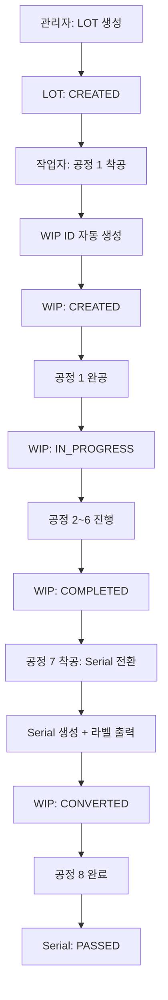
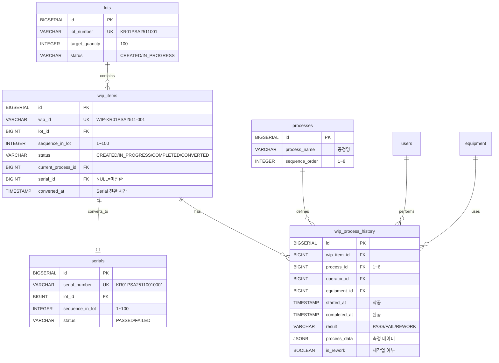
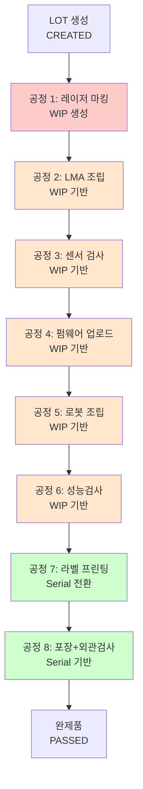
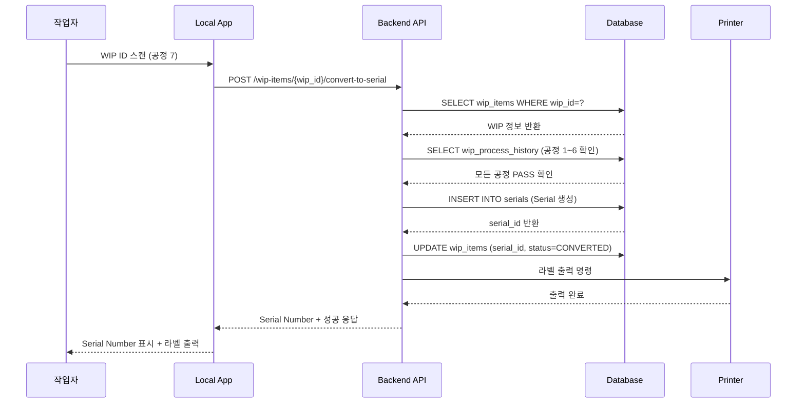
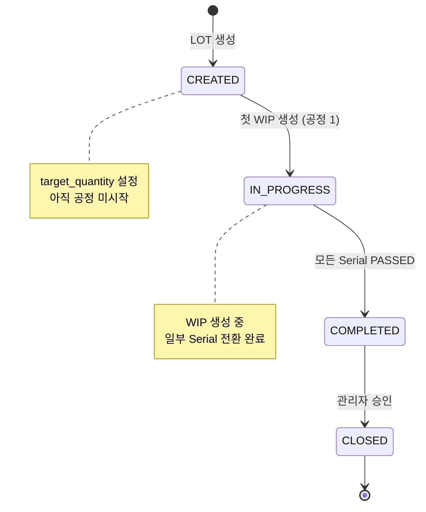
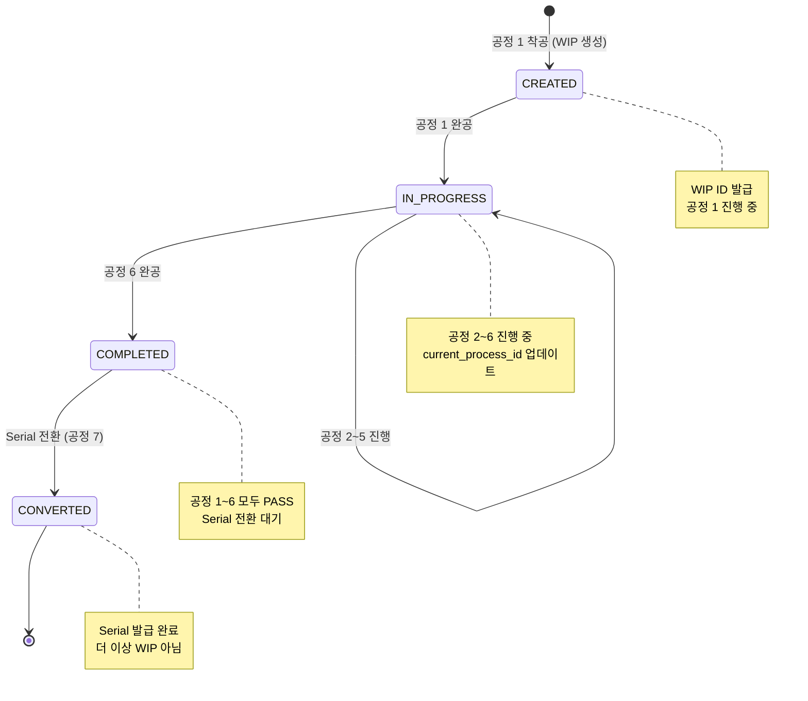
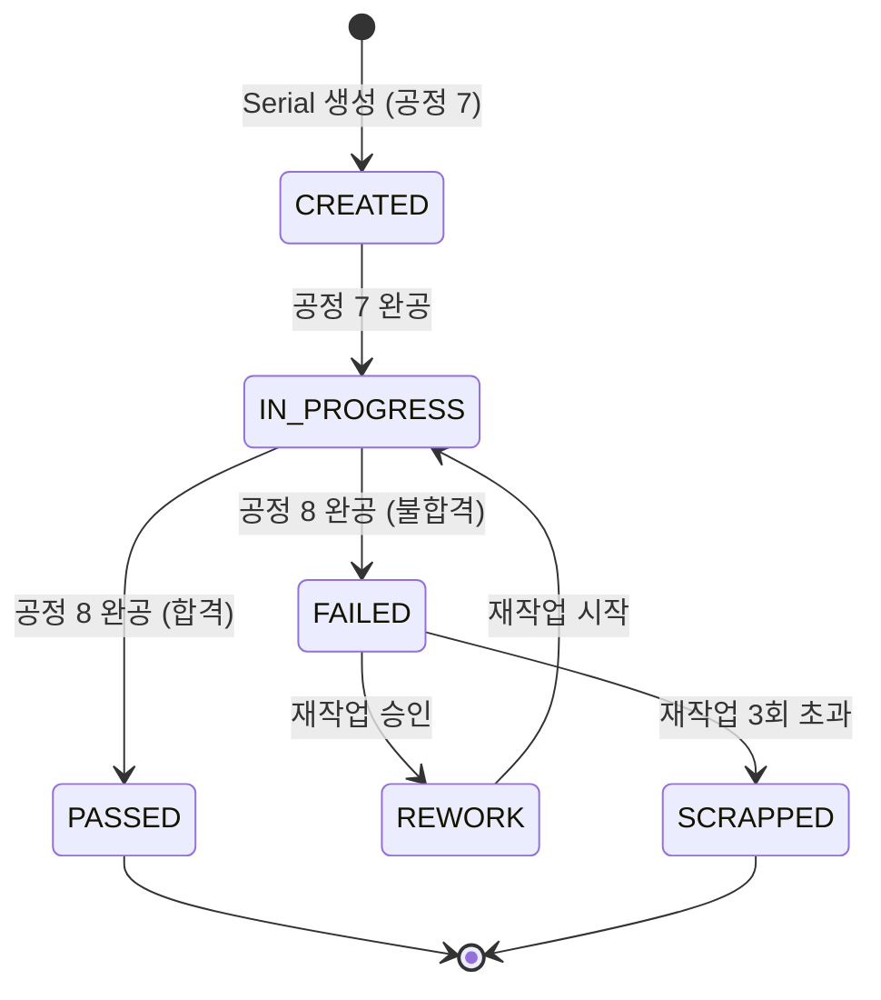

# WIP ID 기반 공정 운영 시스템 아키텍처

> F2X NeuroHub MES - WIP (Work In Progress) 시스템 설계 문서

**문서 버전**: 1.0
**작성일**: 2025-11-21
**작성자**: 시스템 아키텍처 팀

---

## 📋 목차

1. [시스템 개요](#1-시스템-개요)
2. [WIP ID 개념](#2-wip-id-개념)
3. [데이터 흐름도](#3-데이터-흐름도)
4. [엔티티 관계도 (ERD)](#4-엔티티-관계도-erd)
5. [공정 흐름도](#5-공정-흐름도)
6. [상태 전이 다이어그램](#6-상태-전이-다이어그램)
7. [API 설계](#7-api-설계)
8. [데이터베이스 스키마](#8-데이터베이스-스키마)

---

## 1. 시스템 개요

### 1.1 WIP 시스템의 필요성

기존 시스템에서는 Serial Number가 공정 7(라벨 프린팅)에서 생성되어 공정 1~6에서는 제품 개별 추적이 불가능했습니다. WIP 시스템은 이 문제를 해결하기 위해 도입되었습니다.

**기존 시스템의 문제점**:
- 공정 1~6에서 개별 제품 추적 불가
- LOT 단위로만 관리되어 세밀한 품질 관리 어려움
- 불량 발생 시 원인 추적 한계

**WIP 시스템의 해결책**:
- 공정 1부터 개별 제품 식별 가능
- WIP ID로 공정 1~6 추적, Serial Number로 공정 7~8 추적
- 전 공정 완벽한 이력 관리

### 1.2 시스템 구성 요소

| 구성 요소 | 설명 | 책임 |
|----------|------|------|
| **LOT** | 생산 단위 (100개) | 생산 계획 및 관리 |
| **WIP Item** | 작업 중인 제품 (공정 1~6) | 공정 진행 추적 |
| **Serial** | 완제품 (공정 7~8) | 최종 제품 관리 |
| **Process History** | 공정 실행 기록 | 이력 추적 및 분석 |

---

## 2. WIP ID 개념

### 2.1 WIP ID란?

**WIP (Work In Progress) ID**: LOT 생성 후 공정 1에서 생성되는 작업 중인 제품의 고유 식별자

### 2.2 WIP ID vs Serial Number

| 구분 | WIP ID | Serial Number |
|------|--------|---------------|
| **생성 시점** | 공정 1 (레이저 마킹) | 공정 7 (라벨 프린팅) |
| **사용 범위** | 공정 1~6 | 공정 7~8 |
| **포맷** | `WIP-{LOT}-{SEQ:03d}` | `{lot_number}{sequence:04d}` |
| **예시** | `WIP-KR01PSA2511-001` | `KR01PSA25110010001` |
| **길이** | 19자 (4+11+1+3) | 15자 |

### 2.3 WIP ID 포맷

```
WIP-{LOT}-{SEQ:03d}

예시:
WIP-KR01PSA2511-001
│   │          │
│   │          └─ 순번 (001~100)
│   └──────────── LOT 번호 (11자)
└────────────── 접두어 (WIP-)
```

**구성 요소**:
- 접두어: `WIP-` (4자, Work In Progress 식별자)
- LOT 번호: 11자리 (KR01PSA2511 형식)
- 구분자: `-` (1자)
- 순번: 3자리 (001~100, LOT당 순차 증가)

### 2.4 생명주기


---

## 3. 데이터 흐름도

### 3.1 전체 데이터 흐름



### 3.2 공정별 데이터 흐름

#### 공정 1 (레이저 마킹)

```
입력: LOT ID
처리:
  1. WIP ID 생성 (WIP-{LOT}-{SEQ:03d})
  2. wip_items 테이블에 레코드 생성
  3. wip_process_history에 공정 1 기록
  4. LOT 상태: CREATED → IN_PROGRESS
출력: WIP ID + 바코드
```

#### 공정 2~6 (조립 및 검사)

```
입력: WIP ID 스캔
처리:
  1. WIP ID 검증
  2. 이전 공정 완료 확인
  3. 착공 기록 (wip_process_history)
  4. 작업 수행
  5. 완공 기록 (결과: PASS/FAIL)
출력: 다음 공정 진행 가능 여부
```

#### 공정 7 (라벨 프린팅 - 전환)

```
입력: WIP ID 스캔
처리:
  1. 공정 1~6 PASS 확인
  2. Serial Number 자동 생성
  3. serials 테이블에 레코드 생성
  4. wip_items.serial_id 업데이트
  5. wip_items.status = CONVERTED
  6. 바코드 라벨 출력
출력: Serial Number + 라벨
```

#### 공정 8 (포장 + 외관검사)

```
입력: Serial Number 스캔
처리:
  1. Serial Number 검증
  2. 외관 검사 수행
  3. process_data에 공정 8 기록
  4. serials.status = PASSED
출력: 완제품
```

---

## 4. 엔티티 관계도 (ERD)

### 4.1 WIP 관련 ERD



### 4.2 관계 설명

| 관계 | Cardinality | 설명 |
|------|-------------|------|
| lots → wip_items | 1:N | 1개 LOT은 최대 100개의 WIP 보유 |
| wip_items → wip_process_history | 1:N | 1개 WIP은 공정 1~6의 이력 보유 (최대 6개) |
| wip_items → serials | 1:1 | 1개 WIP은 1개 Serial로 전환 |
| processes → wip_process_history | 1:N | 1개 공정 정의는 여러 실행 기록 |

---

## 5. 공정 흐름도

### 5.1 전체 공정 흐름



**색상 구분**:
- 🔴 빨강: WIP 생성 (공정 1)
- 🟠 주황: WIP 기반 작업 (공정 2~6)
- 🟢 초록: Serial 기반 작업 (공정 7~8)

### 5.2 WIP → Serial 전환 상세



---

## 6. 상태 전이 다이어그램

### 6.1 LOT 상태 전이



### 6.2 WIP 상태 전이



### 6.3 Serial 상태 전이



---

## 7. API 설계

### 7.1 WIP 관련 API 엔드포인트

| Method | Endpoint | 설명 | 사용 공정 |
|--------|----------|------|----------|
| **POST** | `/api/v1/lots/{lot_id}/start-wip-generation` | LOT에서 WIP 생성 시작 | 공정 1 준비 |
| **POST** | `/api/v1/wip-items` | WIP 생성 | 공정 1 착공 |
| **GET** | `/api/v1/wip-items?lot_id={lot_id}` | LOT의 WIP 목록 조회 | 관리자 |
| **GET** | `/api/v1/wip-items/{wip_id}` | WIP 상세 정보 + 이력 | 전체 |
| **POST** | `/api/v1/wip-items/{wip_id}/scan` | WIP 바코드 스캔 | 공정 2~6 |
| **POST** | `/api/v1/wip-items/{wip_id}/start-process` | 공정 착공 | 공정 1~6 |
| **POST** | `/api/v1/wip-items/{wip_id}/complete-process` | 공정 완공 | 공정 1~6 |
| **POST** | `/api/v1/wip-items/{wip_id}/convert-to-serial` | Serial 전환 | 공정 7 |

### 7.2 API 호출 흐름 예시

#### 공정 1 (WIP 생성)

```http
POST /api/v1/wip-items
Content-Type: application/json

{
  "lot_id": 1,
  "operator_id": 10,
  "equipment_id": "LASER-001"
}

Response:
{
  "id": 123,
  "wip_id": "WIP-KR01PSA2511-001",
  "lot_id": 1,
  "sequence_in_lot": 1,
  "status": "CREATED",
  "created_at": "2025-11-21T09:00:00Z"
}
```

#### 공정 2~6 (착공/완공)

```http
# 착공
POST /api/v1/wip-items/WIP-KR01PSA2511-001/start-process
{
  "process_id": 2,
  "operator_id": 10,
  "equipment_id": "EQ-002"
}

# 완공
POST /api/v1/wip-items/WIP-KR01PSA2511-001/complete-process
{
  "process_id": 2,
  "result": "PASS",
  "process_data": {
    "notes": "조립 완료"
  }
}
```

#### 공정 7 (Serial 전환)

```http
POST /api/v1/wip-items/WIP-KR01PSA2511-001/convert-to-serial
{
  "operator_id": 10,
  "printer_id": "ZEBRA-001"
}

Response:
{
  "wip_id": "WIP-KR01PSA2511-001",
  "serial_number": "KR01PSA25110001",
  "serial_id": 456,
  "label_printed": true,
  "converted_at": "2025-11-21T11:00:00Z"
}
```

---

## 8. 데이터베이스 스키마

### 8.1 wip_items 테이블

```sql
CREATE TABLE wip_items (
    id BIGSERIAL PRIMARY KEY,
    wip_id VARCHAR(50) UNIQUE NOT NULL,
    lot_id BIGINT NOT NULL REFERENCES lots(id),
    sequence_in_lot INTEGER NOT NULL,
    status VARCHAR(20) DEFAULT 'CREATED' NOT NULL,
    current_process_id BIGINT REFERENCES processes(id),
    serial_id BIGINT REFERENCES serials(id),
    created_at TIMESTAMPTZ DEFAULT NOW() NOT NULL,
    updated_at TIMESTAMPTZ DEFAULT NOW() NOT NULL,
    converted_at TIMESTAMPTZ,
    UNIQUE(lot_id, sequence_in_lot)
);
```

### 8.2 wip_process_history 테이블

```sql
CREATE TABLE wip_process_history (
    id BIGSERIAL PRIMARY KEY,
    wip_item_id BIGINT NOT NULL REFERENCES wip_items(id),
    process_id BIGINT NOT NULL REFERENCES processes(id),
    operator_id BIGINT REFERENCES users(id),
    equipment_id BIGINT REFERENCES equipment(id),
    started_at TIMESTAMPTZ NOT NULL,
    completed_at TIMESTAMPTZ,
    result VARCHAR(20) CHECK (result IN ('PASS', 'FAIL', 'REWORK')),
    process_data JSONB,
    is_rework BOOLEAN DEFAULT FALSE NOT NULL,
    created_at TIMESTAMPTZ DEFAULT NOW() NOT NULL,
    updated_at TIMESTAMPTZ DEFAULT NOW() NOT NULL
);
```

### 8.3 인덱스 전략

```sql
-- WIP 조회 최적화
CREATE INDEX idx_wip_lot ON wip_items(lot_id);
CREATE INDEX idx_wip_status ON wip_items(status);
CREATE INDEX idx_wip_not_converted ON wip_items(lot_id, status)
WHERE status != 'CONVERTED';

-- WIP 이력 조회 최적화
CREATE INDEX idx_wip_history_wip ON wip_process_history(wip_item_id);
CREATE INDEX idx_wip_history_process ON wip_process_history(process_id);
CREATE INDEX idx_wip_history_wip_process ON wip_process_history(wip_item_id, process_id);
CREATE INDEX idx_wip_history_jsonb ON wip_process_history USING GIN (process_data);
```

---

## 9. 성능 및 확장성

### 9.1 데이터량 추정

| 항목 | 연간 | 3년 후 | 5년 후 |
|------|------|--------|--------|
| **WIP Items** | 5M | 15M | 25M |
| **WIP Process History** | 30M | 90M | 150M |
| **Serials** | 5M | 15M | 25M |

### 9.2 성능 최적화

**인덱싱**:
- B-Tree 인덱스: FK, 상태, 시간
- GIN 인덱스: JSONB 데이터
- Partial 인덱스: 미전환 WIP

**파티셔닝** (선택):
- wip_process_history: 월별 파티셔닝
- 1년 이상 된 데이터: Archive 테이블로 이동

**캐싱**:
- LOT 정보: Redis 캐싱 (5분)
- 공정 정의: 메모리 캐싱 (변경 없음)

---

## 10. 관련 문서

- [API 엔드포인트 명세](../backend/.docs/api/API_ENDPOINTS.md)
- [데이터베이스 스키마](../backend/.docs/database/02-entity-definitions.md)
- [WIP 운영 매뉴얼](./WIP_OPERATIONAL_MANUAL.md)
- [WIP 마이그레이션 가이드](./WIP_MIGRATION_GUIDE.md)

---

**마지막 업데이트**: 2025-11-21
**버전**: 1.0
