# F2X NeuroHub MES 시스템 개발 사양서 (개선안 v2.0)

**설비 공정 데이터 자동 수집·통합 관리 시스템**

**Version:** 2.0 (개선안)
**작성일:** 2025.11.10
**기반 버전:** v1.6 검토 후 개선

---

## 📋 목차

1. [프로젝트 개요](#1-프로젝트-개요)
2. [변경 사항 요약](#2-변경-사항-요약)
3. [시스템 아키텍처](#3-시스템-아키텍처)
4. [LOT 및 시리얼 번호 체계](#4-lot-및-시리얼-번호-체계)
5. [데이터베이스 설계](#5-데이터베이스-설계)
6. [API 명세](#6-api-명세)
7. [보안 및 인증](#7-보안-및-인증)
8. [에러 처리 및 복구](#8-에러-처리-및-복구)
9. [백업 및 재해복구](#9-백업-및-재해복구)
10. [개발 계획](#10-개발-계획)
11. [투자 계획](#11-투자-계획)
12. [부록](#12-부록)

---

## 1. 프로젝트 개요

### 1.1 프로젝트 목적

- ✅ 생산라인 MES 시스템 구축을 통한 **생산정보 실시간 모니터링**
- ✅ LOT 기반 **공정 추적 관리 체계** 구축
- ✅ 각 공정별 착공/완공 **자동 처리 및 품질 데이터 수집**
- ✅ 생산 현황 **가시성 확보 및 품질 이력 관리**
- ✅ 데이터 기반 **생산성 분석 및 의사결정** 지원
- 🆕 **안정적인 운영 환경** 구축 (장애 대응, 백업, 보안)
- 🆕 **확장 가능한 아키텍처** 설계

### 1.2 개발 범위

**Phase 1 (MVP - 2개월)**
- 전체 생산라인 MES 시스템 개발
- LOT 번호 기반 공정 관리
- 7개 공정 통합 관리 (스프링 투입, LMA 조립, 레이저 마킹, EOL 검사, 로봇 성능검사, 프린팅, 포장)
- 생산 대차 추적 시스템
- 실시간 모니터링 대시보드
- 품질 데이터 수집 및 분석
- 🆕 JWT 기반 인증/인가
- 🆕 에러 처리 및 로깅
- 🆕 자동 백업 시스템
- 🆕 오프라인 모드 지원

**Phase 2 (안정화 - 1개월)**
- 서버 이중화 (HA)
- 고급 통계 및 리포트
- 감사 로그 시스템
- 성능 최적화

### 1.3 프로젝트 정보

| 항목 | 내용 |
|------|------|
| 개발 기간 | **2-3개월** (기존 1개월 → 변경) |
| 제품 | F2X Wearable Robot |
| 생산 방식 | LOT 기반 생산 대차 운영 |
| 동시 접속 | 50명 이내 |
| 시스템 가동률 | 99.5% 이상 (SLA) |
| RPO | 1시간 (데이터 손실 허용) |
| RTO | 2시간 (서비스 복구 시간) |

---

## 2. 변경 사항 요약

### 2.1 주요 개선 사항

| 구분 | v1.6 (기존) | v2.0 (개선안) | 개선 효과 |
|------|-------------|---------------|-----------|
| **개발 기간** | 1개월 | **2-3개월** | 현실적인 일정 |
| **통신 방식** | JSON 파일 + API | **REST API 통합** | 복잡도 감소 |
| **LOT 번호** | FN-YYMMDD-Axxx | **FN-KR01-YYYYMMDD-D-000001** | 확장성 확보 |
| **DB 구조** | 9개 테이블 (공정별 분리) | **통합 테이블 + JSONB** | 정규화, 유지보수성 |
| **인증/인가** | 없음 | **JWT + RBAC** | 보안 강화 |
| **에러 처리** | 없음 | **에러 프레임워크 + 로깅** | 안정성 향상 |
| **백업** | 없음 | **자동 백업 (6시간)** | 데이터 보호 |
| **장애 대응** | SPOF 존재 | **서버 이중화 (Phase 2)** | 가용성 향상 |
| **테스트** | 없음 | **단위/통합 테스트 80%** | 품질 보증 |
| **투자 금액** | 4,280만원 | **5,080만원** | +18.7% |

### 2.2 Critical 이슈 해결

✅ **개발 일정 과소 추정** → 2-3개월로 조정
✅ **단일 장애점(SPOF)** → Active-Standby 이중화 (Phase 2)
✅ **에러 처리 부재** → 에러 프레임워크 구축
✅ **백업 계획 없음** → 자동 백업 시스템
✅ **인증 시스템 없음** → JWT + RBAC 구현

---

## 3. 시스템 아키텍처

### 3.1 전체 구성도 (개선안)

```mermaid
graph TB
    subgraph Factory["🏭 생산 현장 (Factory Floor)"]
        PC1["공정 1-7<br/>작업 PC #1<br/><br/>PyQt5 App<br/>바코드 스캐너<br/>오프라인 큐"]
        PC2["공정 1-7<br/>작업 PC #2<br/><br/>PyQt5 App<br/>바코드 스캐너<br/>오프라인 큐"]
        PC3["공정 1-7<br/>작업 PC #3<br/><br/>PyQt5 App<br/>바코드 스캐너<br/>오프라인 큐"]
        PC4["공정 1-7<br/>작업 PC #4<br/><br/>PyQt5 App<br/>바코드 스캐너<br/>오프라인 큐"]
        PCN["..."]
    end

    subgraph OnPremise["💻 로컬 서버 (On-Premise)"]
        VIP["Virtual IP: 192.168.1.100<br/>(Keepalived)"]

        subgraph Primary["Primary Server (192.168.1.10)"]
            FastAPI["FastAPI<br/>(Uvicorn)"]
            PrimaryDB["PostgreSQL 15+<br/>(Primary DB)"]
            Redis["Redis<br/>(Session + Cache)"]

            FastAPI -.-> Redis
            PrimaryDB -.-> Redis
        end

        subgraph Standby["Standby Server (192.168.1.11)<br/>Phase 2"]
            StandbyDB["PostgreSQL 15+<br/>(Hot Standby)"]
        end

        PrimaryDB -->|Streaming<br/>Replication| StandbyDB
        VIP -.-> Primary
    end

    subgraph Monitoring["📊 관리자 접속 (Monitoring)"]
        Web1["웹 브라우저<br/>(관리자)"]
        Web2["웹 브라우저<br/>(감독자)"]
        Mobile["모바일 앱<br/>(Phase 3)"]
        Dashboard["React Dashboard<br/>Chart.js<br/>WebSocket"]

        Web1 -.-> Dashboard
        Web2 -.-> Dashboard
        Mobile -.-> Dashboard
    end

    PC1 -->|WiFi<br/>REST API<br/>HTTPS| VIP
    PC2 -->|WiFi<br/>REST API<br/>HTTPS| VIP
    PC3 -->|WiFi<br/>REST API<br/>HTTPS| VIP
    PC4 -->|WiFi<br/>REST API<br/>HTTPS| VIP
    PCN -.->|WiFi<br/>REST API<br/>HTTPS| VIP

    VIP -->|HTTPS<br/>WebSocket<br/>VPN/포트포워딩| Dashboard

    style Factory fill:#1e3a5f,stroke:#4a90e2,stroke-width:2px,color:#ffffff
    style OnPremise fill:#5a4a1f,stroke:#d4af37,stroke-width:2px,color:#ffffff
    style Monitoring fill:#1f4d2f,stroke:#50c878,stroke-width:2px,color:#ffffff
    style Primary fill:#5a2a2a,stroke:#ff6b6b,stroke-width:2px,color:#ffffff
    style Standby fill:#5a2a2a,stroke:#ff6b6b,stroke-width:2px,color:#ffffff
    style VIP fill:#b8860b,stroke:#ffd700,stroke-width:3px,color:#000000,font-weight:bold
```



### 3.2 통신 방식 개선

#### 기존 (v1.6) - JSON 파일 방식
```
[공정 앱 - 외부 업체] → JSON 파일 생성
         ↓
[C:\F2X\output\]
         ↓
[Frontend App] → 파일 감시 및 읽기
         ↓
[REST API] → 서버 전송
```

**문제점:**
- 파일 락 경합 (공정 앱과 Frontend App 동시 접근)
- 중복 처리 가능성 (처리 상태 추적 어려움)
- 에러 추적 부족 (실패한 파일 관리 불명확)
- 착공/완공 구분 방법 불명확
- 착공 시 즉각적인 피드백 제공 어려움

**제약사항:**
- ⚠️ **공정 앱은 외부 업체 개발** (7개 업체, 각기 다름)
- ⚠️ **공정 앱 수정 불가능** (소스코드 접근 불가)
- ⚠️ **완공 데이터는 JSON 파일 방식 필수 유지** (유일한 통신 수단)

#### 개선안 (v2.0) - 착공/완공 분리 처리

##### 핵심 개선: 착공은 UI 직접 입력, 완공은 JSON 파일 모니터링

##### 3.2.1 착공(START) 처리 - 바코드 스캐너 방식

```
[작업자] → 바코드 리더기로 LOT 스캔
    ↓
[Frontend App - PyQt5]
  ├─ 즉시 UI 피드백 (LOT 정보 표시)
  ├─ 공정 착공 정보 입력 (작업자, 시작 시간 등)
  └─ 유효성 검증 (LOT 중복, 이전 공정 완료 여부)
    ↓ REST API (HTTPS) - 동기 호출
[Backend 서버 - FastAPI]
  ├─ LOT 상태 검증
  ├─ DB 저장 (work_records 테이블)
  └─ 성공/실패 응답
    ↓
[Frontend App] → UI 피드백 (성공: 녹색, 실패: 빨간색 + 에러 메시지)
```

**장점:**

- ✅ **즉각적인 피드백** (작업자가 PC 앞에 있음)
- ✅ **직관적인 UX** (바코드 스캔 → 즉시 결과 확인)
- ✅ **데이터 무결성** (실시간 검증 가능)
- ✅ **오류 즉시 대응** (작업자가 바로 확인 가능)

##### 3.2.2 완공(COMPLETE) 처리 - JSON 파일 방식

```
[공정 앱 - 외부 업체, 변경 불가]
         ↓ JSON 파일 생성
[C:\F2X\input\complete\]
         ↓ watchdog 감시
[Frontend App - PyQt5]
  ├─ JSON 읽기 및 스키마 검증
  ├─ 파일 락 안전 처리
  ├─ 처리 완료 파일 이동 (processed/complete/)
  ├─ 에러 파일 분리 (error/complete/)
  └─ 오프라인 큐 지원 (SQLite)
         ↓ REST API (HTTPS) - 비동기 호출
[Backend 서버 - FastAPI]
```

**장점:**

- ✅ **외부 공정 앱 수정 불필요** (기존 JSON 방식 유지)
- ✅ **파일 처리 안정성** (락 처리, 재시도, 이동 관리)
- ✅ **중복 처리 방지** (processed 폴더로 이동)
- ✅ **에러 추적 용이** (error 폴더 분리)
- ✅ **오프라인 대응** (네트워크 단절 시 로컬 큐)

**폴더 구조:**

```text
C:\F2X\
├── input\
│   ├── start\       # (선택) 백업용 착공 JSON (watchdog 모니터링 최소)
│   └── complete\    # 공정 앱이 완공 JSON 생성 (주요 모니터링 대상)
│
├── processed\
│   ├── start\       # 백업 착공 처리 완료
│   └── complete\    # 완공 처리 완료 (30일 보관)
│
├── error\
│   ├── start\       # 백업 착공 에러
│   └── complete\    # 완공 에러 (수동 처리 필요)
│
└── queue\
    └── offline_queue.db  # 네트워크 단절 시 임시 저장
```

**개선 효과:**

- ✅ **착공 UX 최적화** (바코드 스캔 → 즉시 피드백)
- ✅ **완공 안정성 확보** (JSON 파일 처리 최적화)
- ✅ **외부 공정 앱 수정 불필요** (완공 JSON 방식 유지)
- ✅ **작업 효율성 향상** (착공 시 대기 시간 제거)
- ✅ **오류 즉시 대응** (착공 시 실시간 검증)
- ✅ **오프라인 대응** (네트워크 단절 시 로컬 큐)

### 3.3 네트워크 구성

| 구분 | IP 주소 | 용도 | 비고 |
|------|---------|------|------|
| **Virtual IP** | 192.168.1.100 | 서비스 접속 (HA) | Keepalived 관리 |
| Primary Server | 192.168.1.10 | 주 서버 | Active |
| Standby Server | 192.168.1.11 | 대기 서버 (Phase 2) | Standby |
| 작업 PC #1 | 192.168.1.101 | 스프링 투입 | - |
| 작업 PC #2 | 192.168.1.102 | LMA 조립 | - |
| 작업 PC #3 | 192.168.1.103 | 레이저 마킹 | - |
| 작업 PC #4 | 192.168.1.104 | EOL 검사 | - |
| 작업 PC #5 | 192.168.1.105 | 로봇 성능검사 | - |
| 작업 PC #6 | 192.168.1.106 | 프린팅 | - |
| 작업 PC #7 | 192.168.1.107 | 포장 | - |
| 관리자 PC | 192.168.1.200~210 | 모니터링 | - |
| WiFi 공유기 | 192.168.1.1 | Gateway | - |

### 3.4 기술 스택

#### Backend
```yaml
언어: Python 3.11+
프레임워크: FastAPI 0.109+
DB: PostgreSQL 15+
ORM: SQLAlchemy 2.0+
인증: python-jose (JWT)
캐시: Redis 7+
비동기: asyncio, asyncpg
마이그레이션: Alembic
테스트: pytest, pytest-asyncio
```

#### Frontend - 작업 PC
```yaml
언어: Python 3.11+
GUI: PyQt5 5.15+
HTTP: requests 2.31+
로컬 DB: SQLite 3 (오프라인 큐)
바코드: python-barcode
```

#### Frontend - Dashboard
```yaml
언어: TypeScript 5+
프레임워크: React 18+
빌드: Vite 5+
UI: Ant Design 5+
차트: Recharts 2+
HTTP: Axios 1.6+
상태관리: React Query 3+
```

#### DevOps
```yaml
컨테이너: Docker, Docker Compose
웹서버: Nginx (리버스 프록시)
HA: Keepalived (VIP 관리)
백업: pg_dump, Cron
모니터링: Prometheus + Grafana (Phase 2)
```

### 3.5 JSON 파일 통신 규격

#### 3.5.1 폴더 구조

공정 앱(외부 업체 개발, 수정 불가)과 Frontend App(내부 개발) 간 통신을 위한 표준 폴더 구조입니다.

```
C:\F2X\
│
├── input\                  # 공정 앱이 JSON 생성하는 폴더
│   ├── start\             # 착공 데이터
│   │   └── *.json        # 파일명 자유 (공정 앱마다 다름)
│   └── complete\          # 완공 데이터
│       └── *.json        # 파일명 자유
│
├── processed\             # Frontend App이 처리 완료 후 이동
│   ├── start\
│   │   └── {YYYYMMDD}\   # 날짜별 폴더
│   │       └── *.json
│   └── complete\
│       └── {YYYYMMDD}\
│           └── *.json
│
├── error\                 # 처리 실패 (형식 오류, 검증 실패 등)
│   ├── start\
│   │   └── {YYYYMMDD}\
│   │       └── *.json
│   └── complete\
│       └── {YYYYMMDD}\
│           └── *.json
│
└── queue\                 # 오프라인 큐 (네트워크 단절 시)
    └── offline_queue.db
```

**폴더별 역할:**

| 폴더 | 역할 | 관리 주체 |
|------|------|-----------|
| `input\start\` | 공정 착공 JSON 생성 | 공정 앱 (쓰기 전용) |
| `input\complete\` | 공정 완공 JSON 생성 | 공정 앱 (쓰기 전용) |
| `processed\` | 처리 완료 파일 보관 (30일) | Frontend App |
| `error\` | 에러 파일 보관 (수동 처리) | Frontend App |
| `queue\` | 오프라인 큐 DB | Frontend App |

#### 3.5.2 JSON 파일명 규칙

**파일명은 표준화하지 않음** (공정 앱마다 다를 수 있음)

- ✅ `12345.json`
- ✅ `output.json`
- ✅ `result_20251110_093015.json`
- ✅ `SPRING_SN-xxx_20251110.json`

**중요한 것은 파일명이 아니라:**
1. **어느 폴더에 있는가** (start/complete)
2. **JSON 내부 포맷이 표준인가**

#### 3.5.3 JSON 스키마 (표준 포맷)

**⚠️ 중요:**

- ✅ **착공(START)**: 프론트엔드 앱에서 바코드 스캔으로 처리 (JSON 불필요)
- ✅ **완공(COMPLETE)**: 외부 공정 앱이 JSON 파일 생성 (아래 포맷 준수 필수)

---

##### 1. 착공 데이터 (Frontend App → Backend API)

착공(START) 작업은 프론트엔드 앱에서 바코드 스캐너로 처리하며, 다음 정보를 수집하여 Backend API로 전송합니다:

**API 엔드포인트**: `POST /api/v1/process/start`

**Request Body:**
```json
{
  "serial_number": "FN-KR-251110D-001-0001",
  "process_code": "LMA",
  "operator_id": "W002",
  "equipment_id": "EQ-LMA-01",
  "workstation": "STATION-02"
}
```

**착공 필수 필드:**

| 필드 | 타입 | 설명 | 입력 방식 | 예시 |
|------|------|------|-----------|------|
| `serial_number` | string | 시리얼 번호 | 바코드 스캔 | FN-KR-251110D-001-0001 |
| `process_code` | string | 공정 코드 | 작업 PC 고정값 | LMA |
| `operator_id` | string | 작업자 ID | 바코드 스캔 또는 입력 | W002 |
| `equipment_id` | string | 설비 ID (선택) | 작업 PC 고정값 | EQ-LMA-01 |
| `workstation` | string | 작업 스테이션 (선택) | 작업 PC 고정값 | STATION-02 |

**착공 처리 프로세스:**

1. **작업자 바코드 스캔** → `operator_id` 입력
2. **제품 시리얼 번호 바코드 스캔** → `serial_number` 입력
3. **자동 정보 수집**:
   - `process_code`: 작업 PC에 미리 설정된 공정 코드
   - `equipment_id`: 작업 PC에 연결된 설비 ID (선택)
   - `workstation`: 작업 스테이션 정보 (선택)
   - `timestamp`: 서버에서 자동 생성
4. **Backend API 호출** → 즉시 응답 (동기 처리)
5. **UI 피드백** → 착공 성공/실패 메시지 표시

**Response (성공):**
```json
{
  "status": "success",
  "message": "착공 처리 완료",
  "data": {
    "serial_number": "FN-KR-251110D-001-0001",
    "process_code": "LMA",
    "started_at": "2025-11-10T09:30:00+09:00"
  }
}
```

**Response (실패):**
```json
{
  "status": "error",
  "message": "이미 착공된 시리얼 번호입니다",
  "error_code": "ALREADY_STARTED"
}
```

---

##### 2. 완공 데이터 (외부 공정 앱 → JSON 파일)

완공(COMPLETE) 작업은 외부 공정 앱이 JSON 파일을 생성하여 처리합니다.

**파일 위치**: `C:\F2X\input\complete\*.json`

**JSON 포맷:**
```json
{
  "serial_number": "FN-KR-251110D-001-0001",
  "process_code": "LMA",
  "operator_id": "W002",
  "is_pass": true,
  "cycle_time": 185,
  "process_specific_data": {
    "lma_model": "LMA-2024-V2",
    "assembly_complete": true,
    "torque_test": 5.2
  },
  "inspection_result": {
    "visual_check": "OK",
    "dimension_check": "OK"
  },
  "defect_code": null,
  "defect_description": null,
  "timestamp": "2025-11-10T09:33:20+09:00"
}
```

**완공 필수 필드:**

| 필드 | 타입 | 설명 | 예시 |
|------|------|------|------|
| `serial_number` | string | 시리얼 번호 | FN-KR-251110D-001-0001 |
| `process_code` | string | 공정 코드 | LMA |
| `operator_id` | string | 작업자 ID | W002 |
| `is_pass` | boolean | 합격 여부 | true, false |
| `cycle_time` | integer | 사이클 타임 (초) | 185 |
| `process_specific_data` | object | 공정별 특화 데이터 | {...} |
| `inspection_result` | object | 검사 결과 (선택) | {...} |
| `defect_code` | string \| null | 불량 코드 (불합격 시) | D002 |
| `defect_description` | string \| null | 불량 상세 | "LMA 조립 불량" |
| `timestamp` | string | 완공 시각 | 2025-11-10T09:33:20+09:00 |

---

#### 3.5.4 공정별 `process_specific_data` 예시

**스프링 투입 (SPRING):**
```json
{
  "inspection_result": "OK",
  "spring_type": "Type-A",
  "spring_length": 45.2
}
```

**LMA 조립 (LMA):**
```json
{
  "lma_model": "LMA-2024-V2",
  "assembly_complete": true,
  "torque_test": 5.2,
  "alignment_check": "OK"
}
```

**레이저 마킹 (LASER):**
```json
{
  "marking_quality": 5,
  "power_level": 80,
  "marking_duration": 12
}
```

**EOL 검사 (EOL):**
```json
{
  "temperature_sensor": 25.3,
  "tof_sensor": 1523,
  "firmware_version": "v2.5.1",
  "firmware_upload_status": "success",
  "battery_voltage": 12.5
}
```

**로봇 성능검사 (ROBOT):**
```json
{
  "performance_score": 95,
  "motion_test": "OK",
  "accuracy_test": 98.5,
  "speed_test": "PASS"
}
```

**프린팅 (PRINT):**
```json
{
  "label_path": "/storage/labels/SN-FN-KR01-20251110-D-000001-0001-A7.png",
  "printing_status": "completed",
  "printer_id": "PRINTER-01"
}
```

**포장 (PACK):**
```json
{
  "package_type": "Standard Box",
  "package_weight": 3.2,
  "package_id": "PKG-20251110-001"
}
```

#### 3.5.5 Frontend App 동작 흐름

```
1. watchdog가 input\start\ 및 input\complete\ 폴더 감시

2. 새 JSON 파일 감지
   ↓
3. 파일 쓰기 완료 대기 (파일 크기 안정화)
   ↓
4. 파일 락 획득 및 읽기
   ↓
5. JSON 스키마 검증
   ├─ 성공 → 6번으로
   └─ 실패 → error\ 폴더로 이동 + 로그 기록

6. Backend API 호출
   ├─ POST /api/v1/process/start (착공)
   └─ POST /api/v1/process/complete (완공)

7. API 응답 처리
   ├─ 200/201 성공 → processed\ 폴더로 이동
   ├─ 4xx/5xx 에러 → error\ 폴더로 이동
   └─ 네트워크 오류 → queue\offline_queue.db에 저장

8. 처리 완료 로그 기록
```

#### 3.5.6 에러 처리 시나리오

**시나리오 1: JSON 형식 오류**
```
input\start\invalid.json (잘못된 JSON)
   ↓
Frontend App: JSON 파싱 실패
   ↓
error\start\20251110\invalid.json 이동
   ↓
에러 로그 기록: "JSON 파싱 오류: Unexpected token..."
```

**시나리오 2: 필수 필드 누락**
```
input\complete\missing_field.json (serial_number 없음)
   ↓
Frontend App: 스키마 검증 실패
   ↓
error\complete\20251110\missing_field.json 이동
   ↓
에러 로그 기록: "필수 필드 누락: serial_number"
```

**시나리오 3: 네트워크 단절**
```
input\start\valid.json
   ↓
Frontend App: JSON 읽기 및 검증 성공
   ↓
Backend API 호출 → 연결 실패
   ↓
queue\offline_queue.db에 저장
   ↓
input\start\valid.json → processed\start\로 이동
   ↓
백그라운드에서 주기적으로 큐 처리 (10초마다)
```

**시나리오 4: 서버 에러 (500)**
```
input\complete\data.json
   ↓
Backend API 호출 → 500 Internal Server Error
   ↓
재시도 (최대 3회, 지수 백오프: 1초 → 2초 → 4초)
   ↓
3회 모두 실패 → error\complete\20251110\data.json 이동
   ↓
에러 로그 기록: "서버 오류 (500): ..."
```

#### 3.5.7 외부 공정 앱 개발 가이드

외부 업체가 공정 앱을 개발할 때 준수해야 할 사항:

**1. JSON 파일 생성 위치**
- 착공: `C:\F2X\input\start\`
- 완공: `C:\F2X\input\complete\`

**2. JSON 파일명**
- 제약 없음 (자유롭게 지정 가능)
- 권장: 유일한 파일명 (타임스탬프 포함)

**3. JSON 포맷**
- UTF-8 인코딩 필수
- 착공: `serial_number`, `process_code`, `operator_id`, `timestamp` 필수
- 완공: 위 필드 + `is_pass`, `cycle_time`, `process_specific_data` 필수

**4. 파일 쓰기**
- 임시 파일로 쓴 후 rename (원자성 보장)
- 예시:
  ```python
  # Bad: 직접 쓰기 (Frontend App이 불완전한 파일 읽을 수 있음)
  with open('C:\\F2X\\input\\start\\data.json', 'w') as f:
      json.dump(data, f)

  # Good: 임시 파일 → rename
  temp_path = 'C:\\F2X\\input\\start\\data.json.tmp'
  final_path = 'C:\\F2X\\input\\start\\data.json'
  with open(temp_path, 'w') as f:
      json.dump(data, f)
  os.rename(temp_path, final_path)  # 원자적 연산
  ```

**5. 테스트**
- JSON Validator로 스키마 검증
- Frontend App 로그 확인 (`C:\F2X\logs\frontend.log`)

---

## 4. LOT 및 시리얼 번호 체계

### 4.1 LOT 번호 체계 v2 (개선안)

#### 형식: `FN-[Plant]-YYMMDD[Shift]-[Seq]`

```
FN-KR-251109D-001
│  │  │      │  │
│  │  │      │  └─ 일일 LOT 번호 (001-999)
│  │  │      └──── 교대 (D=주간, N=야간)
│  │  └─────────── 생산 날짜 (YYMMDD)
│  └────────────── 공장 코드 (KR=한국, CN=중국, US=미국)
└───────────────── 브랜드 (FN=F2X NeuroHub)
```

#### 구성 요소

| 필드 | 길이 | 설명 | 예시 |
|------|------|------|------|
| Brand | 2 | F2X NeuroHub | FN |
| Plant | 2 | 공장 코드 | KR, CN, US |
| Date | 6 | 생산 날짜 (YYMMDD) | 251109 |
| Shift | 1 | 교대 (D/N) | D, N |
| Seq | 3 | 일일 LOT (001~999) | 001, 150 |

**총 길이:** 17자 (구분자 포함)

**예시:**

- `FN-KR-251109D-001` - 2025년 11월 9일 주간 첫 번째 LOT
- `FN-KR-251109D-150` - 2025년 11월 9일 주간 150번째 LOT
- `FN-KR-251109N-001` - 2025년 11월 9일 야간 첫 번째 LOT

#### 특징 및 장점

✅ **간결성:** 17자로 바코드 스캔 및 입력 용이
✅ **고유성 보장:** 공장 + 날짜 + 교대 + LOT 번호로 중복 불가
✅ **확장성:** 일일 최대 999 LOT × 2교대 = 1,998 LOT/일 (충분한 규모)
✅ **글로벌 대응:** 공장 코드로 다국적 생산 지원
✅ **추적성:** LOT만으로 생산지, 날짜, 교대 파악 가능
✅ **읽기 쉬움:** 교대+날짜 통합으로 직관적

#### 생성 알고리즘

```python
from datetime import datetime
from sqlalchemy import text

async def generate_lot_number(db, plant_code: str, shift: str) -> str:
    """LOT 번호 생성 (동시성 보장)"""
    today = datetime.now().strftime("%y%m%d")  # YYMMDD

    # DB 시퀀스 사용 (트랜잭션 보장)
    result = await db.execute(text(
        """
        INSERT INTO lot_sequences (plant_code, date, shift, seq)
        VALUES (:plant, :date, :shift,
                COALESCE((
                    SELECT seq + 1
                    FROM lot_sequences
                    WHERE plant_code = :plant
                      AND date = :date
                      AND shift = :shift
                    ORDER BY seq DESC
                    LIMIT 1
                ), 1))
        RETURNING seq
        """
    ), {"plant": plant_code, "date": today, "shift": shift})

    seq = result.scalar()
    lot_number = f"FN-{plant_code}-{today}{shift}-{seq:03d}"

    return lot_number

# 예시
# generate_lot_number(db, "KR", "D") → "FN-KR-251109D-001"
# generate_lot_number(db, "CN", "N") → "FN-CN-251109N-002"
```

### 4.2 시리얼 번호 체계 v2 (개선안)

#### 형식: `[LOT번호]-[SeqNo]`

```
FN-KR-251109D-001-0001
│                  │
│                  └─ LOT 내 시퀀스 (0001-9999)
└──────────────────── LOT 번호 (17자)
```

**총 길이:** 22자 (구분자 포함)

**예시:**

- `FN-KR-251109D-001-0001` - 2025년 11월 9일 주간 첫 LOT의 첫 제품
- `FN-KR-251109D-001-0150` - 2025년 11월 9일 주간 첫 LOT의 150번째 제품
- `FN-KR-251109N-002-0001` - 2025년 11월 9일 야간 두 번째 LOT의 첫 제품

#### 생성 알고리즘

```python
async def generate_serial_number(db, lot_number: str) -> str:
    """시리얼 번호 생성 (LOT 내 시퀀스)"""

    # DB 시퀀스 사용 (트랜잭션 보장)
    result = await db.execute(text(
        """
        INSERT INTO serial_sequences (lot_number, seq)
        VALUES (:lot,
                COALESCE((
                    SELECT seq + 1
                    FROM serial_sequences
                    WHERE lot_number = :lot
                    ORDER BY seq DESC
                    LIMIT 1
                ), 1))
        RETURNING seq
        """
    ), {"lot": lot_number})

    seq = result.scalar()
    serial_number = f"{lot_number}-{seq:04d}"

    return serial_number

# 예시
# lot = "FN-KR-251109D-001"
# generate_serial_number(db, lot) → "FN-KR-251109D-001-0001"
# generate_serial_number(db, lot) → "FN-KR-251109D-001-0002"
```

#### 시리얼 번호 검증

```python
def validate_serial_number(serial_number: str) -> bool:
    """시리얼 번호 유효성 검증"""
    if not serial_number.startswith("FN-"):
        return False

    parts = serial_number.split("-")
    if len(parts) != 5:  # FN + Plant + DateShift + LOT + Seq
        return False

    # 각 파트 검증
    brand, plant, date_shift, lot_seq, serial_seq = parts

    # 브랜드 체크
    if brand != "FN":
        return False

    # 공장 코드 체크 (2자리 대문자)
    if len(plant) != 2 or not plant.isupper():
        return False

    # 날짜+교대 체크 (6자리 숫자 + 1자리 D/N)
    if len(date_shift) != 7:
        return False
    if not date_shift[:6].isdigit():
        return False
    if date_shift[6] not in ['D', 'N']:
        return False

    # LOT 번호 체크 (3자리 숫자)
    if len(lot_seq) != 3 or not lot_seq.isdigit():
        return False

    # 시리얼 시퀀스 체크 (4자리 숫자)
    if len(serial_seq) != 4 or not serial_seq.isdigit():
        return False

    return True

# 예시
validate_serial_number("FN-KR-251109D-001-0001")  # True
validate_serial_number("FN-KR-251109D-001-9999")  # True
validate_serial_number("FN-US-251109N-150-0025")  # True
validate_serial_number("INVALID-001-0001")       # False
```

### 4.3 번호 체계 비교표

| 구분 | v1.6 (기존) | v2.0 (개선안) | 비고 |
|------|-------------|---------------|------|
| **LOT 형식** | FN-YYMMDD-Axxx | FN-KR-YYMMDD[D/N]-XXX | 교대 통합 |
| **LOT 예시** | FN-251109-A001 | FN-KR-251109D-001 | - |
| **LOT 길이** | 15자 | 17자 | +2자 |
| **Serial 형식** | (미정의) | [LOT]-XXXX | LOT + 시퀀스 |
| **Serial 예시** | - | FN-KR-251109D-001-0001 | - |
| **Serial 길이** | - | 22자 | 바코드 최적 |
| **일일 용량** | 25,974 (26그룹×999) | 1,998 LOT (2교대×999) | LOT 기반 관리 |
| **LOT당 제품** | - | 9,999개 | 충분한 용량 |
| **공장 구분** | 없음 | 있음 (KR, CN, US) | 글로벌 확장 |
| **교대 구분** | 없음 | 있음 (D/N) | 시간대 추적 |
| **연도 표기** | YY (2자리) | YY (2자리) | 2099년까지 |
| **체크섬** | 없음 | 없음 | 단순성 우선 |

**개선 포인트:**

- ✅ **간결성**: 22자로 바코드 스캔 최적화
- ✅ **명확성**: LOT-Serial 구조로 계층 명확
- ✅ **확장성**: 글로벌 공장 코드 지원
- ✅ **추적성**: 날짜, 교대, LOT, 제품 순서 모두 파악 가능

---

## 5. 데이터베이스 설계

### 5.1 ERD 개요

```
┌─────────────┐         ┌──────────────┐
│  processes  │         │ product_     │
│  (공정마스터)│         │ models       │
└──────┬──────┘         └──────┬───────┘
       │                       │
       │ FK                    │ FK
       │                       │
       ▼                       ▼
┌──────────────┐         ┌─────────────┐
│    lots      │◄────────┤   serials   │
│  (LOT 정보)   │   1:N   │ (시리얼번호) │
└──────┬───────┘         └──────┬──────┘
       │                        │
       │ FK                     │ FK
       │                        │
       ▼                        ▼
┌────────────────┐       ┌──────────────────┐
│ lot_status_    │       │ process_data     │
│ history        │       │ (통합 공정 데이터)│
└────────────────┘       └──────┬───────────┘
                                │
                                ▼
                         ┌─────────────┐
                         │  reworks    │
                         │ (재작업)     │
                         └─────────────┘
```

### 5.2 핵심 테이블 DDL

#### 5.2.1 공정 마스터 (processes)

```sql
CREATE TABLE processes (
    id SERIAL PRIMARY KEY,
    process_code VARCHAR(20) UNIQUE NOT NULL,
    process_name VARCHAR(100) NOT NULL,
    sequence_order INTEGER NOT NULL,
    description TEXT,
    standard_cycle_time INTEGER,  -- 표준 사이클 타임 (초)
    is_active BOOLEAN DEFAULT TRUE,
    created_at TIMESTAMP WITH TIME ZONE DEFAULT NOW(),
    updated_at TIMESTAMP WITH TIME ZONE DEFAULT NOW()
);

-- 기본 데이터 입력
INSERT INTO processes (process_code, process_name, sequence_order, standard_cycle_time) VALUES
('SPRING', '스프링 투입', 1, 120),
('LMA', 'LMA 조립', 2, 180),
('LASER', '레이저 마킹', 3, 60),
('EOL', 'EOL 검사', 4, 300),
('ROBOT', '로봇 성능검사', 5, 180),
('PRINT', '프린팅', 6, 60),
('PACK', '포장', 7, 120);

CREATE INDEX idx_processes_sequence ON processes(sequence_order);
```

#### 5.2.2 제품 모델 마스터 (product_models)

```sql
CREATE TABLE product_models (
    id SERIAL PRIMARY KEY,
    model_code VARCHAR(50) UNIQUE NOT NULL,
    model_name VARCHAR(100) NOT NULL,
    specification JSONB,  -- 제품 사양
    target_cycle_time INTEGER,  -- 목표 사이클 타임 (초/개)
    bom JSONB,  -- Bill of Materials
    is_active BOOLEAN DEFAULT TRUE,
    created_at TIMESTAMP WITH TIME ZONE DEFAULT NOW(),
    updated_at TIMESTAMP WITH TIME ZONE DEFAULT NOW()
);

-- 예시 데이터
INSERT INTO product_models (model_code, model_name, specification, target_cycle_time) VALUES
('NH-F2X-001', 'F2X Wearable Robot Standard',
 '{"weight": "2.5kg", "battery": "Li-ion 5000mAh", "color": "Black"}'::jsonb,
 900);

CREATE INDEX idx_product_models_code ON product_models(model_code);
```

#### 5.2.3 LOT 정보 (lots)

```sql
CREATE TABLE lots (
    id BIGSERIAL PRIMARY KEY,
    lot_number VARCHAR(50) UNIQUE NOT NULL,

    -- 생산 정보
    plant_code VARCHAR(10) NOT NULL,
    product_model_id INTEGER NOT NULL REFERENCES product_models(id),
    shift VARCHAR(1) NOT NULL CHECK (shift IN ('D', 'N')),
    production_date DATE NOT NULL,

    -- 수량 정보
    target_quantity INTEGER NOT NULL CHECK (target_quantity > 0),
    actual_quantity INTEGER DEFAULT 0 CHECK (actual_quantity >= 0),
    defect_quantity INTEGER DEFAULT 0 CHECK (defect_quantity >= 0),

    -- 상태 정보
    status VARCHAR(20) NOT NULL DEFAULT 'CREATED',
    -- CREATED, IN_PROGRESS, COMPLETED, CANCELLED
    priority VARCHAR(20) DEFAULT 'NORMAL',
    -- URGENT, HIGH, NORMAL, LOW

    -- 시간 정보
    created_at TIMESTAMP WITH TIME ZONE DEFAULT NOW(),
    started_at TIMESTAMP WITH TIME ZONE,
    completed_at TIMESTAMP WITH TIME ZONE,

    -- 작업자 정보
    created_by VARCHAR(50),

    -- 기타
    notes TEXT,

    CONSTRAINT check_quantity CHECK (actual_quantity + defect_quantity <= target_quantity)
);

-- 인덱스
CREATE INDEX idx_lots_lot_number ON lots(lot_number);
CREATE INDEX idx_lots_status ON lots(status);
CREATE INDEX idx_lots_plant_date ON lots(plant_code, production_date);
CREATE INDEX idx_lots_priority ON lots(priority, created_at);
CREATE INDEX idx_lots_created_at ON lots(created_at DESC);

-- 파티셔닝 (월별) - 선택사항
CREATE TABLE lots_partitioned (
    LIKE lots INCLUDING ALL
) PARTITION BY RANGE (production_date);

CREATE TABLE lots_2025_11 PARTITION OF lots_partitioned
    FOR VALUES FROM ('2025-11-01') TO ('2025-12-01');
```

#### 5.2.4 시리얼 번호 (serials)

```sql
CREATE TABLE serials (
    id BIGSERIAL PRIMARY KEY,
    serial_number VARCHAR(100) UNIQUE NOT NULL,

    -- LOT 연계
    lot_id BIGINT NOT NULL REFERENCES lots(id) ON DELETE CASCADE,
    sequence_in_lot INTEGER NOT NULL,
    checksum VARCHAR(2) NOT NULL,

    -- 상태 정보
    status VARCHAR(20) NOT NULL DEFAULT 'CREATED',
    -- CREATED, IN_PROGRESS, COMPLETED, DEFECTIVE, SCRAPPED
    current_process_id INTEGER REFERENCES processes(id),

    -- 불량 정보
    is_defective BOOLEAN DEFAULT FALSE,
    defect_code VARCHAR(50),
    defect_description TEXT,

    -- 시간 정보
    created_at TIMESTAMP WITH TIME ZONE DEFAULT NOW(),
    started_at TIMESTAMP WITH TIME ZONE,
    completed_at TIMESTAMP WITH TIME ZONE,

    UNIQUE(lot_id, sequence_in_lot)
);

-- 인덱스
CREATE INDEX idx_serials_serial_number ON serials(serial_number);
CREATE INDEX idx_serials_lot_id ON serials(lot_id);
CREATE INDEX idx_serials_status ON serials(status);
CREATE INDEX idx_serials_created_at ON serials(created_at DESC);
CREATE INDEX idx_serials_defective ON serials(is_defective) WHERE is_defective = TRUE;
```

#### 5.2.5 통합 공정 데이터 (process_data)

**핵심 개선:** 7개 개별 테이블 → 1개 통합 테이블 + JSONB

```sql
CREATE TABLE process_data (
    id BIGSERIAL PRIMARY KEY,

    -- 참조
    serial_id BIGINT NOT NULL REFERENCES serials(id),
    process_id INTEGER NOT NULL REFERENCES processes(id),
    work_order INTEGER NOT NULL DEFAULT 1,  -- 재작업 시 증가

    -- 시간 정보
    started_at TIMESTAMP WITH TIME ZONE NOT NULL,
    completed_at TIMESTAMP WITH TIME ZONE,
    cycle_time INTEGER,  -- 실제 사이클 타임 (초)

    -- 작업자 및 설비
    operator_id VARCHAR(50),
    equipment_id VARCHAR(50),

    -- 상태
    status VARCHAR(20) NOT NULL DEFAULT 'IN_PROGRESS',
    -- IN_PROGRESS, COMPLETED, FAILED
    is_pass BOOLEAN,

    -- 공정별 특화 데이터 (JSONB)
    process_specific_data JSONB,
    /*
    예시:
    - 스프링 투입: {"inspection_result": "OK"}
    - LMA 조립: {"lma_model": "LMA-2024-V2", "torque": 5.2}
    - 레이저 마킹: {"marking_quality": 5, "power": 80}
    - EOL: {"temperature": 25.3, "tof": 1523, "firmware": "v2.5.1"}
    - 로봇 성능: {"performance_score": 95, "motion_test": "OK"}
    - 프린팅: {"label_path": "/storage/labels/..."}
    */

    -- 검사 결과
    inspection_result JSONB,

    -- 불량 정보
    defect_code VARCHAR(50),
    defect_description TEXT,

    -- 메타
    created_at TIMESTAMP WITH TIME ZONE DEFAULT NOW(),
    updated_at TIMESTAMP WITH TIME ZONE DEFAULT NOW(),

    CONSTRAINT unique_serial_process_order
        UNIQUE(serial_id, process_id, work_order)
);

-- 인덱스
CREATE INDEX idx_process_data_serial ON process_data(serial_id);
CREATE INDEX idx_process_data_process ON process_data(process_id);
CREATE INDEX idx_process_data_started ON process_data(started_at DESC);
CREATE INDEX idx_process_data_status ON process_data(status);
CREATE INDEX idx_process_data_operator ON process_data(operator_id);

-- JSONB 인덱스 (특정 필드 검색 성능 향상)
CREATE INDEX idx_process_data_jsonb_gin
    ON process_data USING GIN (process_specific_data);
```

#### 5.2.6 이력 관리 (status_history)

```sql
CREATE TABLE status_history (
    id BIGSERIAL PRIMARY KEY,
    entity_type VARCHAR(20) NOT NULL,  -- 'LOT', 'SERIAL', 'PROCESS'
    entity_id BIGINT NOT NULL,
    old_status VARCHAR(20),
    new_status VARCHAR(20) NOT NULL,
    changed_by VARCHAR(50),
    changed_at TIMESTAMP WITH TIME ZONE DEFAULT NOW(),
    reason TEXT
);

CREATE INDEX idx_status_history_entity
    ON status_history(entity_type, entity_id);
CREATE INDEX idx_status_history_changed_at
    ON status_history(changed_at DESC);
```

#### 5.2.7 감사 로그 (audit_log)

```sql
CREATE TABLE audit_log (
    id BIGSERIAL PRIMARY KEY,
    table_name VARCHAR(50) NOT NULL,
    record_id BIGINT NOT NULL,
    action VARCHAR(10) NOT NULL,  -- INSERT, UPDATE, DELETE
    old_data JSONB,
    new_data JSONB,
    changed_by VARCHAR(50),
    changed_at TIMESTAMP WITH TIME ZONE DEFAULT NOW(),
    ip_address INET,
    user_agent TEXT
);

CREATE INDEX idx_audit_log_table
    ON audit_log(table_name, record_id);
CREATE INDEX idx_audit_log_changed_at
    ON audit_log(changed_at DESC);
CREATE INDEX idx_audit_log_changed_by
    ON audit_log(changed_by);
```

#### 5.2.8 재작업 (reworks)

```sql
CREATE TABLE reworks (
    id BIGSERIAL PRIMARY KEY,
    serial_id BIGINT NOT NULL REFERENCES serials(id),
    original_process_id INTEGER NOT NULL REFERENCES processes(id),
    defect_code VARCHAR(50) NOT NULL,
    rework_reason TEXT,
    rework_started_at TIMESTAMP WITH TIME ZONE,
    rework_completed_at TIMESTAMP WITH TIME ZONE,
    rework_operator VARCHAR(50),
    is_completed BOOLEAN DEFAULT FALSE,
    final_result VARCHAR(20),  -- PASS, SCRAP
    notes TEXT,
    created_at TIMESTAMP WITH TIME ZONE DEFAULT NOW()
);

CREATE INDEX idx_reworks_serial ON reworks(serial_id);
CREATE INDEX idx_reworks_process ON reworks(original_process_id);
CREATE INDEX idx_reworks_completed ON reworks(is_completed);
```

#### 5.2.9 불량 코드 마스터 (defect_codes)

```sql
CREATE TABLE defect_codes (
    id SERIAL PRIMARY KEY,
    defect_code VARCHAR(50) UNIQUE NOT NULL,
    defect_name VARCHAR(100) NOT NULL,
    process_id INTEGER REFERENCES processes(id),
    severity VARCHAR(20),  -- CRITICAL, MAJOR, MINOR
    description TEXT,
    is_active BOOLEAN DEFAULT TRUE
);

-- 예시 데이터
INSERT INTO defect_codes (defect_code, defect_name, process_id, severity) VALUES
('D001', '스프링 불량', 1, 'MAJOR'),
('D002', 'LMA 조립 불량', 2, 'CRITICAL'),
('D003', '마킹 품질 불량', 3, 'MINOR'),
('D004', '온도센서 이상', 4, 'CRITICAL'),
('D005', 'TOF 센서 이상', 4, 'CRITICAL'),
('D006', '펌웨어 업로드 실패', 4, 'CRITICAL'),
('D007', '로봇 동작 불량', 5, 'CRITICAL'),
('D008', '프린팅 불량', 6, 'MINOR');

CREATE INDEX idx_defect_codes_process ON defect_codes(process_id);
```

### 5.3 트리거 및 함수

#### 5.3.1 감사 로그 자동 기록 트리거

```sql
CREATE OR REPLACE FUNCTION audit_trigger_func()
RETURNS TRIGGER AS $$
BEGIN
    IF TG_OP = 'INSERT' THEN
        INSERT INTO audit_log (table_name, record_id, action, new_data, changed_by)
        VALUES (TG_TABLE_NAME, NEW.id, 'INSERT',
                row_to_json(NEW)::jsonb, current_user);
        RETURN NEW;
    ELSIF TG_OP = 'UPDATE' THEN
        INSERT INTO audit_log (table_name, record_id, action, old_data, new_data, changed_by)
        VALUES (TG_TABLE_NAME, NEW.id, 'UPDATE',
                row_to_json(OLD)::jsonb, row_to_json(NEW)::jsonb, current_user);
        RETURN NEW;
    ELSIF TG_OP = 'DELETE' THEN
        INSERT INTO audit_log (table_name, record_id, action, old_data, changed_by)
        VALUES (TG_TABLE_NAME, OLD.id, 'DELETE',
                row_to_json(OLD)::jsonb, current_user);
        RETURN OLD;
    END IF;
END;
$$ LANGUAGE plpgsql;

-- 트리거 적용
CREATE TRIGGER lots_audit_trigger
    AFTER INSERT OR UPDATE OR DELETE ON lots
    FOR EACH ROW EXECUTE FUNCTION audit_trigger_func();

CREATE TRIGGER serials_audit_trigger
    AFTER INSERT OR UPDATE OR DELETE ON serials
    FOR EACH ROW EXECUTE FUNCTION audit_trigger_func();
```

#### 5.3.2 상태 변경 이력 자동 기록

```sql
CREATE OR REPLACE FUNCTION status_history_trigger_func()
RETURNS TRIGGER AS $$
BEGIN
    IF TG_OP = 'UPDATE' AND OLD.status IS DISTINCT FROM NEW.status THEN
        INSERT INTO status_history (entity_type, entity_id, old_status, new_status, changed_by)
        VALUES (TG_TABLE_NAME, NEW.id, OLD.status, NEW.status, current_user);
    END IF;
    RETURN NEW;
END;
$$ LANGUAGE plpgsql;

-- 트리거 적용
CREATE TRIGGER lots_status_history_trigger
    AFTER UPDATE ON lots
    FOR EACH ROW EXECUTE FUNCTION status_history_trigger_func();

CREATE TRIGGER serials_status_history_trigger
    AFTER UPDATE ON serials
    FOR EACH ROW EXECUTE FUNCTION status_history_trigger_func();
```

### 5.4 뷰 (Views)

#### 5.4.1 생산 현황 요약 뷰

```sql
CREATE OR REPLACE VIEW v_production_summary AS
SELECT
    l.id AS lot_id,
    l.lot_number,
    l.production_date,
    l.shift,
    pm.model_name AS product_model,
    l.target_quantity,
    l.actual_quantity,
    l.defect_quantity,
    ROUND(l.actual_quantity::numeric / l.target_quantity * 100, 2) AS completion_rate,
    ROUND(l.defect_quantity::numeric / NULLIF(l.actual_quantity, 0) * 100, 2) AS defect_rate,
    l.status,
    l.created_at,
    l.started_at,
    l.completed_at
FROM lots l
JOIN product_models pm ON l.product_model_id = pm.id
ORDER BY l.created_at DESC;
```

#### 5.4.2 공정별 진행 현황 뷰

```sql
CREATE OR REPLACE VIEW v_process_progress AS
SELECT
    p.process_name,
    COUNT(DISTINCT pd.serial_id) AS total_processed,
    COUNT(DISTINCT CASE WHEN pd.is_pass = TRUE THEN pd.serial_id END) AS passed,
    COUNT(DISTINCT CASE WHEN pd.is_pass = FALSE THEN pd.serial_id END) AS failed,
    ROUND(AVG(pd.cycle_time), 2) AS avg_cycle_time,
    MIN(pd.cycle_time) AS min_cycle_time,
    MAX(pd.cycle_time) AS max_cycle_time
FROM process_data pd
JOIN processes p ON pd.process_id = p.id
WHERE pd.started_at >= CURRENT_DATE
GROUP BY p.id, p.process_name
ORDER BY p.sequence_order;
```

---

## 6. API 명세

### 6.1 API 기본 정보

**Base URL:** `https://192.168.1.100/api/v1`
**인증 방식:** JWT Bearer Token
**Content-Type:** `application/json`

### 6.2 인증 API

#### POST `/auth/login`
**설명:** 사용자 로그인

**Request:**
```json
{
  "username": "operator01",
  "password": "password123"
}
```

**Response (200 OK):**
```json
{
  "success": true,
  "data": {
    "access_token": "eyJhbGciOiJIUzI1NiIs...",
    "token_type": "bearer",
    "expires_in": 3600,
    "user": {
      "id": 1,
      "username": "operator01",
      "full_name": "김작업",
      "role": "OPERATOR"
    }
  },
  "message": "로그인 성공",
  "timestamp": "2025-11-10T09:15:30+09:00"
}
```

### 6.3 LOT 관리 API

#### POST `/lots`
**설명:** 새 LOT 생성

**Request:**
```json
{
  "plant_code": "KR01",
  "product_model_code": "NH-F2X-001",
  "shift": "D",
  "target_quantity": 100,
  "priority": "NORMAL"
}
```

**Response (201 Created):**
```json
{
  "success": true,
  "data": {
    "id": 1,
    "lot_number": "FN-KR01-20251110-D-000001",
    "plant_code": "KR01",
    "production_date": "2025-11-10",
    "shift": "D",
    "target_quantity": 100,
    "status": "CREATED",
    "created_at": "2025-11-10T09:15:30+09:00"
  },
  "message": "LOT 생성 완료",
  "timestamp": "2025-11-10T09:15:30+09:00"
}
```

#### GET `/lots/{lot_number}`
**설명:** LOT 상세 조회

**Response (200 OK):**
```json
{
  "success": true,
  "data": {
    "id": 1,
    "lot_number": "FN-KR01-20251110-D-000001",
    "product_model": {
      "model_code": "NH-F2X-001",
      "model_name": "F2X Wearable Robot Standard"
    },
    "target_quantity": 100,
    "actual_quantity": 23,
    "defect_quantity": 2,
    "completion_rate": 23.0,
    "defect_rate": 8.7,
    "status": "IN_PROGRESS",
    "serials": [
      {
        "serial_number": "FN-KR-251110D-001-0001",
        "status": "COMPLETED",
        "current_process": "포장"
      }
    ]
  }
}
```

#### GET `/lots`
**설명:** LOT 목록 조회 (페이지네이션)

**Query Parameters:**
- `page` (int): 페이지 번호 (default: 1)
- `page_size` (int): 페이지 크기 (default: 20)
- `status` (string): 상태 필터
- `plant_code` (string): 공장 코드 필터
- `start_date` (date): 시작 날짜
- `end_date` (date): 종료 날짜

**Response (200 OK):**
```json
{
  "success": true,
  "data": {
    "items": [...],
    "total": 150,
    "page": 1,
    "page_size": 20,
    "total_pages": 8
  }
}
```

### 6.4 시리얼 관리 API

#### POST `/lots/{lot_id}/serials/generate`
**설명:** 시리얼 번호 일괄 생성

**Request:**
```json
{
  "quantity": 10
}
```

**Response (201 Created):**
```json
{
  "success": true,
  "data": {
    "generated_count": 10,
    "serials": [
      "SN-FN-KR01-20251110-D-000001-0001-A7",
      "SN-FN-KR01-20251110-D-000001-0002-B3",
      ...
    ]
  }
}
```

#### GET `/serials/{serial_number}`
**설명:** 시리얼 상세 조회 (전체 공정 이력 포함)

**Response (200 OK):**
```json
{
  "success": true,
  "data": {
    "serial_number": "FN-KR-251110D-001-0001",
    "lot_number": "FN-KR01-20251110-D-000001",
    "status": "IN_PROGRESS",
    "current_process": "LMA 조립",
    "process_history": [
      {
        "process_name": "스프링 투입",
        "started_at": "2025-11-10T09:20:00+09:00",
        "completed_at": "2025-11-10T09:22:15+09:00",
        "cycle_time": 135,
        "operator": "operator01",
        "is_pass": true,
        "data": {
          "inspection_result": "OK"
        }
      }
    ]
  }
}
```

### 6.5 공정 데이터 API

#### POST `/process/start`
**설명:** 공정 착공 (Frontend App → Backend API)

**처리 방식:** 바코드 스캐너로 입력, 동기 처리 (즉시 응답)

**Request:**
```json
{
  "serial_number": "FN-KR-251110D-001-0001",
  "process_code": "LMA",
  "operator_id": "W002",
  "equipment_id": "EQ-LMA-01",
  "workstation": "STATION-02"
}
```

**Request 필드:**

| 필드 | 타입 | 필수 | 설명 | 입력 방식 |
|------|------|------|------|-----------|
| `serial_number` | string | ✅ | 시리얼 번호 | 바코드 스캔 |
| `process_code` | string | ✅ | 공정 코드 | 작업 PC 고정값 |
| `operator_id` | string | ✅ | 작업자 ID | 바코드 스캔 또는 입력 |
| `equipment_id` | string | ⬜ | 설비 ID | 작업 PC 고정값 |
| `workstation` | string | ⬜ | 작업 스테이션 | 작업 PC 고정값 |

**Response (200 OK):**
```json
{
  "status": "success",
  "message": "착공 처리 완료",
  "data": {
    "serial_number": "FN-KR-251110D-001-0001",
    "process_code": "LMA",
    "started_at": "2025-11-10T09:30:00+09:00"
  }
}
```

**Response (400 Bad Request):**
```json
{
  "status": "error",
  "message": "이미 착공된 시리얼 번호입니다",
  "error_code": "ALREADY_STARTED"
}
```

#### POST `/process/complete`
**설명:** 공정 완공

**Request:**
```json
{
  "process_data_id": 123,
  "is_pass": true,
  "process_specific_data": {
    "lma_model": "LMA-2024-V2",
    "assembly_complete": true,
    "torque_test": 5.2
  },
  "inspection_result": {
    "visual_check": "OK",
    "dimension_check": "OK"
  }
}
```

**Response (200 OK):**
```json
{
  "success": true,
  "data": {
    "process_data_id": 123,
    "completed_at": "2025-11-10T09:33:45+09:00",
    "cycle_time": 225,
    "is_pass": true,
    "next_process": "레이저 마킹"
  }
}
```

#### POST `/process/{process_code}/data`
**설명:** 공정별 데이터 입력 (통합 엔드포인트)

**각 공정별 예시:**

**스프링 투입:**
```json
{
  "serial_number": "FN-KR-251110D-001-0001",
  "operator_id": "operator01",
  "process_specific_data": {
    "inspection_result": "OK",
    "spring_type": "Type-A"
  }
}
```

**EOL 검사:**
```json
{
  "serial_number": "FN-KR-251110D-001-0001",
  "operator_id": "operator04",
  "process_specific_data": {
    "temperature_sensor": 25.3,
    "tof_sensor": 1523,
    "firmware_version": "v2.5.1",
    "firmware_upload_status": "success"
  },
  "is_pass": true
}
```

### 6.6 대시보드 API

#### GET `/dashboard/summary`
**설명:** 생산 현황 요약 (오늘)

**Response (200 OK):**
```json
{
  "success": true,
  "data": {
    "date": "2025-11-10",
    "total_lots": 5,
    "active_lots": 3,
    "completed_lots": 2,
    "total_serials": 250,
    "completed_serials": 156,
    "defective_serials": 8,
    "completion_rate": 62.4,
    "defect_rate": 5.1,
    "processes": [
      {
        "process_name": "스프링 투입",
        "total": 250,
        "completed": 250,
        "in_progress": 0,
        "avg_cycle_time": 118
      },
      {
        "process_name": "LMA 조립",
        "total": 250,
        "completed": 210,
        "in_progress": 40,
        "avg_cycle_time": 175
      }
    ]
  }
}
```

#### GET `/dashboard/realtime`
**WebSocket:** `wss://192.168.1.100/ws/realtime`

**메시지 형식:**
```json
{
  "type": "process_update",
  "data": {
    "serial_number": "FN-KR-251110D-001-0001",
    "process": "LMA 조립",
    "status": "completed",
    "timestamp": "2025-11-10T09:33:45+09:00"
  }
}
```

### 6.7 에러 응답 형식

```json
{
  "success": false,
  "error": {
    "code": "E001",
    "message": "LOT 번호가 이미 존재합니다",
    "details": {
      "lot_number": "FN-KR01-20251110-D-000001"
    }
  },
  "timestamp": "2025-11-10T09:15:30+09:00"
}
```

**에러 코드:**
- `E001`: 중복된 LOT 번호
- `E002`: 시리얼 번호를 찾을 수 없음
- `E003`: 유효하지 않은 공정
- `E004`: 권한 없음
- `E005`: 유효성 검증 실패
- `E500`: 서버 내부 오류

---

## 7. 보안 및 인증

### 7.1 JWT 인증 시스템

#### 토큰 구조
```
Header.Payload.Signature
```

**Payload 예시:**
```json
{
  "sub": "operator01",
  "user_id": 1,
  "role": "OPERATOR",
  "exp": 1699620930,
  "iat": 1699617330
}
```

#### 구현 예시 (Backend)

```python
# auth.py
from datetime import datetime, timedelta
from jose import JWTError, jwt
from passlib.context import CryptContext
from fastapi import Depends, HTTPException, status
from fastapi.security import HTTPBearer, HTTPAuthorizationCredentials

SECRET_KEY = "your-secret-key-change-in-production"
ALGORITHM = "HS256"
ACCESS_TOKEN_EXPIRE_MINUTES = 60

pwd_context = CryptContext(schemes=["bcrypt"], deprecated="auto")
security = HTTPBearer()

def create_access_token(data: dict) -> str:
    to_encode = data.copy()
    expire = datetime.utcnow() + timedelta(minutes=ACCESS_TOKEN_EXPIRE_MINUTES)
    to_encode.update({"exp": expire})
    encoded_jwt = jwt.encode(to_encode, SECRET_KEY, algorithm=ALGORITHM)
    return encoded_jwt

def verify_token(credentials: HTTPAuthorizationCredentials = Depends(security)) -> dict:
    try:
        payload = jwt.decode(credentials.credentials, SECRET_KEY, algorithms=[ALGORITHM])
        return payload
    except JWTError:
        raise HTTPException(
            status_code=status.HTTP_401_UNAUTHORIZED,
            detail="Invalid authentication credentials"
        )
```

### 7.2 역할 기반 접근 제어 (RBAC)

#### 권한 테이블

```sql
CREATE TABLE users (
    id SERIAL PRIMARY KEY,
    username VARCHAR(50) UNIQUE NOT NULL,
    hashed_password VARCHAR(255) NOT NULL,
    full_name VARCHAR(100),
    role VARCHAR(20) NOT NULL,
    is_active BOOLEAN DEFAULT TRUE,
    created_at TIMESTAMP WITH TIME ZONE DEFAULT NOW()
);

CREATE TABLE permissions (
    id SERIAL PRIMARY KEY,
    role VARCHAR(20) NOT NULL,
    resource VARCHAR(50) NOT NULL,
    action VARCHAR(20) NOT NULL,
    UNIQUE(role, resource, action)
);
```

#### 권한 설정

| Role | Resource | Actions |
|------|----------|---------|
| **OPERATOR** | PROCESS | CREATE, READ |
| **SUPERVISOR** | PROCESS | CREATE, READ, UPDATE |
| **SUPERVISOR** | LOT | CREATE, READ |
| **SUPERVISOR** | REPORT | READ |
| **ADMIN** | LOT | CREATE, READ, UPDATE, DELETE |
| **ADMIN** | SERIAL | CREATE, READ, UPDATE, DELETE |
| **ADMIN** | USER | CREATE, READ, UPDATE, DELETE |
| **ADMIN** | REPORT | READ |

#### 권한 체크 데코레이터

```python
from functools import wraps
from fastapi import HTTPException, status

def require_permission(resource: str, action: str):
    def decorator(func):
        @wraps(func)
        async def wrapper(*args, current_user: dict = Depends(verify_token), **kwargs):
            # DB에서 권한 확인
            has_permission = await check_permission(
                current_user["role"], resource, action
            )
            if not has_permission:
                raise HTTPException(
                    status_code=status.HTTP_403_FORBIDDEN,
                    detail=f"Permission denied: {resource}.{action}"
                )
            return await func(*args, current_user=current_user, **kwargs)
        return wrapper
    return decorator

# 사용 예시
@app.post("/lots")
@require_permission("LOT", "CREATE")
async def create_lot(lot_data: LotCreate, current_user: dict):
    ...
```

### 7.3 HTTPS 설정

#### Nginx 설정

```nginx
# /etc/nginx/sites-available/mes
server {
    listen 443 ssl http2;
    server_name 192.168.1.100;

    ssl_certificate /etc/nginx/ssl/cert.pem;
    ssl_certificate_key /etc/nginx/ssl/key.pem;
    ssl_protocols TLSv1.2 TLSv1.3;
    ssl_ciphers 'ECDHE-ECDSA-AES128-GCM-SHA256:ECDHE-RSA-AES128-GCM-SHA256';
    ssl_prefer_server_ciphers on;

    # Security headers
    add_header Strict-Transport-Security "max-age=31536000" always;
    add_header X-Frame-Options "SAMEORIGIN" always;
    add_header X-Content-Type-Options "nosniff" always;

    # API 프록시
    location /api {
        proxy_pass http://localhost:8000;
        proxy_set_header Host $host;
        proxy_set_header X-Real-IP $remote_addr;
        proxy_set_header X-Forwarded-For $proxy_add_x_forwarded_for;
        proxy_set_header X-Forwarded-Proto $scheme;
    }

    # WebSocket 프록시
    location /ws {
        proxy_pass http://localhost:8000;
        proxy_http_version 1.1;
        proxy_set_header Upgrade $upgrade;
        proxy_set_header Connection "upgrade";
        proxy_set_header Host $host;
    }

    # Static files
    location / {
        root /var/www/mes-dashboard;
        try_files $uri $uri/ /index.html;
    }
}
```

### 7.4 접근 로그

```sql
CREATE TABLE access_logs (
    id BIGSERIAL PRIMARY KEY,
    user_id INTEGER REFERENCES users(id),
    username VARCHAR(50),
    resource VARCHAR(50) NOT NULL,
    action VARCHAR(20) NOT NULL,
    ip_address INET,
    user_agent TEXT,
    status_code INTEGER,
    timestamp TIMESTAMP WITH TIME ZONE DEFAULT NOW()
);

CREATE INDEX idx_access_logs_user ON access_logs(user_id);
CREATE INDEX idx_access_logs_timestamp ON access_logs(timestamp DESC);
```

---

## 8. 에러 처리 및 복구

### 8.1 에러 처리 프레임워크

#### 에러 클래스 계층

```python
# exceptions.py
from enum import Enum

class ErrorSeverity(Enum):
    LOW = "LOW"
    MEDIUM = "MEDIUM"
    HIGH = "HIGH"
    CRITICAL = "CRITICAL"

class MESException(Exception):
    def __init__(
        self,
        message: str,
        error_code: str,
        severity: ErrorSeverity,
        context: dict = None
    ):
        self.message = message
        self.error_code = error_code
        self.severity = severity
        self.context = context or {}
        super().__init__(self.message)

class NetworkException(MESException):
    """네트워크 관련 예외"""
    pass

class DatabaseException(MESException):
    """데이터베이스 관련 예외"""
    pass

class ProcessException(MESException):
    """공정 관련 예외"""
    pass

class ValidationException(MESException):
    """데이터 검증 예외"""
    pass
```

#### 에러 로그 테이블

```sql
CREATE TABLE error_logs (
    id BIGSERIAL PRIMARY KEY,
    timestamp TIMESTAMP WITH TIME ZONE NOT NULL DEFAULT NOW(),
    error_code VARCHAR(50) NOT NULL,
    severity VARCHAR(20) NOT NULL,
    message TEXT NOT NULL,
    context JSONB,
    stack_trace TEXT,
    resolved BOOLEAN DEFAULT FALSE,
    resolved_at TIMESTAMP WITH TIME ZONE,
    resolved_by VARCHAR(50),
    notes TEXT
);

CREATE INDEX idx_error_logs_timestamp ON error_logs(timestamp DESC);
CREATE INDEX idx_error_logs_severity ON error_logs(severity);
CREATE INDEX idx_error_logs_resolved ON error_logs(resolved) WHERE resolved = FALSE;
```

#### 에러 핸들러

```python
# error_handler.py
import logging
from fastapi import Request, status
from fastapi.responses import JSONResponse
from sqlalchemy.ext.asyncio import AsyncSession

logger = logging.getLogger(__name__)

class ErrorHandler:
    @staticmethod
    async def log_error(
        exception: MESException,
        db: AsyncSession,
        request: Request = None
    ):
        """에러 로그 DB 저장"""
        error_log = {
            "error_code": exception.error_code,
            "severity": exception.severity.value,
            "message": exception.message,
            "context": exception.context,
            "stack_trace": traceback.format_exc()
        }

        await db.execute(
            """
            INSERT INTO error_logs
            (error_code, severity, message, context, stack_trace)
            VALUES (:error_code, :severity, :message, :context, :stack_trace)
            """,
            error_log
        )
        await db.commit()

        # 심각도에 따른 알림
        if exception.severity in [ErrorSeverity.HIGH, ErrorSeverity.CRITICAL]:
            await send_alert(error_log)

    @staticmethod
    def handle_exception(exc: Exception) -> JSONResponse:
        """전역 예외 핸들러"""
        if isinstance(exc, MESException):
            return JSONResponse(
                status_code=status.HTTP_400_BAD_REQUEST,
                content={
                    "success": False,
                    "error": {
                        "code": exc.error_code,
                        "message": exc.message,
                        "details": exc.context
                    },
                    "timestamp": datetime.now().isoformat()
                }
            )
        else:
            logger.exception("Unexpected error")
            return JSONResponse(
                status_code=status.HTTP_500_INTERNAL_SERVER_ERROR,
                content={
                    "success": False,
                    "error": {
                        "code": "E500",
                        "message": "Internal server error"
                    },
                    "timestamp": datetime.now().isoformat()
                }
            )
```

### 8.2 오프라인 모드 지원

#### 작업 PC 로컬 큐 (SQLite)

```python
# offline_queue.py
import sqlite3
import json
from datetime import datetime

class OfflineQueue:
    def __init__(self, db_path="offline_queue.db"):
        self.db_path = db_path
        self._init_db()

    def _init_db(self):
        conn = sqlite3.connect(self.db_path)
        conn.execute("""
            CREATE TABLE IF NOT EXISTS queue (
                id INTEGER PRIMARY KEY AUTOINCREMENT,
                endpoint VARCHAR(200) NOT NULL,
                method VARCHAR(10) NOT NULL,
                payload TEXT NOT NULL,
                created_at TIMESTAMP DEFAULT CURRENT_TIMESTAMP,
                retry_count INTEGER DEFAULT 0,
                last_error TEXT,
                status VARCHAR(20) DEFAULT 'PENDING'
            )
        """)
        conn.commit()
        conn.close()

    def enqueue(self, endpoint: str, method: str, payload: dict):
        """큐에 추가"""
        conn = sqlite3.connect(self.db_path)
        conn.execute(
            """
            INSERT INTO queue (endpoint, method, payload)
            VALUES (?, ?, ?)
            """,
            (endpoint, method, json.dumps(payload))
        )
        conn.commit()
        conn.close()

    async def process_queue(self, api_client):
        """큐 처리 (백그라운드 태스크)"""
        conn = sqlite3.connect(self.db_path)
        cursor = conn.execute(
            """
            SELECT id, endpoint, method, payload
            FROM queue
            WHERE status = 'PENDING' AND retry_count < 5
            ORDER BY created_at
            LIMIT 100
            """
        )

        for row in cursor.fetchall():
            queue_id, endpoint, method, payload = row
            try:
                # 서버로 전송 시도
                await api_client.request(
                    method, endpoint, json=json.loads(payload)
                )
                # 성공 시 큐에서 제거
                conn.execute("DELETE FROM queue WHERE id = ?", (queue_id,))
            except Exception as e:
                # 실패 시 재시도 카운트 증가
                conn.execute(
                    """
                    UPDATE queue
                    SET retry_count = retry_count + 1,
                        last_error = ?,
                        status = CASE WHEN retry_count >= 4 THEN 'FAILED' ELSE 'PENDING' END
                    WHERE id = ?
                    """,
                    (str(e), queue_id)
                )

        conn.commit()
        conn.close()
```

### 8.3 재시도 메커니즘

```python
# retry_decorator.py
import asyncio
from functools import wraps

def retry(max_attempts: int = 3, delay: float = 1.0, backoff: float = 2.0):
    """재시도 데코레이터 (지수 백오프)"""
    def decorator(func):
        @wraps(func)
        async def wrapper(*args, **kwargs):
            current_delay = delay
            for attempt in range(max_attempts):
                try:
                    return await func(*args, **kwargs)
                except Exception as e:
                    if attempt == max_attempts - 1:
                        raise
                    logger.warning(
                        f"Attempt {attempt + 1} failed: {str(e)}. "
                        f"Retrying in {current_delay}s..."
                    )
                    await asyncio.sleep(current_delay)
                    current_delay *= backoff
        return wrapper
    return decorator

# 사용 예시
@retry(max_attempts=3, delay=1.0, backoff=2.0)
async def send_process_data(api_client, data):
    response = await api_client.post("/process/complete", json=data)
    response.raise_for_status()
    return response.json()
```

---

## 9. 백업 및 재해복구

### 9.1 백업 전략

#### 백업 유형 및 주기

| 백업 유형 | 주기 | 보관 기간 | 저장 위치 |
|-----------|------|-----------|-----------|
| **전체 백업** | 매일 01:00 | 30일 | NAS/외장 HDD |
| **증분 백업** | 6시간마다 | 7일 | 로컬 스토리지 |
| **WAL 아카이빙** | 실시간 | 7일 | 로컬 + NAS |
| **설정 파일** | 변경 시 | 무제한 | Git |

#### 자동 백업 스크립트

```bash
#!/bin/bash
# backup.sh

set -e

# 설정
BACKUP_DIR="/backup/postgres"
DATE=$(date +%Y%m%d_%H%M%S)
RETENTION_DAYS=30
DB_NAME="mes_db"
DB_USER="mes_user"

# 백업 디렉토리 생성
mkdir -p "$BACKUP_DIR"

echo "=== MES Database Backup Started at $(date) ==="

# PostgreSQL 전체 백업
echo "1. PostgreSQL full backup..."
PGPASSWORD=$DB_PASSWORD pg_dump \
    -h localhost \
    -U $DB_USER \
    -d $DB_NAME \
    --format=custom \
    --file="$BACKUP_DIR/mes_db_$DATE.dump"

# 압축
echo "2. Compressing backup..."
gzip "$BACKUP_DIR/mes_db_$DATE.dump"

# 파일 스토리지 백업
echo "3. Backing up file storage..."
tar -czf "$BACKUP_DIR/storage_$DATE.tar.gz" \
    /var/mes/storage/

# 설정 파일 백업
echo "4. Backing up configuration..."
tar -czf "$BACKUP_DIR/config_$DATE.tar.gz" \
    /etc/mes/ \
    /etc/nginx/sites-available/mes

# 백업 검증
echo "5. Verifying backups..."
for file in "$BACKUP_DIR"/*_$DATE.*; do
    if [ -f "$file" ]; then
        echo "  ✓ $(basename $file) - $(du -h $file | cut -f1)"
    else
        echo "  ✗ Backup file missing: $file"
        exit 1
    fi
done

# 오래된 백업 삭제
echo "6. Cleaning up old backups (older than $RETENTION_DAYS days)..."
find "$BACKUP_DIR" -name "*.gz" -mtime +$RETENTION_DAYS -delete
find "$BACKUP_DIR" -name "*.dump" -mtime +$RETENTION_DAYS -delete

# NAS로 복사 (선택사항)
if [ -d "/mnt/nas/mes_backup" ]; then
    echo "7. Copying to NAS..."
    rsync -av "$BACKUP_DIR/" /mnt/nas/mes_backup/
fi

# 백업 성공 알림
echo "8. Sending notification..."
curl -X POST http://localhost:8000/api/v1/notifications \
  -H "Content-Type: application/json" \
  -d "{
    \"type\": \"backup_completed\",
    \"message\": \"Backup completed successfully at $DATE\",
    \"severity\": \"INFO\"
  }" || true

echo "=== Backup Completed Successfully at $(date) ==="
```

#### Cron 설정

```bash
# /etc/cron.d/mes-backup

# 전체 백업 (매일 01:00)
0 1 * * * root /usr/local/bin/mes-backup.sh >> /var/log/mes-backup.log 2>&1

# 증분 백업 (6시간마다)
0 */6 * * * root /usr/local/bin/mes-incremental-backup.sh >> /var/log/mes-backup.log 2>&1
```

### 9.2 재해복구 계획

#### RPO/RTO 정의

- **RPO (Recovery Point Objective):** 1시간
  - 최대 1시간 데이터 손실 허용
  - WAL 아카이빙으로 최소화

- **RTO (Recovery Time Objective):** 2시간
  - 2시간 내 서비스 복구 목표

#### 복구 시나리오

**시나리오 1: DB 서버 장애 (Phase 2 이중화 적용 시)**
```
1. Keepalived가 장애 감지 (5초)
2. VIP를 Standby 서버로 자동 이동 (10초)
3. Standby 서버를 Primary로 승격 (30초)
4. 애플리케이션 자동 재연결 (10초)

총 복구 시간: 약 1분
데이터 손실: 없음 (스트리밍 복제)
```

**시나리오 2: 전체 시스템 장애**
```
1. 하드웨어 교체 및 OS 설치 (1시간)
2. PostgreSQL 설치 및 설정 (10분)
3. 최신 백업 복원 (30분)
   - 전체 백업 복원
   - WAL 아카이브 재생 (PITR)
4. 애플리케이션 배포 (10분)
5. 데이터 검증 및 서비스 재개 (10분)

총 복구 시간: 약 2시간
데이터 손실: 최대 1시간 (마지막 WAL 아카이브까지)
```

**시나리오 3: 데이터 손상/실수 삭제**
```
1. 손상 범위 파악 (10분)
2. PITR(Point-In-Time Recovery) 수행
   - 원하는 시점으로 복구 (30분)
3. 데이터 검증 (20분)

총 복구 시간: 약 1시간
```

#### PITR 복구 스크립트

```bash
#!/bin/bash
# pitr_recovery.sh

TARGET_TIME="2025-11-10 09:00:00"
BACKUP_FILE="/backup/postgres/mes_db_20251110_010000.dump.gz"
WAL_ARCHIVE="/backup/postgres/wal_archive"

echo "=== Point-In-Time Recovery to $TARGET_TIME ==="

# 1. 서비스 중지
systemctl stop mes-backend
systemctl stop postgresql

# 2. 기존 데이터 디렉토리 백업
mv /var/lib/postgresql/15/main /var/lib/postgresql/15/main.old

# 3. 새 데이터 디렉토리 초기화
pg_createcluster 15 main

# 4. 백업 복원
gunzip -c $BACKUP_FILE | pg_restore -U postgres -d mes_db

# 5. recovery.conf 설정
cat > /var/lib/postgresql/15/main/recovery.conf <<EOF
restore_command = 'cp $WAL_ARCHIVE/%f %p'
recovery_target_time = '$TARGET_TIME'
recovery_target_action = 'promote'
EOF

# 6. PostgreSQL 시작 (복구 모드)
systemctl start postgresql

# 7. 복구 완료 대기
while [ ! -f /var/lib/postgresql/15/main/recovery.done ]; do
    echo "Waiting for recovery to complete..."
    sleep 5
done

# 8. 서비스 재시작
systemctl restart mes-backend

echo "=== Recovery Completed ==="
```

### 9.3 재해복구 훈련

**훈련 일정:** 분기별 1회
**훈련 항목:**
1. 백업 복원 테스트
2. 서버 이중화 페일오버 테스트
3. PITR 복구 테스트
4. 비상 연락망 점검

---

## 10. 개발 계획

### 10.1 개발 일정 (8주)

#### Week 1: 프로젝트 준비 및 설계
- **Day 1-2:** 요구사항 상세 분석 및 킥오프
  - 개발팀 온보딩
  - 개발 환경 셋업
  - Git 저장소 설정

- **Day 3-4:** DB 스키마 최종 설계
  - ERD 작성 및 리뷰
  - DDL 작성
  - 마이그레이션 스크립트 작성

- **Day 5:** API 명세서 작성
  - OpenAPI/Swagger 문서
  - 팀 리뷰 및 승인

#### Week 2: 인프라 구축
- **Day 1-2:** 개발/스테이징 환경 구축
  - Docker Compose 설정
  - PostgreSQL 설정
  - Redis 설정

- **Day 3-4:** CI/CD 파이프라인 구축
  - GitHub Actions 설정
  - 자동 테스트 구성
  - 배포 자동화

- **Day 5:** DB 마이그레이션 및 초기 데이터
  - Alembic 마이그레이션 실행
  - 마스터 데이터 입력

#### Week 3-4: Backend 개발 (Sprint 1)
- **Week 3:**
  - LOT 관리 API (2일)
  - 시리얼 관리 API (2일)
  - 인증/인가 시스템 (1일)

- **Week 4:**
  - 공정 데이터 수집 API (3일)
  - 에러 처리 및 로깅 (1일)
  - 단위 테스트 작성 (1일)

#### Week 5-6: Frontend 개발 (Sprint 2)
- **Week 5:** 작업 PC PyQt5 앱
  - 공통 컴포넌트 (1일)
  - 공정별 데이터 입력 화면 (3일)
  - 오프라인 모드 구현 (1일)

- **Week 6:** 관리자 React Dashboard
  - 로그인 및 인증 (1일)
  - 실시간 모니터링 화면 (2일)
  - 통계 및 리포트 화면 (2일)

#### Week 7: 통합 및 테스트 (Sprint 3)
- **Day 1-3:** 통합 테스트
  - End-to-End 시나리오 테스트
  - 버그 수정

- **Day 4:** 성능 테스트
  - 부하 테스트 (Locust)
  - 병목 지점 개선

- **Day 5:** 보안 테스트
  - 침투 테스트
  - 취약점 스캔

#### Week 8: 배포 및 안정화
- **Day 1-2:** UAT (User Acceptance Test)
  - 실제 사용자 테스트
  - 피드백 수집 및 반영

- **Day 3:** 운영 환경 배포
  - 프로덕션 배포
  - 데이터 마이그레이션

- **Day 4-5:** 모니터링 및 긴급 버그 수정
  - 운영 모니터링
  - 사용자 지원
  - 문서 최종 정리

### 10.2 팀 구성

| 역할 | 인원 | 책임 |
|------|------|------|
| **Backend 개발자** | 1-2명 | FastAPI, DB, API 개발 |
| **Frontend 개발자** | 1-2명 | PyQt5, React 개발 |
| **DevOps** | 0.5명 | 인프라, CI/CD (겸임 가능) |
| **QA** | 0.5명 | 테스트, 품질 관리 (겸임 가능) |
| **PM** | 0.5명 | 프로젝트 관리 (겸임 가능) |

**최소 인원:** 2-3명 (풀스택)
**권장 인원:** 3-4명

### 10.3 개발 프로세스

#### Agile/Scrum
- **Sprint 기간:** 2주
- **Daily Standup:** 매일 오전 10시 (10분)
- **Sprint Planning:** Sprint 시작일 (2시간)
- **Sprint Review:** Sprint 종료일 (1시간)
- **Sprint Retrospective:** Sprint 종료일 (1시간)

#### Git 브랜치 전략
```
main (운영)
  └── develop (개발 통합)
       ├── feature/lot-management
       ├── feature/process-data
       ├── feature/dashboard
       └── hotfix/critical-bug
```

#### 코드 리뷰 정책
- 모든 코드는 PR(Pull Request)로 관리
- 최소 1명의 리뷰어 승인 필요
- 자동화된 테스트 통과 필수
- 코드 커버리지 80% 이상 유지

---

## 11. 투자 계획

### 11.1 초기 투자 비용

#### 하드웨어 (1,605만원)

| 구분 | 항목 | 수량 | 단가 | 금액 | 비고 |
|------|------|------|------|------|------|
| **서버** | Primary 서버 (i7, 16GB, SSD 512GB) | 1 | 150 | 150 | - |
| | Standby 서버 (Phase 2) | 1 | 150 | 150 | Phase 2 |
| | UPS 무정전 전원장치 | 1 | 50 | 50 | - |
| **작업 PC** | 공정별 작업 PC (i5, 8GB, SSD 256GB) | 7 | 80 | 560 | - |
| **네트워크** | WiFi 공유기 (기가비트) | 2 | 15 | 30 | - |
| | 네트워크 스위치 (24포트) | 1 | 30 | 30 | - |
| **입력** | 바코드 스캐너 (USB) | 7 | 15 | 105 | - |
| | 바코드 프린터 (라벨용) | 2 | 80 | 160 | - |
| **출력** | 모니터 24인치 | 8 | 20 | 160 | - |
| | 레이저 프린터 (문서용) | 1 | 30 | 30 | - |
| **기타** | KVM 스위치 | 1 | 10 | 10 | - |
| | 외장 HDD (백업, 2TB) | 2 | 10 | 20 | - |
| | NAS (4Bay, 8TB) | 1 | 150 | 150 | Phase 2 |

**하드웨어 소계:** 1,605만원

#### 소프트웨어 (315만원)

| 구분 | 항목 | 수량 | 단가 | 금액 | 비고 |
|------|------|------|------|------|------|
| **OS** | Windows 10 Pro (작업 PC) | 7 | 25 | 175 | - |
| | Ubuntu Server (서버 PC) | 2 | 0 | 0 | 무료 |
| **개발** | PyCharm Professional (1년) | 2 | 30 | 60 | - |
| | VS Code | - | 0 | 0 | 무료 |
| **DB** | PostgreSQL | - | 0 | 0 | 오픈소스 |
| **백업** | Backup 솔루션 | 1 | 50 | 50 | - |
| | Monitoring (Grafana) | 1 | 0 | 0 | 무료 |
| **보안** | SSL 인증서 (1년) | 1 | 10 | 10 | - |
| | VPN 라이선스 | 1 | 20 | 20 | - |

**소프트웨어 소계:** 315만원

#### 인력 (2,450만원)

| 역할 | 투입 기간 | 월 단가 | 금액 | 비고 |
|------|-----------|---------|------|------|
| Backend 개발자 | 2개월 | 600 | 1,200 | - |
| Frontend 개발자 | 2개월 | 500 | 1,000 | - |
| DevOps (겸임) | 0.5개월 | 500 | 250 | - |

**인력 소계:** 2,450만원

#### 기타 (710만원)

| 구분 | 항목 | 금액 | 비고 |
|------|------|------|------|
| **교육** | 사용자 교육 (2일, 20명) | 100 | - |
| | 운영자 교육 (3일, 5명) | 80 | - |
| **설치** | 네트워크 구축 및 설정 | 50 | - |
| | 시스템 설치 및 셋업 | 100 | - |
| **예비비** | 예상치 못한 비용 (10%) | 380 | - |

**기타 소계:** 710만원

### 11.2 총 투자 요약

| 구분 | Phase 1 (MVP) | Phase 2 (안정화) | 합계 |
|------|---------------|------------------|------|
| 하드웨어 | 1,305만원 | 300만원 | 1,605만원 |
| 소프트웨어 | 315만원 | 0만원 | 315만원 |
| 인력 | 2,450만원 | 600만원 | 3,050만원 |
| 기타 | 710만원 | 0만원 | 710만원 |
| **합계** | **4,780만원** | **900만원** | **5,680만원** |

**Phase 1 (필수):** 4,780만원 (2개월)
**Phase 2 (권장):** 900만원 (1개월)

### 11.3 연간 운영 비용 (TCO)

| 구분 | 항목 | 연간 비용 |
|------|------|-----------|
| **인력** | 시스템 운영자 (1명) | 600만원 |
| | IT 지원 (0.5명) | 300만원 |
| **유지보수** | 하드웨어 유지보수 (10%) | 160만원 |
| | 소프트웨어 라이선스 갱신 | 120만원 |
| **네트워크** | 인터넷 회선 (전용선) | 72만원 |
| **백업** | 클라우드 백업 (500GB) | 60만원 |
| **기타** | 소모품 (라벨, 토너 등) | 50만원 |
| **합계** | | **1,362만원/년** |

### 11.4 ROI 분석

#### 기대 효과 (연간)

| 항목 | 절감/효과 | 금액 |
|------|-----------|------|
| 수작업 데이터 입력 시간 절감 | 4명 × 2시간/일 × 250일 × 25,000원 | 5,000만원 |
| 불량 추적 시간 단축 (50%) | - | 300만원 |
| 재고 정확도 향상 | - | 200만원 |
| 보고서 작성 자동화 | 40시간/월 × 12월 × 25,000원 | 1,200만원 |
| **합계** | | **6,700만원** |

#### 투자 회수 기간

```
1년차 순 이익: 6,700만원 - 4,780만원 - 1,362만원 = 558만원
2년차 순 이익: 6,700만원 - 1,362만원 = 5,338만원
3년차 순 이익: 6,700만원 - 1,362만원 = 5,338만원

투자 회수 기간: 약 9-10개월
3년간 누적 ROI: (558 + 5,338 + 5,338) / 4,780 = 235%
```

**결론:** 투자 타당성 매우 높음

---

## 12. 부록

### 12.1 용어 정의

| 용어 | 설명 |
|------|------|
| **LOT** | 동일 조건으로 생산된 제품 묶음 단위 |
| **시리얼 번호** | 개별 제품 고유 식별 번호 |
| **생산 대차** | LOT 단위로 제품을 이동/보관하는 이동식 작업대 |
| **착공** | 공정 작업 시작 |
| **완공** | 공정 작업 완료 |
| **RPO** | Recovery Point Objective (데이터 손실 허용 시간) |
| **RTO** | Recovery Time Objective (서비스 복구 목표 시간) |
| **RBAC** | Role-Based Access Control (역할 기반 접근 제어) |
| **JWT** | JSON Web Token (인증 토큰) |
| **PITR** | Point-In-Time Recovery (특정 시점 복구) |

### 12.2 참고 자료

- FastAPI 공식 문서: https://fastapi.tiangolo.com
- PostgreSQL 공식 문서: https://www.postgresql.org/docs/
- React 공식 문서: https://react.dev
- PyQt5 공식 문서: https://www.riverbankcomputing.com/static/Docs/PyQt5/

### 12.3 문서 버전 이력

| 버전 | 날짜 | 변경 내용 | 작성자 |
|------|------|-----------|--------|
| v1.0 | 2025.11.09 | 초기 버전 | - |
| v1.6 | 2025.11.09 | 투자 목록 추가 | - |
| **v2.0** | **2025.11.10** | **검토 후 전면 개선** | **Claude** |

### 12.4 연락처

**프로젝트 관리자:** TBD
**기술 책임자:** TBD
**긴급 연락처:** TBD

---

## 문서 완료

**F2X NeuroHub MES 시스템 개발 사양서 v2.0 (개선안)**

이 문서는 기존 v1.6 사양서를 검토하여 발견된 문제점을 개선하고, 안정적이고 확장 가능한 MES 시스템 구축을 위한 상세 설계를 담고 있습니다.

**주요 개선 사항:**
- ✅ 현실적인 개발 일정 (2-3개월)
- ✅ 통합 DB 스키마 (정규화)
- ✅ 보안 시스템 (JWT + RBAC)
- ✅ 에러 처리 프레임워크
- ✅ 백업 및 재해복구 계획
- ✅ 서버 이중화 (Phase 2)

**다음 단계:**
1. 경영진 승인
2. 개발팀 구성
3. 개발 착수

---

**END OF DOCUMENT**
