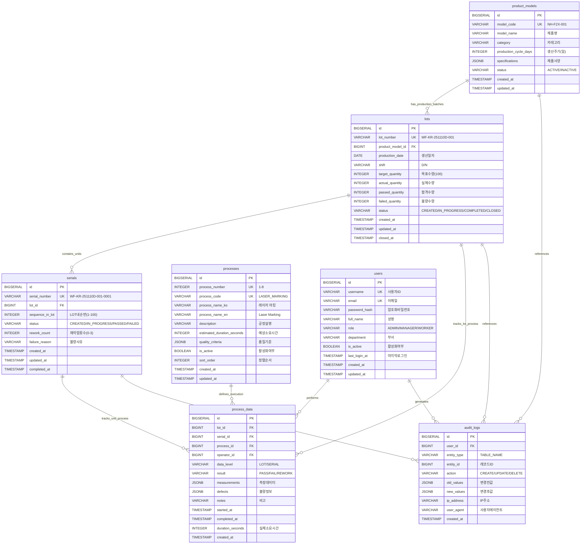

# Entity-Relationship Diagram (ERD)
# F2X NeuroHub MES Database

## Overview

This document presents the Entity-Relationship Diagram for the F2X NeuroHub Manufacturing Execution System (MES). The database design supports complete traceability from product models through production lots to individual serial numbers, tracking all 8 manufacturing processes with comprehensive audit capabilities.

## Database Architecture Summary

- **7 Core Entities**: Product Models, LOTs, Serials, Processes, Process Data, Users, Audit Logs
- **5 Primary Relationships**: Hierarchical production tracking with process execution records
- **Database Engine**: PostgreSQL 14+ (leveraging JSONB, advanced indexing, triggers)
- **Design Principles**: ACID compliance, full traceability, audit trail, scalability

---

## Entity-Relationship Diagram



---

## Relationship Descriptions

### 1. product_models → lots (1:N)
**Cardinality**: One product model has many production lots

**Description**: Each product model (e.g., NH-F2X-001) can have multiple production batches (LOTs) manufactured over time. A LOT is always associated with exactly one product model.

**Business Logic**:
- LOTs cannot be created without a valid product model
- Product models cannot be deleted if they have associated LOTs (ON DELETE RESTRICT)
- Each LOT inherits specifications from its product model

---

### 2. lots → serials (1:N)
**Cardinality**: One LOT contains up to 100 serial numbers

**Description**: Each LOT contains individual production units, each identified by a unique serial number. The relationship is strictly bounded (max 100 units per LOT).

**Business Logic**:
- Serial numbers are auto-generated based on LOT number + sequence (0001-0100)
- A LOT's status depends on the completion status of its serials
- LOTs cannot be deleted if they have associated serials (ON DELETE RESTRICT)

**Constraint**: Maximum 100 serials per LOT (enforced by trigger)

---

### 3. processes → process_data (1:N)
**Cardinality**: One process definition has many execution records

**Description**: The 8 manufacturing processes (레이저 마킹, LMA 조립, 센서검사, 펌웨어 업로드, 로봇 조립, 성능검사, 라벨 프린팅, 포장 + 외관검사) serve as templates for actual process executions recorded in process_data.

**Business Logic**:
- Process definitions are relatively static (master data)
- Process data records the actual execution with measurements
- Processes cannot be deleted if they have associated data (ON DELETE RESTRICT)

**Process Sequence**: 1→2→3→4→5→6→7→8 (enforced by trigger)

---

### 4. lots → process_data (1:N)
**Cardinality**: One LOT has multiple process execution records

**Description**: LOT-level process data captures aggregate measurements and quality checks performed at the batch level (not per-unit).

**Business Logic**:
- Some processes are performed at LOT level (e.g., final packaging)
- LOT-level data complements serial-level data
- Used for batch quality analysis and reporting

**Data Level**: Identified by `data_level = 'LOT'`

---

### 5. serials → process_data (1:N)
**Cardinality**: One serial has 8 process execution records (one per process)

**Description**: Each individual unit (serial) must pass through all 8 manufacturing processes. Process data tracks measurements, results, and timing for each process step.

**Business Logic**:
- Each serial should have exactly 8 process_data records (one per process)
- Process sequence must be followed (cannot skip processes)
- Failed processes may result in rework (up to 3 attempts)
- Process data includes JSONB measurements specific to each process type

**Data Level**: Identified by `data_level = 'SERIAL'`

---

### 6. users → process_data (1:N)
**Cardinality**: One user performs many process executions

**Description**: Every process execution is performed by an authenticated user (operator). This enables operator performance tracking and accountability.

**Business Logic**:
- Operator must be authenticated before recording process data
- Operator role determines allowed actions (WORKER can execute, MANAGER can approve rework)
- User deletion is restricted if they have associated process data (ON DELETE RESTRICT)

---

### 7. users → audit_logs (1:N)
**Cardinality**: One user generates many audit log entries

**Description**: All system changes are attributed to a specific user for compliance and traceability.

**Business Logic**:
- Every CREATE/UPDATE/DELETE operation generates an audit log
- User deletion is restricted if they have audit logs (ON DELETE RESTRICT)
- Audit logs are immutable (no UPDATE/DELETE allowed)

---

### 8. Entity References → audit_logs (1:N)
**Cardinality**: One entity record has many audit log entries

**Description**: Audit logs can reference any entity type (product_models, lots, serials, etc.) using a polymorphic pattern.

**Business Logic**:
- `entity_type` identifies the table name
- `entity_id` identifies the specific record
- `old_values` and `new_values` store JSONB snapshots
- Enables complete change history for compliance (3-year retention)

---

## Key Design Features

### 1. Hierarchical Production Tracking
```
product_models
    └── lots (production batches)
        └── serials (individual units)
            └── process_data (8 processes per unit)
```

### 2. Process Traceability
- Every serial must complete all 8 processes in sequence
- Process data captures measurements, timing, operator, and results
- JSONB flexibility allows process-specific data structures

### 3. Audit Trail
- Comprehensive logging of all system changes
- User attribution for accountability
- Immutable logs for regulatory compliance

### 4. Scalability Considerations
- BIGSERIAL primary keys support large datasets
- JSONB indexing (GIN) for flexible query performance
- Partitioning strategy available for process_data and audit_logs

---

## Entity Attribute Summary

### Core Production Entities
- **product_models**: 9 attributes (model info, specifications, status)
- **lots**: 12 attributes (LOT tracking, quantities, status, dates)
- **serials**: 9 attributes (serial tracking, status, rework, completion)

### Process Tracking Entities
- **processes**: 10 attributes (process definitions, criteria, configuration)
- **process_data**: 12 attributes (execution records, measurements, results, timing)

### System Management Entities
- **users**: 10 attributes (authentication, authorization, profile)
- **audit_logs**: 10 attributes (change tracking, compliance, history)

---

## Relationship Cardinality Summary

| Parent Entity | Child Entity | Cardinality | Constraint |
|---------------|--------------|-------------|------------|
| product_models | lots | 1:N | ON DELETE RESTRICT |
| lots | serials | 1:N | Max 100 serials per LOT |
| lots | process_data | 1:N | LOT-level data |
| serials | process_data | 1:N | Exactly 8 per serial |
| processes | process_data | 1:N | ON DELETE RESTRICT |
| users | process_data | 1:N | ON DELETE RESTRICT |
| users | audit_logs | 1:N | ON DELETE RESTRICT |

---

## Database Integrity Rules

### Referential Integrity
- All foreign keys use `ON DELETE RESTRICT` to prevent orphaned records
- `ON UPDATE CASCADE` propagates identifier changes (rare)

### Data Validation
- CHECK constraints enforce status values and ranges
- UNIQUE constraints prevent duplicate identifiers
- NOT NULL constraints ensure data completeness

### Process Control
- Triggers enforce process sequence (1→2→3→4→5→6→7→8)
- Triggers validate status transitions (state machine logic)
- Triggers auto-generate identifiers (LOT numbers, serial numbers)

### Audit Compliance
- All changes are logged to audit_logs
- Audit logs are append-only (no modifications)
- 3-year retention policy for compliance

---

## Performance Optimization Strategy

### Indexing
- B-Tree indexes on all foreign keys
- GIN indexes on JSONB columns (measurements, specifications)
- Composite indexes on frequently queried combinations
- Partial indexes on active/incomplete records

### Query Optimization
- Materialized views for complex aggregations
- Partitioning for large tables (process_data, audit_logs)
- Query plan analysis and optimization

### Scalability
- Horizontal scaling via read replicas
- Partitioning by date for time-series data
- Archive strategy for completed LOTs (>1 year old)

---

## Next Steps

1. Review **02-entity-definitions.md** for detailed table schemas
2. Review **03-relationship-specifications.md** for foreign key implementations
3. Execute DDL scripts to create database schema
4. Configure indexes and triggers
5. Load master data (product_models, processes, initial users)
6. Implement application-level validation logic

---

**Document Version**: 1.0
**Last Updated**: 2025-11-17
**Author**: Database Architecture Team
**Status**: Ready for Implementation
