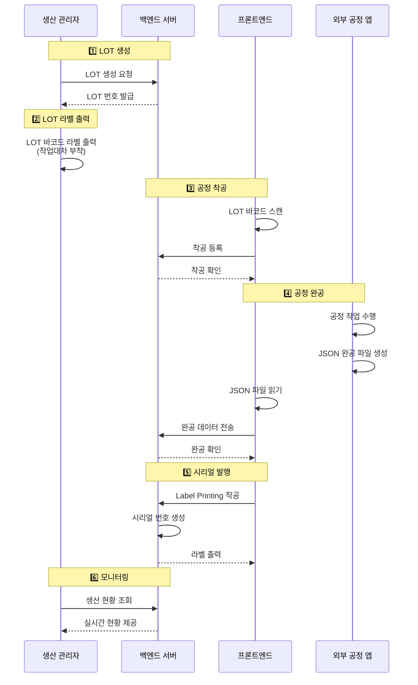

# 3. MES 요구사항 (TO-BE)

[← 목차로 돌아가기](../../README.md)

## 3.1 전체 프로세스 개요



## 3.2 핵심 기능 요구사항

> **FR (Functional Requirement):** 기능 요구사항 - 시스템이 제공해야 하는 기능을 정의

### 3.2.1 LOT 관리

**FR-LOT-001: LOT 생성**

**생성 주체:** 생산 관리자

**생성 방법:**
- 관리자용 대시보드(React 웹 애플리케이션)에서 LOT 생성
- 입력 항목: 제품 모델, 목표 수량, 교대조
- 백엔드 서버에 LOT 생성 요청 전송

**처리 결과:**
- LOT 번호 자동 발급 (예: `WF-KR-251110D-001`, 상세 체계는 [2.6.1 LOT 번호 체계](../02-product-process.md#261-lot-번호-체계) 참조)
- 생성 시 상태: CREATED
- LOT 정보 데이터베이스 저장

**FR-LOT-002: LOT 라벨 출력**

- LOT 바코드 라벨 1장 출력
- 작업대차에 부착하여 전 공정에서 식별

**FR-LOT-003: LOT 상태 관리**

- 상태: CREATED → IN_PROGRESS → COMPLETED → CLOSED
- 각 상태 전환 이력 기록


### 3.2.2 시리얼 번호 관리

**FR-SN-001: 시리얼 번호 생성**

- Label Printing 공정 착공 시 자동 생성
- 형식: `WF-KR-251110D-001-0001`
- LOT당 순차적으로 발급

**FR-SN-002: 시리얼 라벨 출력**

- 시리얼 번호 바코드 라벨 자동 출력
- 라벨에 포함 정보: 시리얼, LOT, 제품명, 날짜

**FR-SN-003: 라벨 재출력**

- 라벨 손상/분실 시 재출력 기능
- 재출력 이력 기록 (사유, 작업자, 시간)


### 3.2.3 공정 관리

**FR-PROC-001: 착공 처리**

**처리 방법:**
- LOT 바코드 스캔으로 착공 등록
- 실시간 검증 (이전 공정 완료 여부)
- 즉시 피드백 제공 (성공/실패)

**착공 규칙:**
- 동일 공정에서 착공은 **여러 번 가능** (재시도 허용)
- 단, 해당 공정이 PASS 완공된 경우 착공 불가

**FR-PROC-002: 완공 처리**

**처리 방법:**
- 외부 공정 앱에서 JSON 파일로 완공 데이터 전송
- 공정별 데이터 수집 (온도, 변위, 힘, 부품 LOT 등)
- 완공 검증 및 저장

**완공 규칙:**
- **PASS 완공**: 1번만 가능 (중복 차단)
- **FAIL 완공**: 여러 번 가능 (재시도 허용)

**완공 검증 로직:**
- 프론트엔드 File Watcher가 JSON 파일 처리 전 검증
- 해당 시리얼+공정에 PASS 완공이 이미 존재하는지 백엔드에 조회
- PASS 완공 존재 시: 완공 거부, JSON 파일을 error 폴더로 이동
- FAIL 완공 또는 완공 이력 없음: 정상 처리

**FR-PROC-003: 공정 순서 제어**

- 정의된 공정 순서 준수 강제
- 이전 공정 미완료 시 착공 불가


### 3.2.4 모니터링 및 대시보드

**FR-DASH-001: 실시간 생산 현황**

- 금일 생산 현황 (착공/완공/불량)
- LOT별 진행 상태
- 공정별 현황

**FR-DASH-002: LOT 상세 조회**

- LOT 기본 정보
- 공정별 진행 현황
- 시리얼 번호 목록

**FR-DASH-003: 추적성 조회**

- 시리얼 번호로 전체 이력 조회
- 공정별 작업 데이터
- 사용된 부품 LOT

### 3.2.5 품질 및 불량 관리

**FR-DEFECT-001: 불량 등록 및 분류**

**불량 등록 방식:** 공정 특성에 따라 2가지 방식

**방식 1: 자동 검사 공정 (검사기 기반)**

적용 공정: 센서 검사(공정 3), 성능검사(공정 6)

처리 흐름:
1. 검사기가 자동으로 합격/불합격 판정
2. 완공 데이터에 `result: "FAIL"` 및 실패한 검사 항목 포함
3. 시스템이 자동으로 불량 등록

완공 데이터 예시:
```json
{
  "result": "FAIL",
  "process_data": {
    "temp_sensor": {
      "result": "FAIL",
      "measured_temp": 58.0,
      "target_temp": 60.0
    },
    "defect_type": "SENSOR_TEMP_FAIL",
    "defect_description": "온도 센서 측정값 범위 초과"
  }
}
```

**방식 2: 수동 작업 공정 (작업자 판단)**

적용 공정: LMA 조립(공정 2), 펌웨어 업로드(공정 4), 로봇 조립(공정 5), 라벨 프린팅(공정 7)

처리 흐름:
1. 작업자가 작업 중 불량 발견
2. 완공 시 불량 유형 선택 및 상세 내용 입력
3. 완공 데이터에 `result: "FAIL"`, `defect_type`, `defect_description` 포함
4. 시스템이 불량 등록

완공 데이터 예시:
```json
{
  "result": "FAIL",
  "process_data": {
    "defect_type": "PART_DEFECT",
    "defect_part": "SMA 스프링",
    "defect_description": "스프링 변형 발견"
  }
}
```

**불량 유형 코드:** [2.7 불량 유형 코드 체계](../02-product-process.md#27-불량-유형-코드-체계) 참조

**처리 결과:**
- 불량 데이터베이스 저장
- 불량 상태: DEFECTED
- 실시간 대시보드에 불량 현황 반영

**FR-DEFECT-002: 불량 원인 기록 및 분석**

**기록 방법:**
- 불량 발생 시 원인 상세 기록 (자유 텍스트)
- 불량 사진 첨부 (선택)
- 작업자 의견 기록

**분석 기능:**
- 불량 유형별 통계
- 공정별 불량률
- 시리얼 번호 기반 불량 이력 추적

**FR-DEFECT-003: 불량 상태 관리**

**불량 상태:**
- DEFECTED: 불량 발생
- SCRAPPED: 폐기 처리

**상태 전환:**
- DEFECTED → SCRAPPED (폐기 결정 시)
- 모든 상태 전환 이력 기록

### 3.2.6 사용자 및 권한 관리

**FR-USER-001: 사용자 등록 및 관리**

**등록 주체:** 시스템 관리자

**사용자 유형:**
- 작업자 (Worker): 공정 착공/완공 처리
- 생산 관리자 (Manager): LOT 생성, 생산 현황 모니터링, 불량 분석
- 시스템 관리자 (Admin): 사용자 관리, 시스템 설정, 백업/복구

**등록 정보:**
- 사용자 ID, 이름, 소속, 연락처
- 역할 (Role) 지정
- 초기 비밀번호 발급

**처리 결과:**
- 사용자 데이터베이스 저장
- 로그인 자격 증명 생성
- 역할별 권한 자동 부여

**FR-USER-002: 역할 및 권한 설정**

**권한 체계 (RBAC):**

| 기능 | 작업자 | 생산 관리자 | 시스템 관리자 |
|------|--------|-----------|-------------|
| 공정 착공/완공 | ✅ | ✅ | ✅ |
| LOT 생성/관리 | ❌ | ✅ | ✅ |
| 불량 등록 | ✅ | ✅ | ✅ |
| 대시보드 조회 | 제한적 | ✅ | ✅ |
| 추적성 조회 | ❌ | ✅ | ✅ |
| 사용자 관리 | ❌ | ❌ | ✅ |
| 시스템 설정 | ❌ | ❌ | ✅ |

**인증 방식:**
- JWT (JSON Web Token) 기반
- 세션 유효 시간: 8시간
- 모든 API 요청 시 토큰 검증


## 3.3 비기능 요구사항

### 3.3.1 성능

- 착공 API 응답 시간: 1초 이내
- 대시보드 로딩 시간: 3초 이내
- 동시 사용자: 20명

### 3.3.2 가용성

- 목표 시스템 가동률: 99%

### 3.3.3 데이터 보관

- 생산 데이터: 영구 보관
- 백업: 일일 전체 백업, 6시간 증분 백업
- 백업 보관: 30일

### 3.3.4 보안

- 사용자 인증: JWT 기반
- 역할 기반 접근 제어 (RBAC)
- 모든 변경 이력 감사 로그

---

**다음 섹션:** [3.4 데이터 인터페이스 요구사항](03-2-api-specs.md)
