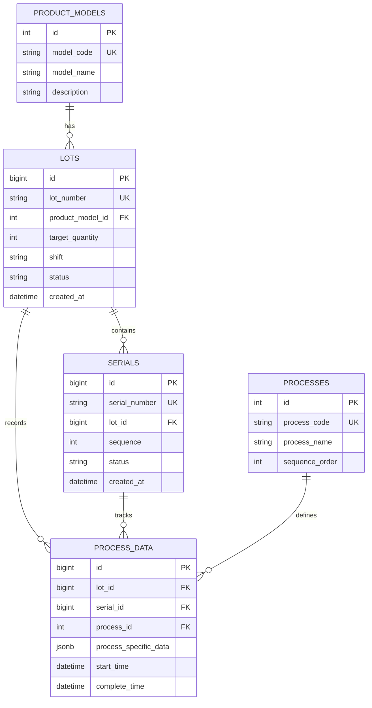

# 5.1 ERD 및 데이터베이스 스키마

[← 목차로 돌아가기](../README.md)

---

## 목차

- [5.1.1 핵심 엔티티 관계도 (ERD)](#511-핵심-엔티티-관계도-erd)
- [5.1.2 데이터베이스 스키마 상세](#512-데이터베이스-스키마-상세)
  - [product_models 테이블](#product_models-테이블)
  - [lots 테이블](#lots-테이블)
  - [serials 테이블](#serials-테이블)
  - [processes 테이블](#processes-테이블)
  - [process_data 테이블](#process_data-테이블)
  - [users 테이블](#users-테이블)
  - [audit_logs 테이블](#audit_logs-테이블)
- [5.1.3 주요 테이블 설명](#513-주요-테이블-설명)

---

## 5.1.1 핵심 엔티티 관계도 (ERD)



---

## 5.1.2 데이터베이스 스키마 상세

다음은 PostgreSQL 기준 CREATE TABLE 문입니다.

### product_models 테이블

```sql
CREATE TABLE product_models (
    id BIGSERIAL PRIMARY KEY,
    model_code VARCHAR(50) UNIQUE NOT NULL,
    model_name VARCHAR(200) NOT NULL,
    description TEXT,
    created_at TIMESTAMP WITH TIME ZONE DEFAULT NOW(),
    updated_at TIMESTAMP WITH TIME ZONE DEFAULT NOW()
);

CREATE INDEX idx_product_models_code ON product_models(model_code);
```

### lots 테이블

```sql
CREATE TABLE lots (
    id BIGSERIAL PRIMARY KEY,
    lot_number VARCHAR(50) UNIQUE NOT NULL,
    product_model_id BIGINT REFERENCES product_models(id) ON DELETE RESTRICT,
    target_quantity INTEGER DEFAULT 100 CHECK (target_quantity > 0),
    shift CHAR(1) CHECK (shift IN ('D', 'N')),
    status VARCHAR(20) DEFAULT 'CREATED' CHECK (status IN ('CREATED', 'IN_PROGRESS', 'COMPLETED', 'CLOSED')),
    created_at TIMESTAMP WITH TIME ZONE DEFAULT NOW(),
    updated_at TIMESTAMP WITH TIME ZONE DEFAULT NOW(),
    completed_at TIMESTAMP WITH TIME ZONE,
    closed_at TIMESTAMP WITH TIME ZONE
);

CREATE INDEX idx_lot_number ON lots(lot_number);
CREATE INDEX idx_lot_created_at ON lots(created_at DESC);
CREATE INDEX idx_lot_status ON lots(status);
CREATE INDEX idx_lot_product_model ON lots(product_model_id);
```

### serials 테이블

```sql
CREATE TABLE serials (
    id BIGSERIAL PRIMARY KEY,
    serial_number VARCHAR(100) UNIQUE NOT NULL,
    lot_id BIGINT REFERENCES lots(id) ON DELETE RESTRICT,
    sequence INTEGER NOT NULL CHECK (sequence > 0 AND sequence <= 100),
    status VARCHAR(20) DEFAULT 'CREATED' CHECK (status IN ('CREATED', 'IN_PROGRESS', 'PASSED', 'FAILED')),
    created_at TIMESTAMP WITH TIME ZONE DEFAULT NOW(),
    updated_at TIMESTAMP WITH TIME ZONE DEFAULT NOW(),
    UNIQUE(lot_id, sequence)
);

CREATE INDEX idx_serial_number ON serials(serial_number);
CREATE INDEX idx_serial_lot ON serials(lot_id);
CREATE INDEX idx_serial_status ON serials(status);
```

### processes 테이블

```sql
CREATE TABLE processes (
    id BIGSERIAL PRIMARY KEY,
    process_id VARCHAR(20) UNIQUE NOT NULL,
    process_name VARCHAR(100) NOT NULL,
    sequence_order INTEGER NOT NULL,
    description TEXT,
    is_active BOOLEAN DEFAULT TRUE,
    created_at TIMESTAMP WITH TIME ZONE DEFAULT NOW(),
    updated_at TIMESTAMP WITH TIME ZONE DEFAULT NOW()
);

CREATE INDEX idx_process_id ON processes(process_id);
CREATE INDEX idx_process_sequence ON processes(sequence_order);
```

### process_data 테이블

```sql
CREATE TABLE process_data (
    id BIGSERIAL PRIMARY KEY,
    lot_id BIGINT REFERENCES lots(id) ON DELETE RESTRICT,
    serial_id BIGINT REFERENCES serials(id) ON DELETE RESTRICT,
    process_id BIGINT REFERENCES processes(id) ON DELETE RESTRICT,
    line_id VARCHAR(50) NOT NULL,
    equipment_id VARCHAR(50) NOT NULL,
    worker_id VARCHAR(50),
    process_specific_data JSONB,
    start_time TIMESTAMP WITH TIME ZONE NOT NULL,
    complete_time TIMESTAMP WITH TIME ZONE,
    result VARCHAR(20) CHECK (result IN ('PASS', 'FAIL', 'PENDING')),
    created_at TIMESTAMP WITH TIME ZONE DEFAULT NOW(),
    updated_at TIMESTAMP WITH TIME ZONE DEFAULT NOW()
);

CREATE INDEX idx_process_data_lot ON process_data(lot_id);
CREATE INDEX idx_process_data_serial ON process_data(serial_id);
CREATE INDEX idx_process_data_process ON process_data(process_id);
CREATE INDEX idx_process_data_line ON process_data(line_id);
CREATE INDEX idx_process_data_equipment ON process_data(equipment_id);
CREATE INDEX idx_process_data_time ON process_data(start_time DESC);
CREATE INDEX idx_process_data_jsonb ON process_data USING GIN (process_specific_data);
```

### users 테이블

```sql
CREATE TABLE users (
    id BIGSERIAL PRIMARY KEY,
    user_id VARCHAR(50) UNIQUE NOT NULL,
    username VARCHAR(100) NOT NULL,
    password_hash VARCHAR(255) NOT NULL,
    role VARCHAR(20) DEFAULT 'WORKER' CHECK (role IN ('ADMIN', 'MANAGER', 'WORKER')),
    is_active BOOLEAN DEFAULT TRUE,
    created_at TIMESTAMP WITH TIME ZONE DEFAULT NOW(),
    updated_at TIMESTAMP WITH TIME ZONE DEFAULT NOW()
);

CREATE INDEX idx_user_id ON users(user_id);
CREATE INDEX idx_user_role ON users(role);
```

### audit_logs 테이블

감사 로그를 위한 테이블:

```sql
CREATE TABLE audit_logs (
    id BIGSERIAL PRIMARY KEY,
    table_name VARCHAR(100) NOT NULL,
    record_id BIGINT,
    action VARCHAR(20) NOT NULL CHECK (action IN ('INSERT', 'UPDATE', 'DELETE')),
    user_id VARCHAR(50),
    old_data JSONB,
    new_data JSONB,
    created_at TIMESTAMP WITH TIME ZONE DEFAULT NOW()
);

CREATE INDEX idx_audit_table ON audit_logs(table_name);
CREATE INDEX idx_audit_time ON audit_logs(created_at DESC);
CREATE INDEX idx_audit_user ON audit_logs(user_id);
```

> **참고:**
> - 모든 타임스탬프는 `TIMESTAMP WITH TIME ZONE`을 사용하여 시간대 정보를 보존합니다.
> - JSONB 인덱스(GIN)는 공정별 데이터 검색 성능을 향상시킵니다.
> - 외래 키에 `ON DELETE RESTRICT`를 사용하여 데이터 무결성을 보장합니다.

---

## 5.1.3 주요 테이블 설명

### 제품 모델 (product_models)

**용도:** 제품 유형 관리

**주요 필드:**

- `model_code`: 제품 모델 코드 (예: NH-F2X-001)
- `model_name`: 제품명
- `description`: 설명


### LOT (lots)

**용도:** LOT 정보 관리

**주요 필드:**

- `lot_number`: LOT 번호 (UK)
- `product_model_id`: 제품 모델 FK
- `target_quantity`: 목표 수량 (100)
- `shift`: 교대 (D/N)
- `status`: CREATED, IN_PROGRESS, COMPLETED, CLOSED


### 시리얼 번호 (serials)

**용도:** 개별 제품 추적

**주요 필드:**

- `serial_number`: 시리얼 번호 (UK)
- `lot_id`: 소속 LOT FK
- `sequence`: LOT 내 순번 (1~100)
- `status`: CREATED, IN_PROGRESS, PASSED, FAILED


### 공정 데이터 (process_data)

**용도:** 공정별 작업 데이터 저장

**주요 필드:**

- `lot_id`: LOT FK
- `serial_id`: 시리얼 FK (nullable)
- `process_id`: 공정 FK
- `process_specific_data`: 공정별 데이터 (JSONB)
- `start_time`: 착공 시간
- `complete_time`: 완공 시간

**JSONB 예시:**

```json
{
  "온도": 60.5,
  "변위": 198.3,
  "힘": 15.2,
  "모선_lot": "MS-2025-100",
  "검사결과": "PASS"
}
```

---

## 관련 문서

- [5.2 코드 체계](./05-2-code-systems.md) - LOT 번호, 불량 코드, 에러 코드 체계
- [3.2 API 명세](../03-requirements/03-2-api-specs.md) - 데이터베이스를 사용하는 API 상세
- [4.3 기술 스택](../04-architecture/04-3-tech-stack.md) - PostgreSQL 상세 설정

---

[← 목차로 돌아가기](../README.md)
