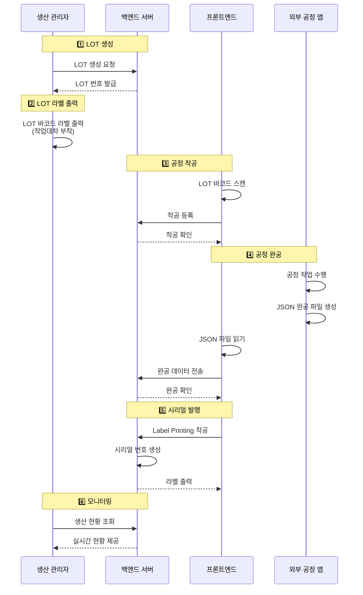

# 3. MES 요구사항 (TO-BE)

[← 목차로 돌아가기](../../README.md)

## 3.1 전체 프로세스 개요



## 3.2 핵심 기능 요구사항

> **FR (Functional Requirement):** 기능 요구사항 - 시스템이 제공해야 하는 기능을 정의

### 3.2.1 LOT 관리

**FR-LOT-001: LOT 생성**

**생성 주체:** 생산 관리자

**생성 방법:**
- 관리자용 대시보드(React 웹 애플리케이션)에서 LOT 생성
- 입력 항목: 제품 모델, 목표 수량, 교대조
- 백엔드 서버에 LOT 생성 요청 전송

**처리 결과:**
- LOT 번호 자동 발급 (예: `PSA10-KR-251110D-001`, 상세 체계는 [2.6.1 LOT 번호 체계](../02-product-process.md#261-lot-번호-체계) 참조)
- 생성 시 상태: CREATED
- LOT 정보 데이터베이스 저장

**FR-LOT-002: LOT 라벨 출력**

- LOT 바코드 라벨 1장 출력
- 작업대차에 부착하여 전 공정에서 식별

**FR-LOT-003: LOT 상태 관리**

- 상태: CREATED → IN_PROGRESS → COMPLETED → CLOSED
- 각 상태 전환 이력 기록


### 3.2.2 시리얼 번호 관리

**FR-SN-001: 시리얼 번호 생성**

- Label Printing 공정 착공 시 자동 생성
- 형식: `PSA10-KR-251110D-001-0001`
- LOT당 순차적으로 발급

**FR-SN-002: 시리얼 라벨 출력**

- 시리얼 번호 바코드 라벨 자동 출력
- 라벨에 포함 정보: 시리얼, LOT, 제품명, 날짜

**FR-SN-003: 라벨 재출력**

- 라벨 손상/분실 시 재출력 기능
- 재출력 이력 기록 (사유, 작업자, 시간)


### 3.2.3 공정 관리

**FR-PROC-001: 착공 처리**

**처리 방법:**
- LOT 바코드 스캔으로 착공 등록
- 실시간 검증 (이전 공정 완료 여부)
- 즉시 피드백 제공 (성공/실패)

**착공 규칙:**
- 동일 공정에서 착공은 **여러 번 가능** (재시도 허용)
- 단, 해당 공정이 PASS 완공된 경우 착공 불가

**FR-PROC-002: 완공 처리**

**처리 방법:**
- 외부 공정 앱에서 JSON 파일로 완공 데이터 전송
- 공정별 데이터 수집 (온도, 변위, 힘, 부품 LOT 등)
- 완공 검증 및 저장

**완공 규칙:**
- **PASS 완공**: 1번만 가능 (중복 차단)
- **FAIL 완공**: 여러 번 가능 (재시도 허용)

**완공 검증 로직:**
- 프론트엔드 File Watcher가 JSON 파일 처리 전 검증
- 해당 시리얼+공정에 PASS 완공이 이미 존재하는지 백엔드에 조회
- PASS 완공 존재 시: 완공 거부, JSON 파일을 error 폴더로 이동
- FAIL 완공 또는 완공 이력 없음: 정상 처리

**FR-PROC-003: 공정 순서 제어**

**순서 규칙:**

1. **완전 순차 공정:** 공정 1 → 2 → 3 → 4 → 5 → 6 → 7 → 8
2. **착공 조건:** 각 공정은 직전 공정이 PASS 완공되어야 착공 가능
3. **예외 규칙:**
   - 공정 1 (레이저 마킹): 이전 공정 확인 생략 (시작 공정)
   - 공정 7 (라벨 프린팅): 공정 6 FAIL 시에도 착공 가능 (불량품도 라벨 필요)

**검증 로직:**

착공 API 호출 시 다음을 확인:
```sql
-- 직전 공정 PASS 완공 여부 확인
SELECT EXISTS (
  SELECT 1 FROM process_data
  WHERE lot_id = :lot_id
    AND process_id = :current_process_id - 1
    AND result = 'PASS'
    AND complete_time IS NOT NULL
)
```

**에러 처리:**

- 이전 공정 미완료: 에러 코드 `PREVIOUS_PROCESS_NOT_COMPLETED`
- 순서 위반 시도: 에러 코드 `INVALID_PROCESS_SEQUENCE`

**관리자 예외 처리:**

- 관리자 권한으로 공정 순서 강제 우회 가능
- 우회 시 다음 필수 사항:
  - 사유 필수 입력 (예: "긴급 수리 후 재검사")
  - 감사 로그 자동 기록 (`audit_logs` 테이블)
  - 승인자 ID 및 시간 기록

**공정 순서 상태 다이어그램:**

```
[LOT 생성]
    ↓
[공정 1 착공] → [공정 1 완공 PASS]
    ↓                    ↓
[차단: FAIL]      [공정 2 착공 허용]
    ↓                    ↓
[재작업 필요]       [공정 2 완공 PASS]
                         ↓
                    [공정 3 착공 허용]
                         ...
                         ↓
                    [공정 8 완공 PASS]
                         ↓
                    [LOT 완료]
```


### 3.2.4 모니터링 및 대시보드

**FR-DASH-001: 실시간 생산 현황**

- 금일 생산 현황 (착공/완공/불량)
- LOT별 진행 상태
- 공정별 현황

**FR-DASH-002: LOT 상세 조회**

- LOT 기본 정보
- 공정별 진행 현황
- 시리얼 번호 목록

**FR-DASH-003: 추적성 조회**

- 시리얼 번호로 전체 이력 조회
- 공정별 작업 데이터
- 사용된 부품 LOT

### 3.2.5 품질 및 불량 관리

**FR-DEFECT-001: 불량 등록 및 분류**

**불량 등록 방식:** 공정 특성에 따라 2가지 방식

**방식 1: 자동 검사 공정 (검사기 기반)**

적용 공정: 센서 검사(공정 3), 성능검사(공정 6)

처리 흐름:
1. 검사기가 자동으로 합격/불합격 판정
2. 완공 데이터에 `result: "FAIL"` 및 실패한 검사 항목 포함
3. 시스템이 자동으로 불량 등록

완공 데이터 예시:
```json
{
  "result": "FAIL",
  "process_data": {
    "temp_sensor": {
      "result": "FAIL",
      "measured_temp": 58.0,
      "target_temp": 60.0
    },
    "defect_type": "SENSOR_TEMP_FAIL",
    "defect_description": "온도 센서 측정값 범위 초과"
  }
}
```

**방식 2: 수동 작업 공정 (작업자 판단)**

적용 공정: LMA 조립(공정 2), 펌웨어 업로드(공정 4), 로봇 조립(공정 5), 라벨 프린팅(공정 7)

처리 흐름:
1. 작업자가 작업 중 불량 발견
2. 완공 시 불량 유형 선택 및 상세 내용 입력
3. 완공 데이터에 `result: "FAIL"`, `defect_type`, `defect_description` 포함
4. 시스템이 불량 등록

완공 데이터 예시:
```json
{
  "result": "FAIL",
  "process_data": {
    "defect_type": "PART_DEFECT",
    "defect_part": "SMA 스프링",
    "defect_description": "스프링 변형 발견"
  }
}
```

**불량 유형 코드:** [2.7 불량 유형 코드 체계](../02-product-process.md#27-불량-유형-코드-체계) 참조

**처리 결과:**
- 불량 데이터베이스 저장
- 불량 상태: DEFECTED
- 실시간 대시보드에 불량 현황 반영

**FR-DEFECT-002: 불량 원인 기록 및 분석**

**기록 방법:**
- 불량 발생 시 원인 상세 기록 (자유 텍스트)
- 불량 사진 첨부 (선택)
- 작업자 의견 기록

**분석 기능:**
- 불량 유형별 통계
- 공정별 불량률
- 시리얼 번호 기반 불량 이력 추적

**FR-DEFECT-003: 불량 상태 관리**

**불량 상태:**
- DEFECTED: 불량 발생
- REWORK: 재작업 중
- SCRAPPED: 폐기 처리

**상태 전환:**
- DEFECTED → REWORK (재작업 승인 시)
- DEFECTED → SCRAPPED (폐기 결정 시)
- REWORK → IN_PROGRESS (재작업 완료 후 다음 공정 진행)
- REWORK → SCRAPPED (재작업 실패 또는 한도 초과 시)
- 모든 상태 전환 이력 기록

**FR-DEFECT-004: 불량 재작업 프로세스**

**재작업 대상:**
- DEFECTED 상태인 시리얼 번호

**재작업 승인 절차:**
1. 관리자 또는 품질 관리자가 재작업 승인
2. 재작업 사유 필수 입력 (예: "부품 교체 후 재검사")
3. 승인자 ID 및 시간 기록
4. 시리얼 상태를 DEFECTED → REWORK로 변경

**재작업 실행:**
1. 불량 발생 공정에 재착공 가능 (이전 완공 데이터는 보존)
2. 재완공 시 `process_data.is_rework = TRUE` 플래그 설정
3. 재완공 결과 처리:
   - **PASS:** 시리얼 상태를 REWORK → IN_PROGRESS로 변경, 다음 공정 진행 가능
   - **FAIL:** 재작업 횟수 증가 (`serials.rework_count`)
     - 재작업 횟수 < 3회: 재작업 재시도 가능
     - 재작업 횟수 ≥ 3회: 자동으로 SCRAPPED 처리

**재작업 제한:**
- **최대 재작업 횟수:** 3회
- **재작업 가능 공정:** 불량 발생 공정만 (이전 공정 재작업 불가)
- **재작업 이력:** 모든 재작업 시도 기록 (`process_data` 테이블에 `is_rework` 플래그)

**데이터 모델 확장:**

다음 필드가 `serials` 테이블에 추가되어야 함:
```sql
ALTER TABLE serials ADD COLUMN rework_count INTEGER DEFAULT 0;
ALTER TABLE serials ADD COLUMN rework_approved_by VARCHAR(50);
ALTER TABLE serials ADD COLUMN rework_approved_at TIMESTAMP WITH TIME ZONE;
ALTER TABLE serials ADD COLUMN rework_reason TEXT;
```

다음 필드가 `process_data` 테이블에 추가되어야 함:
```sql
ALTER TABLE process_data ADD COLUMN is_rework BOOLEAN DEFAULT FALSE;
```

**재작업 프로세스 흐름도:**

```
[불량 발생: DEFECTED]
         ↓
[관리자 재작업 승인]
         ↓
[재작업 사유 입력]
         ↓
[상태: REWORK]
         ↓
[해당 공정 재착공]
         ↓
[재작업 수행]
         ↓
    ┌────┴────┐
    ↓         ↓
 [PASS]    [FAIL]
    ↓         ↓
[다음 공정] [재작업 횟수 확인]
                 ↓
        ┌────────┴────────┐
        ↓                 ↓
   [횟수 < 3회]       [횟수 ≥ 3회]
        ↓                 ↓
   [재시도 가능]      [SCRAPPED]
```

**재작업 이력 추적:**

시리얼 번호 상세 조회 시 재작업 이력 포함:
- 재작업 횟수
- 각 재작업 시도 시간
- 재작업 승인자
- 재작업 사유
- 재작업 결과 (PASS/FAIL)

**권한 제어:**
- 재작업 승인 권한: 관리자(ADMIN), 생산 관리자(MANAGER)
- 재작업 실행: 작업자(WORKER) 가능 (승인 후)

### 3.2.6 생산 라인 및 설비 관리

#### FR-LINE-001: 생산 라인 등록 및 관리

등록 주체: 시스템 관리자

생산 라인 정보:

- 라인 코드 (예: LINE-A, LINE-B)
- 라인명 (한글/영문)
- 위치 정보
- 시프트당 생산 용량
- 활성화 상태

처리 결과:

- 생산 라인 데이터베이스 저장
- LOT 생성 시 생산 라인 선택 가능

#### FR-LINE-002: LOT-생산라인 연결

- LOT 생성 시 생산 라인 지정
- 동일 LOT의 모든 공정은 같은 생산 라인에서 수행
- 생산 라인별 생산 현황 모니터링

#### FR-EQUIP-001: 설비 등록 및 관리

등록 주체: 시스템 관리자

설비 정보:

- 설비 코드 (예: LASER-001, SENSOR-CHECK-01)
- 설비명 (한글/영문)
- 설비 유형 (LASER_MARKER, SENSOR, ROBOT 등)
- 담당 공정 ID
- 소속 생산 라인
- 제조사, 모델번호, 시리얼번호
- 설치일, 정비 이력

처리 결과:

- 설비 데이터베이스 저장
- 공정 착공 시 설비 선택 가능

#### FR-EQUIP-002: 설비-공정 연결

- 공정 실행 시 사용 설비 기록
- 설비별 작업 이력 추적 가능
- 품질 문제 발생 시 설비 추적

#### FR-EQUIP-003: 설비 정비 관리

- 정기 정비 일정 관리
- 정비 필요 설비 알림
- 정비 이력 기록
- 설비 가동률 분석

### 3.2.7 사용자 및 권한 관리

**FR-USER-001: 사용자 등록 및 관리**

**등록 주체:** 시스템 관리자

**사용자 유형:**
- 작업자 (Worker): 공정 착공/완공 처리
- 생산 관리자 (Manager): LOT 생성, 생산 현황 모니터링, 불량 분석
- 시스템 관리자 (Admin): 사용자 관리, 시스템 설정, 백업/복구

**등록 정보:**
- 사용자 ID, 이름, 소속, 연락처
- 역할 (Role) 지정
- 초기 비밀번호 발급

**처리 결과:**
- 사용자 데이터베이스 저장
- 로그인 자격 증명 생성
- 역할별 권한 자동 부여

**FR-USER-002: 역할 및 권한 설정**

**권한 체계 (RBAC):**

| 기능 | 작업자 | 생산 관리자 | 시스템 관리자 |
|------|--------|-----------|-------------|
| 공정 착공/완공 | ✅ | ✅ | ✅ |
| LOT 생성/관리 | ❌ | ✅ | ✅ |
| 불량 등록 | ✅ | ✅ | ✅ |
| 대시보드 조회 | 제한적 | ✅ | ✅ |
| 추적성 조회 | ❌ | ✅ | ✅ |
| 사용자 관리 | ❌ | ❌ | ✅ |
| 시스템 설정 | ❌ | ❌ | ✅ |

**인증 방식:**
- JWT (JSON Web Token) 기반
- 세션 유효 시간: 8시간
- 모든 API 요청 시 토큰 검증


## 3.3 비기능 요구사항

> **참고:** 비기능 요구사항은 ISO 25010 품질 모델을 기반으로 정의되었습니다.

### 3.3.1 성능 요구사항

**API 응답 시간:**
- **NFR-PERF-001:** 착공 API 응답 시간 < 1초 (P95)
- **NFR-PERF-002:** 완공 API 응답 시간 < 2초 (P95)
- **NFR-PERF-003:** 대시보드 초기 로딩 < 3초
- **NFR-PERF-004:** LOT 상세 조회 < 2초

**처리량:**
- **NFR-PERF-005:** 동시 접속자 100명 지원 (피크 시간 200명)
- **NFR-PERF-006:** 일일 트랜잭션 50,000건 처리 (확장 시 100,000건)
- **NFR-PERF-007:** 초당 트랜잭션 처리량(TPS) 최소 20 TPS

**데이터베이스:**
- **NFR-PERF-008:** 쿼리 응답 시간 < 500ms (복잡한 집계 쿼리 기준)
- **NFR-PERF-009:** Connection Pool 최대 50 동시 연결 지원

### 3.3.2 확장성 요구사항

- **NFR-SCALE-001:** 동시 접속자 100명 → 200명 확장 시 코드 변경 없이 인프라만 증설
- **NFR-SCALE-002:** 일일 트랜잭션 50,000건 → 100,000건 확장 가능
- **NFR-SCALE-003:** 수평적 확장(Scale-out) 지원 (백엔드 서버 2대 → 4대)
- **NFR-SCALE-004:** 데이터베이스 파티셔닝 지원 (3개월 단위 날짜 파티셔닝)

### 3.3.3 가용성 요구사항

- **NFR-AVAIL-001:** 시스템 가동률 99% (연간 다운타임 < 87.6시간)
- **NFR-AVAIL-002:** 계획된 유지보수 다운타임 월 4시간 이내
- **NFR-AVAIL-003:** 장애 복구 시간(MTTR) < 4시간
- **NFR-AVAIL-004:** 백업 데이터 복원 시간 < 2시간

### 3.3.4 복구 요구사항

- **NFR-RECOV-001:** RTO (Recovery Time Objective) < 4시간
- **NFR-RECOV-002:** RPO (Recovery Point Objective) < 6시간
- **NFR-RECOV-003:** 백업 복원 성공률 > 95%
- **NFR-RECOV-004:** 일일 전체 백업 + 6시간 증분 백업
- **NFR-RECOV-005:** 백업 데이터 보관 기간 30일

### 3.3.5 보안 요구사항

**인증 및 권한:**
- **NFR-SEC-001:** JWT 기반 인증 (Access Token 유효기간 15분, Refresh Token 7일)
- **NFR-SEC-002:** 역할 기반 접근 제어(RBAC) - 관리자, 생산관리자, 작업자, 뷰어
- **NFR-SEC-003:** 세션 타임아웃 8시간

**패스워드 정책:**
- **NFR-SEC-004:** 패스워드 최소 길이 8자
- **NFR-SEC-005:** 패스워드 복잡도 (대문자, 소문자, 숫자, 특수문자 중 3종 이상)
- **NFR-SEC-006:** 로그인 실패 5회 시 계정 잠금 (10분)

**통신 보안:**
- **NFR-SEC-007:** HTTPS 강제 (모든 API 통신)
- **NFR-SEC-008:** TLS 1.3 사용
- **NFR-SEC-009:** SQL Injection 방어 (ORM Parameterized Query 사용)

**감사 및 로그:**
- **NFR-SEC-010:** 모든 CUD(Create/Update/Delete) 작업 감사 로그 기록
- **NFR-SEC-011:** 로그인/로그아웃 이력 기록
- **NFR-SEC-012:** 민감 정보 로그 마스킹 (패스워드, 토큰 등)

### 3.3.6 호환성 요구사항

**브라우저 호환성:**
- **NFR-COMPAT-001:** Chrome 100+ 지원
- **NFR-COMPAT-002:** Edge 100+ 지원
- **NFR-COMPAT-003:** Firefox 100+ 지원

**운영체제 호환성:**
- **NFR-COMPAT-004:** Windows 10/11 지원 (작업 PC)
- **NFR-COMPAT-005:** Ubuntu 22.04 LTS 지원 (서버)

**하드웨어 호환성:**
- **NFR-COMPAT-006:** 바코드 스캐너 USB HID 표준 지원
- **NFR-COMPAT-007:** 라벨 프린터 (Zebra ZT Series, TSC TTP Series 지원)
- **NFR-COMPAT-008:** ZPL/ESC-POS 명령어 지원

### 3.3.7 유지보수성 요구사항

**로그 관리:**
- **NFR-MAINT-001:** 구조화된 로그 형식 (JSON)
- **NFR-MAINT-002:** 로그 레벨 구분 (DEBUG, INFO, WARNING, ERROR, CRITICAL)
- **NFR-MAINT-003:** 로그 파일 30일 로테이션
- **NFR-MAINT-004:** 로그 보관 기간 90일

**모니터링:**
- **NFR-MAINT-005:** CPU, 메모리, 디스크, 네트워크 메트릭 수집 (15초 간격)
- **NFR-MAINT-006:** API 응답 시간 모니터링 (P95, P99)
- **NFR-MAINT-007:** 알림 임계치 (CPU > 80%, 메모리 > 85%, 에러율 > 1%)

**코드 품질:**
- **NFR-MAINT-008:** 코드 커버리지 > 80%
- **NFR-MAINT-009:** API 문서 자동 생성 (Swagger/OpenAPI)
- **NFR-MAINT-010:** 데이터베이스 마이그레이션 스크립트 버전 관리

### 3.3.8 데이터 보관 요구사항

**데이터 보존:**
- **NFR-DATA-001:** 생산 데이터 영구 보관
- **NFR-DATA-002:** 완공 JSON 파일 90일 보관
- **NFR-DATA-003:** 펌웨어 파일 영구 보관 (버전별)
- **NFR-DATA-004:** 로그 파일 90일 보관

**백업:**
- **NFR-DATA-005:** 일일 전체 백업 (새벽 2시)
- **NFR-DATA-006:** 6시간 증분 백업
- **NFR-DATA-007:** 백업 데이터 30일 보관
- **NFR-DATA-008:** 백업 무결성 검증 (주 1회)

---

> **이전 섹션:** [2. 제품 및 공정 현황 (AS-IS)](../02-product-process.md)
> **다음 섹션:** [3.4 데이터 인터페이스 요구사항](03-2-api-specs.md)
