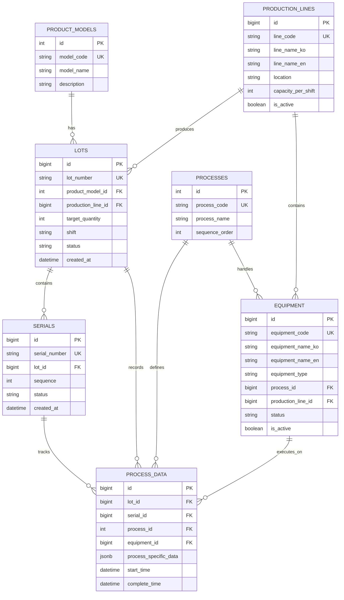

# 5.1 ERD 및 데이터베이스 스키마

[← 목차로 돌아가기](../README.md)

---

## 목차

- [5.1.1 핵심 엔티티 관계도 (ERD)](#511-핵심-엔티티-관계도-erd)
- [5.1.2 데이터베이스 스키마 상세](#512-데이터베이스-스키마-상세)
  - [product_models 테이블](#product_models-테이블)
  - [lots 테이블](#lots-테이블)
  - [serials 테이블](#serials-테이블)
  - [processes 테이블](#processes-테이블)
  - [process_data 테이블](#process_data-테이블)
  - [users 테이블](#users-테이블)
  - [audit_logs 테이블](#audit_logs-테이블)
  - [production_lines 테이블](#production_lines-테이블)
  - [equipment 테이블](#equipment-테이블)
- [5.1.3 주요 테이블 설명](#513-주요-테이블-설명)
- [5.1.4 비즈니스 제약조건 및 트리거](#514-비즈니스-제약조건-및-트리거)

---

## 5.1.1 핵심 엔티티 관계도 (ERD)



---

## 5.1.2 데이터베이스 스키마 상세

다음은 PostgreSQL 기준 CREATE TABLE 문입니다.

### product_models 테이블

```sql
CREATE TABLE product_models (
    id BIGSERIAL PRIMARY KEY,
    model_code VARCHAR(50) UNIQUE NOT NULL,
    model_name VARCHAR(200) NOT NULL,
    description TEXT,
    created_at TIMESTAMP WITH TIME ZONE DEFAULT NOW(),
    updated_at TIMESTAMP WITH TIME ZONE DEFAULT NOW()
);

CREATE INDEX idx_product_models_code ON product_models(model_code);
```

### lots 테이블

```sql
CREATE TABLE lots (
    id BIGSERIAL PRIMARY KEY,
    lot_number VARCHAR(50) UNIQUE NOT NULL,
    product_model_id BIGINT REFERENCES product_models(id) ON DELETE RESTRICT,
    production_line_id BIGINT REFERENCES production_lines(id) ON DELETE SET NULL,
    target_quantity INTEGER DEFAULT 100 CHECK (target_quantity > 0),
    shift CHAR(1) CHECK (shift IN ('D', 'N')),
    status VARCHAR(20) DEFAULT 'CREATED' CHECK (status IN ('CREATED', 'IN_PROGRESS', 'COMPLETED', 'CLOSED')),
    created_at TIMESTAMP WITH TIME ZONE DEFAULT NOW(),
    updated_at TIMESTAMP WITH TIME ZONE DEFAULT NOW(),
    completed_at TIMESTAMP WITH TIME ZONE,
    closed_at TIMESTAMP WITH TIME ZONE
);

CREATE INDEX idx_lot_number ON lots(lot_number);
CREATE INDEX idx_lot_created_at ON lots(created_at DESC);
CREATE INDEX idx_lot_status ON lots(status);
CREATE INDEX idx_lot_product_model ON lots(product_model_id);
CREATE INDEX idx_lot_production_line ON lots(production_line_id) WHERE production_line_id IS NOT NULL;
```

### serials 테이블

```sql
CREATE TABLE serials (
    id BIGSERIAL PRIMARY KEY,
    serial_number VARCHAR(100) UNIQUE NOT NULL,
    lot_id BIGINT REFERENCES lots(id) ON DELETE RESTRICT,
    sequence INTEGER NOT NULL CHECK (sequence > 0 AND sequence <= 100),
    status VARCHAR(20) DEFAULT 'CREATED' CHECK (status IN ('CREATED', 'IN_PROGRESS', 'PASSED', 'FAILED')),
    created_at TIMESTAMP WITH TIME ZONE DEFAULT NOW(),
    updated_at TIMESTAMP WITH TIME ZONE DEFAULT NOW(),
    UNIQUE(lot_id, sequence)
);

CREATE INDEX idx_serial_number ON serials(serial_number);
CREATE INDEX idx_serial_lot ON serials(lot_id);
CREATE INDEX idx_serial_status ON serials(status);
```

### processes 테이블

```sql
CREATE TABLE processes (
    id BIGSERIAL PRIMARY KEY,
    process_id VARCHAR(20) UNIQUE NOT NULL,
    process_name VARCHAR(100) NOT NULL,
    sequence_order INTEGER NOT NULL,
    description TEXT,
    is_active BOOLEAN DEFAULT TRUE,
    created_at TIMESTAMP WITH TIME ZONE DEFAULT NOW(),
    updated_at TIMESTAMP WITH TIME ZONE DEFAULT NOW()
);

CREATE INDEX idx_process_id ON processes(process_id);
CREATE INDEX idx_process_sequence ON processes(sequence_order);
```

### process_data 테이블

```sql
CREATE TABLE process_data (
    id BIGSERIAL PRIMARY KEY,
    lot_id BIGINT REFERENCES lots(id) ON DELETE RESTRICT,
    serial_id BIGINT REFERENCES serials(id) ON DELETE RESTRICT,
    process_id BIGINT REFERENCES processes(id) ON DELETE RESTRICT,
    equipment_id BIGINT REFERENCES equipment(id) ON DELETE SET NULL,
    worker_id VARCHAR(50),
    process_specific_data JSONB,
    start_time TIMESTAMP WITH TIME ZONE NOT NULL,
    complete_time TIMESTAMP WITH TIME ZONE,
    result VARCHAR(20) CHECK (result IN ('PASS', 'FAIL', 'PENDING')),
    created_at TIMESTAMP WITH TIME ZONE DEFAULT NOW(),
    updated_at TIMESTAMP WITH TIME ZONE DEFAULT NOW()
);

CREATE INDEX idx_process_data_lot ON process_data(lot_id);
CREATE INDEX idx_process_data_serial ON process_data(serial_id);
CREATE INDEX idx_process_data_process ON process_data(process_id);
CREATE INDEX idx_process_data_equipment ON process_data(equipment_id) WHERE equipment_id IS NOT NULL;
CREATE INDEX idx_process_data_time ON process_data(start_time DESC);
CREATE INDEX idx_process_data_jsonb ON process_data USING GIN (process_specific_data);
```

### users 테이블

```sql
CREATE TABLE users (
    id BIGSERIAL PRIMARY KEY,
    user_id VARCHAR(50) UNIQUE NOT NULL,
    username VARCHAR(100) NOT NULL,
    password_hash VARCHAR(255) NOT NULL,
    role VARCHAR(20) DEFAULT 'WORKER' CHECK (role IN ('ADMIN', 'MANAGER', 'WORKER')),
    is_active BOOLEAN DEFAULT TRUE,
    created_at TIMESTAMP WITH TIME ZONE DEFAULT NOW(),
    updated_at TIMESTAMP WITH TIME ZONE DEFAULT NOW()
);

CREATE INDEX idx_user_id ON users(user_id);
CREATE INDEX idx_user_role ON users(role);
```

### audit_logs 테이블

감사 로그를 위한 테이블:

```sql
CREATE TABLE audit_logs (
    id BIGSERIAL PRIMARY KEY,
    table_name VARCHAR(100) NOT NULL,
    record_id BIGINT,
    action VARCHAR(20) NOT NULL CHECK (action IN ('INSERT', 'UPDATE', 'DELETE')),
    user_id VARCHAR(50),
    old_data JSONB,
    new_data JSONB,
    created_at TIMESTAMP WITH TIME ZONE DEFAULT NOW()
);

CREATE INDEX idx_audit_table ON audit_logs(table_name);
CREATE INDEX idx_audit_time ON audit_logs(created_at DESC);
CREATE INDEX idx_audit_user ON audit_logs(user_id);
```

### production_lines 테이블

생산 라인 마스터 데이터를 관리하는 테이블:

```sql
CREATE TABLE production_lines (
    id BIGSERIAL PRIMARY KEY,
    line_code VARCHAR(50) UNIQUE NOT NULL,
    line_name_ko VARCHAR(255) NOT NULL,
    line_name_en VARCHAR(255) NOT NULL,
    description TEXT,
    location VARCHAR(255),
    capacity_per_shift INTEGER CHECK (capacity_per_shift > 0),
    is_active BOOLEAN DEFAULT TRUE,
    sort_order INTEGER NOT NULL DEFAULT 1 CHECK (sort_order > 0),
    config JSONB DEFAULT '{}',
    created_at TIMESTAMP WITH TIME ZONE DEFAULT NOW(),
    updated_at TIMESTAMP WITH TIME ZONE DEFAULT NOW()
);

CREATE INDEX idx_production_lines_active ON production_lines(is_active, sort_order) WHERE is_active = TRUE;
CREATE INDEX idx_production_lines_sort_order ON production_lines(sort_order);
CREATE INDEX idx_production_lines_location ON production_lines(location) WHERE location IS NOT NULL;
CREATE INDEX idx_production_lines_config ON production_lines USING gin(config);
```

### equipment 테이블

생산 설비/장비 마스터 데이터를 관리하는 테이블:

```sql
CREATE TABLE equipment (
    id BIGSERIAL PRIMARY KEY,
    equipment_code VARCHAR(50) UNIQUE NOT NULL,
    equipment_name_ko VARCHAR(255) NOT NULL,
    equipment_name_en VARCHAR(255) NOT NULL,
    equipment_type VARCHAR(100) NOT NULL,
    description TEXT,
    manufacturer VARCHAR(255),
    model_number VARCHAR(100),
    serial_number VARCHAR(100),
    process_id BIGINT REFERENCES processes(id) ON DELETE SET NULL,
    production_line_id BIGINT REFERENCES production_lines(id) ON DELETE SET NULL,
    status VARCHAR(20) DEFAULT 'AVAILABLE' CHECK (status IN ('AVAILABLE', 'IN_USE', 'MAINTENANCE', 'OUT_OF_SERVICE', 'RETIRED')),
    is_active BOOLEAN DEFAULT TRUE,
    last_maintenance_date DATE,
    next_maintenance_date DATE,
    total_operation_hours NUMERIC(10, 2) DEFAULT 0 CHECK (total_operation_hours >= 0),
    specifications JSONB DEFAULT '{}',
    maintenance_schedule JSONB DEFAULT '{}',
    created_at TIMESTAMP WITH TIME ZONE DEFAULT NOW(),
    updated_at TIMESTAMP WITH TIME ZONE DEFAULT NOW(),
    CHECK (next_maintenance_date IS NULL OR last_maintenance_date IS NULL OR next_maintenance_date > last_maintenance_date)
);

CREATE INDEX idx_equipment_process ON equipment(process_id) WHERE process_id IS NOT NULL;
CREATE INDEX idx_equipment_production_line ON equipment(production_line_id) WHERE production_line_id IS NOT NULL;
CREATE INDEX idx_equipment_status ON equipment(status);
CREATE INDEX idx_equipment_active ON equipment(is_active, status) WHERE is_active = TRUE;
CREATE INDEX idx_equipment_type ON equipment(equipment_type);
CREATE INDEX idx_equipment_maintenance_schedule ON equipment(next_maintenance_date) WHERE next_maintenance_date IS NOT NULL AND is_active = TRUE;
CREATE INDEX idx_equipment_specifications ON equipment USING gin(specifications);
```

> **참고:**
> - 모든 타임스탬프는 `TIMESTAMP WITH TIME ZONE`을 사용하여 시간대 정보를 보존합니다.
> - JSONB 인덱스(GIN)는 공정별 데이터 검색 성능을 향상시킵니다.
> - 외래 키에 `ON DELETE RESTRICT`를 사용하여 데이터 무결성을 보장합니다.
> - production_lines와 equipment는 `ON DELETE SET NULL`을 사용하여 유연한 관리를 지원합니다.

---

## 5.1.3 주요 테이블 설명

### 제품 모델 (product_models)

**용도:** 제품 유형 관리

**주요 필드:**

- `model_code`: 제품 모델 코드 (예: NH-F2X-001)
- `model_name`: 제품명
- `description`: 설명


### LOT (lots)

**용도:** LOT 정보 관리

**주요 필드:**

- `lot_number`: LOT 번호 (UK)
- `product_model_id`: 제품 모델 FK
- `production_line_id`: 생산 라인 FK
- `target_quantity`: 목표 수량 (100)
- `shift`: 교대 (D/N)
- `status`: CREATED, IN_PROGRESS, COMPLETED, CLOSED


### 시리얼 번호 (serials)

**용도:** 개별 제품 추적

**주요 필드:**

- `serial_number`: 시리얼 번호 (UK)
- `lot_id`: 소속 LOT FK
- `sequence`: LOT 내 순번 (1~100)
- `status`: CREATED, IN_PROGRESS, PASSED, FAILED


### 공정 데이터 (process_data)

**용도:** 공정별 작업 데이터 저장

**주요 필드:**

- `lot_id`: LOT FK
- `serial_id`: 시리얼 FK (nullable)
- `process_id`: 공정 FK
- `equipment_id`: 사용 장비 FK
- `process_specific_data`: 공정별 데이터 (JSONB)
- `start_time`: 착공 시간
- `complete_time`: 완공 시간

**JSONB 예시:**

```json
{
  "온도": 60.5,
  "변위": 198.3,
  "힘": 15.2,
  "모선_lot": "MS-2025-100",
  "검사결과": "PASS"
}
```


### 생산 라인 (production_lines)

**용도:** 생산 라인 마스터 데이터 관리

**주요 필드:**

- `line_code`: 생산 라인 코드 (예: LINE_A, LINE_B)
- `line_name_ko`: 라인명 (한글)
- `line_name_en`: 라인명 (영문)
- `location`: 시설 내 물리적 위치
- `capacity_per_shift`: 교대당 생산 능력
- `is_active`: 운영 상태 (활성/비활성)
- `config`: 라인별 설정 정보 (JSONB)

**관계:**

- LOT 생성 시 생산 라인 지정 (lots.production_line_id)
- 각 라인에 여러 장비 배치 (equipment.production_line_id)


### 설비 (equipment)

**용도:** 생산 설비/장비 마스터 데이터 관리

**주요 필드:**

- `equipment_code`: 장비 코드 (예: EQ_LASER_001)
- `equipment_name_ko`: 장비명 (한글)
- `equipment_name_en`: 장비명 (영문)
- `equipment_type`: 장비 유형 (LASER_MARKER, ASSEMBLY_STATION, INSPECTION_STATION 등)
- `process_id`: 주로 처리하는 공정 FK
- `production_line_id`: 소속 생산 라인 FK
- `status`: 장비 상태 (AVAILABLE, IN_USE, MAINTENANCE, OUT_OF_SERVICE, RETIRED)
- `specifications`: 기술 사양 (JSONB)
- `maintenance_schedule`: 정비 일정 및 절차 (JSONB)

**관계:**

- 공정 데이터에 사용 장비 기록 (process_data.equipment_id)
- 특정 공정 전담 장비 지정 가능 (equipment.process_id)
- 생산 라인에 소속 (equipment.production_line_id)

**상태 관리:**

- `AVAILABLE`: 사용 가능
- `IN_USE`: 사용 중
- `MAINTENANCE`: 정비 중
- `OUT_OF_SERVICE`: 서비스 불가
- `RETIRED`: 폐기/퇴역

---

## 5.1.4 비즈니스 제약조건 및 트리거

### LOT 상태 전이 제약조건

**제약조건 ID:** DB-CONSTRAINT-001

```sql
-- LOT 상태 전이 검증 함수
CREATE OR REPLACE FUNCTION validate_lot_status_transition()
RETURNS TRIGGER AS $$
BEGIN
    -- CREATED → IN_PROGRESS: 허용
    IF OLD.status = 'CREATED' AND NEW.status = 'IN_PROGRESS' THEN
        RETURN NEW;
    END IF;

    -- IN_PROGRESS → COMPLETED: 모든 시리얼이 PASSED 또는 FAILED여야 함
    IF OLD.status = 'IN_PROGRESS' AND NEW.status = 'COMPLETED' THEN
        IF EXISTS (
            SELECT 1 FROM serials
            WHERE lot_id = NEW.id
            AND status NOT IN ('PASSED', 'FAILED')
        ) THEN
            RAISE EXCEPTION 'Cannot complete LOT with pending serials';
        END IF;
        NEW.completed_at = NOW();
        RETURN NEW;
    END IF;

    -- COMPLETED → CLOSED: 허용
    IF OLD.status = 'COMPLETED' AND NEW.status = 'CLOSED' THEN
        NEW.closed_at = NOW();
        RETURN NEW;
    END IF;

    -- 기타 전이는 거부
    RAISE EXCEPTION 'Invalid LOT status transition: % → %', OLD.status, NEW.status;
END;
$$ LANGUAGE plpgsql;

-- 트리거 생성
CREATE TRIGGER trg_validate_lot_status
BEFORE UPDATE ON lots
FOR EACH ROW
WHEN (OLD.status IS DISTINCT FROM NEW.status)
EXECUTE FUNCTION validate_lot_status_transition();
```

### 시리얼 번호 제약조건

**제약조건 ID:** DB-CONSTRAINT-002

```sql
-- 시리얼 번호 생성 시 LOT 상태 검증
CREATE OR REPLACE FUNCTION validate_serial_creation()
RETURNS TRIGGER AS $$
DECLARE
    lot_status VARCHAR(20);
    serial_count INTEGER;
    target_qty INTEGER;
BEGIN
    -- LOT 상태 조회
    SELECT status, target_quantity INTO lot_status, target_qty
    FROM lots WHERE id = NEW.lot_id;

    -- LOT이 CREATED 또는 IN_PROGRESS 상태가 아니면 거부
    IF lot_status NOT IN ('CREATED', 'IN_PROGRESS') THEN
        RAISE EXCEPTION 'Cannot create serial for LOT in % status', lot_status;
    END IF;

    -- 목표 수량 초과 여부 확인
    SELECT COUNT(*) INTO serial_count
    FROM serials WHERE lot_id = NEW.lot_id;

    IF serial_count >= target_qty THEN
        RAISE EXCEPTION 'LOT already has maximum serials (%)', target_qty;
    END IF;

    RETURN NEW;
END;
$$ LANGUAGE plpgsql;

CREATE TRIGGER trg_validate_serial_creation
BEFORE INSERT ON serials
FOR EACH ROW
EXECUTE FUNCTION validate_serial_creation();
```

### 공정 데이터 제약조건

**제약조건 ID:** DB-CONSTRAINT-003

```sql
-- 공정 데이터 완공 시 직전 공정 완료 여부 검증
CREATE OR REPLACE FUNCTION validate_process_sequence()
RETURNS TRIGGER AS $$
DECLARE
    current_sequence INTEGER;
    prev_process_complete BOOLEAN;
BEGIN
    -- 현재 공정의 sequence_order 조회
    SELECT sequence_order INTO current_sequence
    FROM processes WHERE id = NEW.process_id;

    -- 첫 번째 공정(1)이 아닌 경우, 직전 공정 완료 여부 확인
    IF current_sequence > 1 THEN
        SELECT EXISTS (
            SELECT 1 FROM process_data pd
            JOIN processes p ON pd.process_id = p.id
            WHERE pd.serial_id = NEW.serial_id
            AND p.sequence_order = current_sequence - 1
            AND pd.result = 'PASS'
            AND pd.complete_time IS NOT NULL
        ) INTO prev_process_complete;

        IF NOT prev_process_complete THEN
            RAISE EXCEPTION 'Previous process not completed for serial_id %', NEW.serial_id;
        END IF;
    END IF;

    RETURN NEW;
END;
$$ LANGUAGE plpgsql;

CREATE TRIGGER trg_validate_process_sequence
BEFORE INSERT ON process_data
FOR EACH ROW
EXECUTE FUNCTION validate_process_sequence();
```

### 자동 LOT 상태 업데이트 트리거

**제약조건 ID:** DB-TRIGGER-001

```sql
-- 시리얼이 생성되면 LOT을 IN_PROGRESS로 변경
CREATE OR REPLACE FUNCTION auto_update_lot_status_on_serial_insert()
RETURNS TRIGGER AS $$
BEGIN
    UPDATE lots
    SET status = 'IN_PROGRESS', updated_at = NOW()
    WHERE id = NEW.lot_id AND status = 'CREATED';
    RETURN NEW;
END;
$$ LANGUAGE plpgsql;

CREATE TRIGGER trg_auto_lot_in_progress
AFTER INSERT ON serials
FOR EACH ROW
EXECUTE FUNCTION auto_update_lot_status_on_serial_insert();
```

### 시리얼 상태 자동 업데이트

**제약조건 ID:** DB-TRIGGER-002

```sql
-- 공정 완료 시 시리얼 상태 자동 업데이트
CREATE OR REPLACE FUNCTION auto_update_serial_status()
RETURNS TRIGGER AS $$
DECLARE
    last_process_sequence INTEGER;
    current_process_sequence INTEGER;
BEGIN
    -- 완공 데이터가 아니면 무시
    IF NEW.complete_time IS NULL THEN
        RETURN NEW;
    END IF;

    -- 마지막 공정 sequence_order 조회
    SELECT MAX(sequence_order) INTO last_process_sequence FROM processes;

    -- 현재 공정 sequence_order 조회
    SELECT sequence_order INTO current_process_sequence
    FROM processes WHERE id = NEW.process_id;

    -- 불합격 처리
    IF NEW.result = 'FAIL' THEN
        UPDATE serials
        SET status = 'FAILED', updated_at = NOW()
        WHERE id = NEW.serial_id;

    -- 마지막 공정 합격 처리
    ELSIF NEW.result = 'PASS' AND current_process_sequence = last_process_sequence THEN
        UPDATE serials
        SET status = 'PASSED', updated_at = NOW()
        WHERE id = NEW.serial_id;

    -- 중간 공정 합격 처리
    ELSIF NEW.result = 'PASS' THEN
        UPDATE serials
        SET status = 'IN_PROGRESS', updated_at = NOW()
        WHERE id = NEW.serial_id AND status = 'CREATED';
    END IF;

    RETURN NEW;
END;
$$ LANGUAGE plpgsql;

CREATE TRIGGER trg_auto_serial_status
AFTER INSERT OR UPDATE ON process_data
FOR EACH ROW
EXECUTE FUNCTION auto_update_serial_status();
```

### 재작업 횟수 증가 트리거

**제약조건 ID:** DB-TRIGGER-003

```sql
-- 재작업 승인 시 rework_count 증가
CREATE OR REPLACE FUNCTION increment_rework_count()
RETURNS TRIGGER AS $$
BEGIN
    -- rework_approved_at이 새로 설정된 경우
    IF NEW.rework_approved_at IS NOT NULL AND OLD.rework_approved_at IS NULL THEN
        NEW.rework_count = COALESCE(OLD.rework_count, 0) + 1;
    END IF;
    RETURN NEW;
END;
$$ LANGUAGE plpgsql;

CREATE TRIGGER trg_increment_rework_count
BEFORE UPDATE ON serials
FOR EACH ROW
WHEN (NEW.rework_approved_at IS DISTINCT FROM OLD.rework_approved_at)
EXECUTE FUNCTION increment_rework_count();
```

### 감사 로그 자동 생성

**제약조건 ID:** DB-TRIGGER-004

```sql
-- 주요 테이블 변경 시 감사 로그 자동 생성
CREATE OR REPLACE FUNCTION create_audit_log()
RETURNS TRIGGER AS $$
DECLARE
    action_type VARCHAR(20);
BEGIN
    -- 액션 타입 결정
    IF TG_OP = 'INSERT' THEN
        action_type = 'INSERT';
    ELSIF TG_OP = 'UPDATE' THEN
        action_type = 'UPDATE';
    ELSIF TG_OP = 'DELETE' THEN
        action_type = 'DELETE';
    END IF;

    -- 감사 로그 삽입
    INSERT INTO audit_logs (table_name, record_id, action, old_data, new_data)
    VALUES (
        TG_TABLE_NAME,
        CASE
            WHEN TG_OP = 'DELETE' THEN OLD.id
            ELSE NEW.id
        END,
        action_type,
        CASE WHEN TG_OP IN ('UPDATE', 'DELETE') THEN row_to_json(OLD) ELSE NULL END,
        CASE WHEN TG_OP IN ('INSERT', 'UPDATE') THEN row_to_json(NEW) ELSE NULL END
    );

    RETURN COALESCE(NEW, OLD);
END;
$$ LANGUAGE plpgsql;

-- 주요 테이블에 감사 로그 트리거 적용
CREATE TRIGGER trg_audit_lots
AFTER INSERT OR UPDATE OR DELETE ON lots
FOR EACH ROW EXECUTE FUNCTION create_audit_log();

CREATE TRIGGER trg_audit_serials
AFTER INSERT OR UPDATE OR DELETE ON serials
FOR EACH ROW EXECUTE FUNCTION create_audit_log();

CREATE TRIGGER trg_audit_process_data
AFTER INSERT OR UPDATE OR DELETE ON process_data
FOR EACH ROW EXECUTE FUNCTION create_audit_log();
```

### 성능 최적화 인덱스

**제약조건 ID:** DB-INDEX-OPT-001

```sql
-- 복합 인덱스: 공정 순서 검증 최적화
CREATE INDEX idx_process_data_serial_sequence ON process_data(serial_id, process_id);

-- 부분 인덱스: 미완료 공정 조회 최적화
CREATE INDEX idx_process_data_incomplete ON process_data(serial_id, process_id)
WHERE complete_time IS NULL;

-- 복합 인덱스: LOT-시리얼 상태 조회 최적화
CREATE INDEX idx_serials_lot_status ON serials(lot_id, status);

-- 부분 인덱스: 불합격 시리얼 조회 최적화
CREATE INDEX idx_serials_failed ON serials(lot_id, status)
WHERE status = 'FAILED';

-- 복합 인덱스: 공정 데이터 시간대별 조회 최적화
CREATE INDEX idx_process_data_time_result ON process_data(complete_time DESC, result)
WHERE complete_time IS NOT NULL;
```

### 데이터 무결성 체크리스트

**참조:** NFR-REL-003 (데이터 무결성)

| 항목 | 제약조건 ID | 구현 방법 | 검증 방법 |
|------|------------|----------|----------|
| LOT 상태 전이 | DB-CONSTRAINT-001 | Trigger | Unit Test |
| 시리얼 생성 제한 | DB-CONSTRAINT-002 | Trigger | Unit Test |
| 공정 순서 제어 | DB-CONSTRAINT-003 | Trigger | Integration Test |
| LOT 자동 업데이트 | DB-TRIGGER-001 | Trigger | Integration Test |
| 시리얼 상태 업데이트 | DB-TRIGGER-002 | Trigger | Integration Test |
| 재작업 횟수 관리 | DB-TRIGGER-003 | Trigger | Unit Test |
| 감사 로그 | DB-TRIGGER-004 | Trigger | Audit Review |
| 인덱스 최적화 | DB-INDEX-OPT-001 | Index | Performance Test |

---

## 관련 문서

- [5.2 코드 체계](./05-2-code-systems.md) - LOT 번호, 불량 코드, 에러 코드 체계
- [3.2 API 명세](../03-requirements/03-2-api-specs.md) - 데이터베이스를 사용하는 API 상세
- [4.3 기술 스택](../04-architecture/04-3-tech-stack.md) - PostgreSQL 상세 설정

---

> **이전 섹션:** [4.3 기술 스택](../04-architecture/04-3-tech-stack.md)
> **다음 섹션:** [5.2 코드 체계](05-2-code-systems.md)

---

[← 목차로 돌아가기](../README.md)
